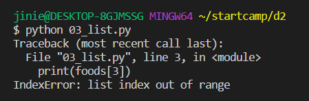
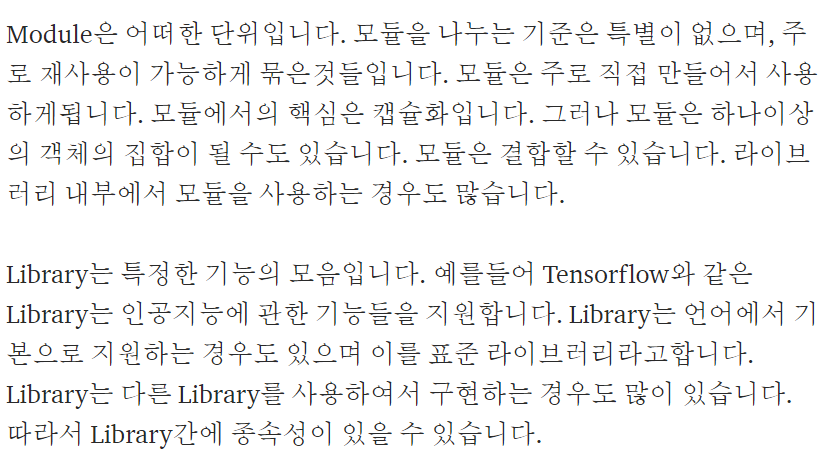
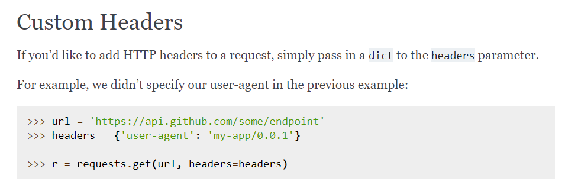

# python 들어가기


## computational thinking?

> computer programming을 하기 위한 사고방식


### 컴퓨터

`계산` & `저장`

### 프로그래밍

- 지시와 명령
- 컴퓨터에게 뭘 시키는 것


1. 언어
2. 데이터
3. 프레임워크
4. 알고리즘
5. 데이터


### 1.언어

> 컴퓨터에게 일을 시키기 위한 언어

언어와 생각의 오류

내가 프로그래밍을, 일을 잘 못시켜서 + 잘 못 시켜서

* 문법적 오류
* 절차적 오류
  * declarative (명령적) < Imperative (선언적, 절차적)
    * what, 사실에 대한 정보  < How, 어떻게 
  * knowledge


`문법` :  문장을 만드는 법(약속)

ex) 5형식의 영어


##### 프로그래밍 언어: 3형식

- 저장
- 조건 (if)
- 반복 (while)


##### 명심할 것

1. 대/소문자
2. 띄어쓰기 및 들여쓰기 (indent)
3. 스펠링


#### 1.저장

`메모리`

모눈종이 한 칸에 무언가를 올려 놓는 행위

`박스`

 dust = 60

우항을 좌항에 저장한다.

dust == 60

우항과 좌항은 같다.


##### 무엇을 저장할 수 있는가?

- 숫자
- 글자
- 참/거짓 : 조건과 반복에 사용됨


##### 어떻게 저장하는가

1. `변수`
   1. 저장된 값을 변경할 수 있는 박스
   2. 숫자, 글자, 참/거짓을 담을 수 있다.
2. `리스트`
   1. dusts = [10,20,30,40]
   2. print(dust[1])
   3. index가 0에서 시작하는 것에 주의
   4. convention: 작명 무조건 복수형
   5. 예약어를 이름으로 짓지 말 것 ex) list = ['a', 'b', 'c']
   6. 리스트 안에 dic을 넣을 수 있다.
3. `dictionary`
   1. 견출지 붙인 박스들의 묶음
   2. key와 value로 이루어진 entity
   3. dusts = {'영등포구':58, '수지구':20, '마포구':40} (엄밀히 말하면 잘못된 dic)
      1. table의 row(record)를 코드로 옮기기 위한 것이 dictionary
      2.  {'지역' : '서울,'습도' : 70, '온도' : -3, '미세먼지농도' :  30}
   4. print(dusts["영등포구"])
   5. dic 안의 dic  `coin['BTC']['max_price']`

##### 자료형 class

`int`/`str`/`bool`/`list`/


##### 형변환 주의

```python
print(int(coin['BTC']['opening_price']) + float(coin['XRP']['opening_price']))
```


```python
#주석

name = '정유진'
greeting = '반갑습니다.'
print(f'{name}님, {greeting}')

foods = ['chicken', 'pizza', 'hamburger']
print(foods)  # 1
foods[1] = 'sushi'
print(foods)  # 1과 결과 다르다   
```




index out of bounds


#### 2.조건

> if와 else

```python
if dust>150:
	print('150 초과')  #주석
elif 80<dust<=150:
    print('80과 150사이')
else:
	print('80이하')
```

중괄호 대신에 들여쓰기(indent) 4칸 ( tab 1번) 

string은 single quotation

, 뒤는 띄어쓰기

같은 줄에 있는 주석은 띄어쓰기 2칸

style guide  중요!


#### 3.반복


#### 4.API 사용하기

> Application Programming Interface


##### API란?

programming하는 사람들이 쓰는 interface


##### json vs  xml vs csv

- json : javascript object notation
- xml : extensible markup language (마크업 표현 사용)
- csv : comma separated values (표로 변환 가능)


##### invalid syntax 주의

```python
f"내 이름은 '유진'이야."
```


double quotation의 시작과 끝을 하나의 문장으로 인지하고

double quotation 안의 single quotation


##### module 이란?

pip3 install requests

ex) requests

pip? 파이썬 모듈 모음 살펴보기





### 내장함수 vs 외장함수

> import가 필요하다면 외장함수

| 함수이름                | 기능               | 참고   |
| ----------------------- | ------------------ | ------ |
| len()                   | list의 길이 return |        |
| print()                 | 매개변수 출력      | 디버깅 |
| input()                 | 사용자 입력 받기   |        |
| round(value, int)       | 반올림             |        |
| for [object] in [list]: | 반복문             |        |


| 함수이름                    | 기능                                   | 참고                  |
| --------------------------- | -------------------------------------- | --------------------- |
| get(url)                    | response 받기                          | requests.get()        |
| get(url, headers = headers) | header 추가                            |                       |
| json()                      | resonse를 json화                       | requests.get().json() |
| randit(start,end)           | 랜덤으로 숫자 추출                     | random.randint()      |
| range(start,end)            | create a sequence                      |                       |
| sample(sequence,k)          | sequence에서 추출해 k 길이의 list 반환 | random.sample()       |


##### 로또 번호 추출

```python
sample(range(1,46),6)
```


##### request에 header custom하기




##### 함수 정의하기

```python
def myFunction(location, weather_infos):
    for weather_info in weather_infos:
        fahrenheit = weather_info['the_temp']*1.8+32
	return fahrenheit
```

- 메소드 작명은 동사로 
- 들여쓰기 주의!