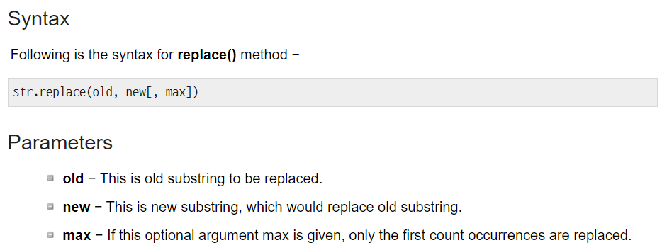
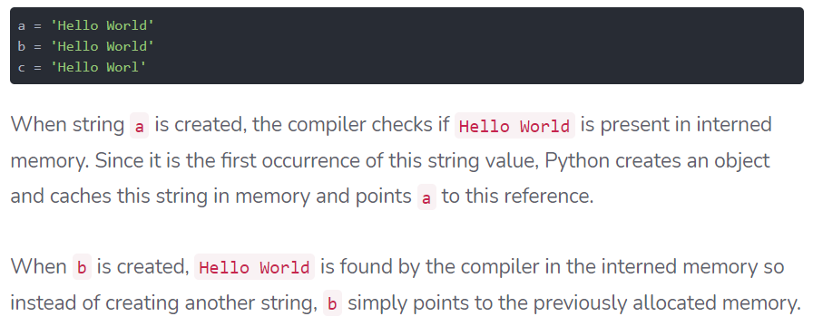
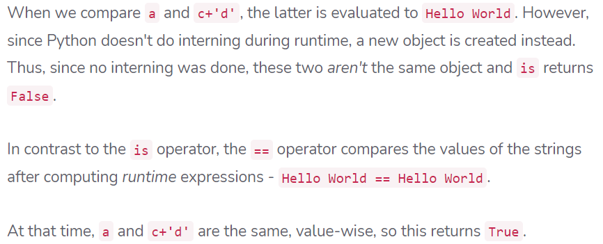
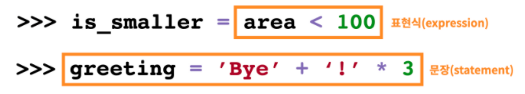
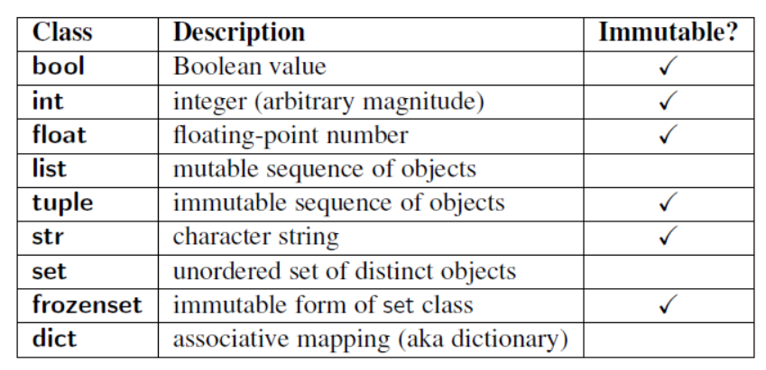

# 데이터


## 기본 타입

### 1. int (정수, Integer)

`long` 타입은 없다.


### 2. float

#### round error 처리하기

```python
a = 3.5 - 3.12
b = 0/38

abs(a - b) <= 1e-10
```

```python
import sys
abs(a-b) <= sys.float_info.epsilon

#elsilon은 부동소수점 연산에서 반올림을 함으로써 발생하는 오차 상환
```

```python
import math
math.isclose(a,b)
```


### 3.complex(복소수)

> 실수로 표현되는 실수부와 허수부를 가진다.
>
> 허수부는 `j`로 표현한다.

```python
a= 3 + 4j
type(a)
```


### 4.str

#### input() : 사용자에게 받은 입력은 기본적으로 str

#### 기본 활용

1. 싱글로 기본 사용
2. 이스케이프 문자(\)        
3.  """ 여러 줄에 걸쳐있는 문장
4. *, + 로 연산 가능
   1. 3*'hi' = 'hihihi'


#### escape

1. \n : new line

2. \t : tab

3. end option (print에서는 기본적으로 end option이 \n으로 생략되어 있다.)

   ```python
   print('개행 문자 말고도 가능하다.', end='!')
   print('연결되어서 출력됩니다.', 'end='.')
   ```

   


#### string interpolation

> 문자열에 변수 값을 넣는 방법

1. $-formatting (기본)

   1. $s : str
   2. %d : int
   3. %f : float

   ```python
   print('Hello, %s' %name)
   print('내 성적은 %d' %score)
   print('내 성적은 %f' %score)
   ```

   

2. str.format

   ```python
   print('Hello, {}. 내 성적은 {}'.format(name, score))
   ```

3. f-string

   ```python
   print(f'Hello, {name}')
   ```

   - 형식 지정 가능하다.
   - 연산과 출력형식 지정 가능하다.

   ```python
   pi = 3.14
   f'원주율은 {pi:.4}. 반지름이 2일 때 원의 넓이는 {pi*2*2}'
   ```

   

   ```python
   import datetime
   today = datetime.datetime.now()
   
   # 오늘은 21년 01월 18일 Monday
   f'오늘은 {today:%y}년 {today:%m}월 {today:%d}일 {today:%A}'
   ```

   (공식문서 참고) https://docs.python.org/ko/3/library/datetime.html#strftime-and-strptime-format-codes


##### str 메소드

| 메소드 이름     | 기능                                 | 비고                         |
| --------------- | ------------------------------------ | ---------------------------- |
| upper()         | to uppercase                         |                              |
| lower()         | to lowercase                         |                              |
| join()          | str을 구분자로 삼아 합쳐준다,        | *stri.join(*iterable*)       |
| startswith(str) | str로 시작하는지 판단 boolean 반환   | *str.startswith(*str*)       |
| replace()       | 특정 문자열을 교체한다(max는 option) | *str*.replace(old, new, max) |



### 5.참/거짓 (Boolean) 타입

#### False로 변환되는 종류

- `0`
- `[]`
- `{}`
- `''`


### 5.None

class 'NoneType'


## 형변환

> 암시적 형변환 : python의 자동변환
>
> 명시적 형변환 : 사용자가 의도적으로 변환


1. 암시적 형변환
   - bool
     - True = 1, Flase = 0
   - Numbers(int, float, complex) : 넓은 방향으로 
     - int + float = float
     - int + complex = complex

2. 명시적 형변환
   - int()
     - 문자열이 특정 숫자 형식일 경우 그 형식으로 변환 가능
     - '3.5'는 int로 변환 불가능
   - float()
   - str()
     - 모든 형식은 문자열로 표현 가능


## 연산자

### 산술 연산자

- `+`

- `-`

- `*`

- `/`

- `//` : 몫

- `%` : 나머지

  - divmod()

    ```python
    quotient, remainder = divmod(5, 2)
    ```

    

- `**` : 제곱

### 비교 연산자

- `<` `<=` `>` `>=`
- `==`
- `!=`


### 논리 연산자

- `and`
- `or`
- `not`


#### 단축 평가

> 첫 번째 값이 확실할 때, 두 번째 값은 확인하지 않는다.
>
> 조건문에서 뒷 부분을 판단하지 않아도 되기 때문에 속도 향상


1. and의 단축 평가 (1번째가 True이면 2번째 확인, 1번째가 False이면 1번째에서 종료)

```python
vowels = 'aeiou'

#1.1 and 조건은 True and Ture만 True이므로 첫번째 값('a')가 True이므로 b도 확인한다.
print('a' and 'b') #  b
print('b' and 'a') # a

('a' and 'b') in vowels # False
('b' and 'a') in vowels # True

print(3 and 5) # 5
print(3 and 0) # 0
print(0 and 3) # 0
print(0 and 0) # 0
```

('b' and 'a')의 연산이 먼저 이루어진 후 in에 대한 평가가 이루어진다.


2. or의 단축 평가(1번 째 True이면 해당값 바로 반환)

```python
print(3 or 5) # 3
print(3 or 0) # 3
print(0 or 3) # 3
print(0 or 0) # 0
```


### 복합연산자

> 연산과 대입이 함께 이루어짐

- a += b : a= a+b
- a++ 안 됨


### 기타 주요 연산자

1. *concatenation*

   1. 'abc' + 'def' = 'abcdef'
   2. [1, 2, 3] + [4, 5, 6] = [1, 2, 3, 4, 5, 6]

2. *containment Test*

   1. `in`
      1. 'a' in 'apple'
      2. 1 in [1, 2, 3]
      3. 1 in range(1,5)

3. *identity*

   1. `is` : id값을 기반으로 동일한 object인지 확인한다.

      ```python
      a = []
      b = []
      print (a == b, a is b) # True(값 비교), False(object 비교)
      ```

   2. `id`

      ```python
      # object interning
      # 의도적으로 특정 범위의 숫자를 id 를 같게끔 해놨다. -5~256
      a = 1
      b = 1
      print(a is b) # True
      
      a = 'hi'
      b ='hi'
      print(a is b) # True
      ```
      
      

   ##### String memory (interned memory)

   https://stackabuse.com/guide-to-string-interning-in-python/#:~:text=Strings%20are%20immutable%20objects%20in,original%20string%20remained%20the%20same.

   

   

4. *indexing/slicing*

   - a [start:stop:step]
   - a[:] : a copy of the whole array
   - a[-1] : last item in the array
   - a[::-1] : all items in the array, reversed 

5. *연산자 우선순위*

   1. ()
   2. Slicing
   3. Indexing
   4. 단항연산자 (음수,양수 부호)
   5. 산술연산자 (* / % + -)
   6. 비교연산자, in, is
   7. 논리연산자  (not, and, or)

6. *표현식(Expression)과 문장(statement)*

   1. 표현식 

      1. 하나의 값(value)로 환원(reduce)될 수 있는 문장
      2. 식별자, 값(literal), 연산자로 구성

   2. 문장

      1. 파이썬이 실행 가능한 최소한의 코드 단위

      
      
      

### 할당 연산자(Assignment Operator) : =

#### 변수 값 바꾸기 

```python
x, y = 10, 100
x, y = y, x
```

temp를 선언해 사용할 필요가 없다.


### 식별자 (Identifiers)

> 변수, 함수, 모듈, 클래스 등을 식별하는 데에 사용되는 이름


#### 키워드

```python
False, None, True, and, as, assert, async, await, break, class, continue, def, del, elif, else, except, finally, for, from, global, if, import, in, is, lambda, nonlocal, not, or, pass, raise, return, try, while, with, yield
```

키워드로 작명해서는 안 된다.


#### 작명

1. 숫자가 먼저 올 수 없음
2. 영문 알파벳과 일부 기호(_)
3. 이미 정의되어 있는 함수의 이름으로 작명할 수 없음
4. list는 복수형으로
5. 대소문자를 구분한다


## 컨테이너(Container)

> 시퀀스형 컨테이너, 순서를 보장한다.

### 1. list

- [val1, val2, val 3]
- list[i]
- 선언시 trailing comma (마지막 요소에게 ',')

| 함수 이름          | 기능                        | 비고 |
| ------------------ | --------------------------- | ---- |
| list.append(value) | value를 list에 추가         |      |
| list.remove(value) | value를 list에서 제거       |      |
| list.count(value)  | list의 특정 value 개수 반환 |      |
| list.reverse()     | list 순서 역정렬            |      |


### 2. tuple

> python 내부적으로 간접적 활용

- 나열된 값 수정 불가능 (immutable)
- (val1, val2)

### 3.range

- range(n)
- range(n, m) : n부터 m-1
- range(n, m, s) : n부터 m-1까지 +s (step은 int형만 가능)
  - sample_list[0: :3] (step이 3, 0부터 끝까지)

### 4. String


#### sequence에 사용할 수 있는 함수

- x  `in`/`not in` s
- s1 + s2
- s * n
  - [0] * 6 = [0, 0 ,0, 0, 0, 0]
- s[i] : indexing
- s[i:j] :slicing
- s[i:j:k] : k간격으로 slicing
- len(s) : 길이
- min(s) : 최솟값
- max(s) : 최댓값
- s.count(x) : x의 개수


> 비시퀀스형 컨테이너, 순서를 보장하지 않는다. collection

### 1. set

- {val1, val2, val3}

- 순서 보장되지 않음

- 집합의 연산 가능하다
  - set_a - set_b
  - set_a | set_b
  - set_a & set_b
  
- 중복을 제거한다

  - list에 중복된 value가 있을 경우 

    ```python
    sample = [1, 1, 2, 2, 3, 4]
    
    no_duplicate = list(set(sample))
    ```

    


### 2. dictionary

- key와 value가 쌍으로 이루어져있다.

- 현실 데이터와 닮아있다, 테이블의 레코드

- {key1:val1, key2:val2, key3:val3}

- key는 immutable한 데이터만 가능하고 중복되지 않는다.

- key를 통해 value에 접근한다.

- 생성

  - dict(key=value, key=value, key=value...)

- 메소드

  - keys()

  - values()

  - items() : (key, value)로 된 튜플들

    - for k, v in phone_book.items():

      ​		print(k,v)

    - tuple이 튀어나온다. (k, v)에서 소괄호가 생략된 것
    
  - get()
  
    - 해당 key가 존재하지 않을 때 None을 value로 return
    - dict[index] 는 해당 key 존재하지 않으면 error
    
  - update()
  
    - dict에 값을 추가할 수 있다.
    - argument로 dict나 tuple같이 key와 value로 이루어진 객체를 사용한다.


## Mutable vs Immutable

https://medium.com/@meghamohan/mutable-and-immutable-side-of-python-c2145cf72747



### immutable : 

1. 리터럴 (Number, String, Bool)
2. range()
3. tuple()


> 리터럴이란?

'' {} [] 로 생성하는, 생성 방법 중 하나 

' ' == str() # 표준 생성 방법

{} == dict()

[ ] == list()


### mutable 

> index로 접근한 뒤 값을 바꿀 수 있다.

1.list

```python
# mutable 데이터의 복사는 어떻게 이루어질까?
# shallow copy 같은 곳을 참조한다.
num1 = [1, 2, 3, 4]
num2 = num1
num2[0] = 100

print(num1)  # [100, 2, 3, 4]
print(num2)  # [100, 2, 3, 4]
```

```python
a = [1, 2, 3]
b = a
c = [1, 2, 3]

print(a is b)  # True
print(a is c)  # False
```

2.dict

3.set


