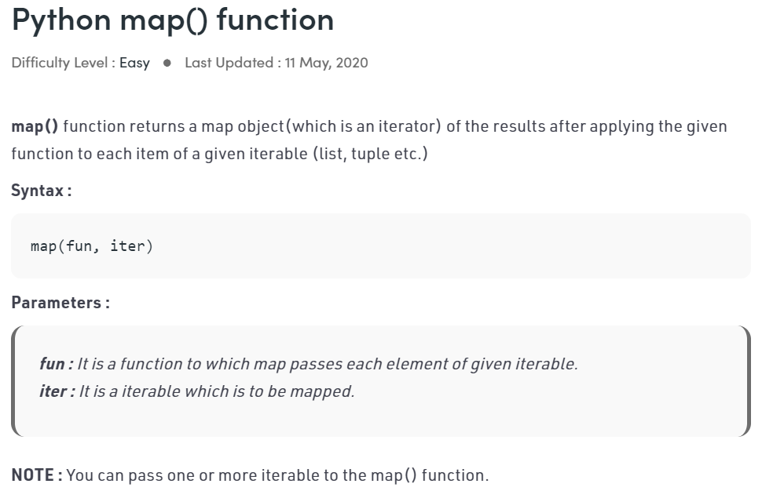

# funciton 1

> logic을 반복적으로 활용하기 위해 함수로 저장하여 사용한다.


## 함수의 의의

- 특정 기능을 하는 코드의 묶음
- 높은 가독성, 재사용성, 유지 보수 용이
- 함수는 (로직을 담은) 값이다. 
- 함수 로직을 참조하여 사용한다. 


## 1.함수의 선언과 호출

```python
def <함수이름>(param1, param2):
	<코드 블럭>
	return value
```

##### print와 return의 차이

print는 출력, return은 변수로 저장해 재사용 가능

(REPL에서는 둘다 평가 결과가 눈에 보이기 때문에 비슷해 보이지만

return은 실제로 출력되지 않는다. )


##### 함수 이름과 변수 이름이 같지 않도록 주의할 것 (덮어쓴다)

`내장함수` dir(builtins)


##### 아스키 코드 관련 메소드

- ord() : char를 아스키코드로
- chr() : 아스키코드를 char로


##### map () 사용하기

- iterable한 객체의 요소 하나하나에 function을 적용한다.

- function에는 builtin 함수 뿐만 아니라 사용자 정의 함수, 람다식도 가능하다.
- 일회성으로 쓸 수 있는 식을 람다식이라고 한다.
  - 익명함수라고도 부른다.
  - return이 없는 함수는 무의미하다.


```python
list(map(function, iterable))

# 예시
list(map(str, [1, 2, 3, 4, 5]))

list(map(lambda n: n+10, [1, 2, 3, 4, 5]))

def plus_ten(n):
    return n+ 10

# lambda식 만들기
# 1. def를 지운다.
# 2. func_name을 지우고 그 자리에 lambda 키워드를 작성한다.
# 3. 인자를 감싼 괄호를 지운다.
# 4. enter, return을 지운다
# lambda input : output
```





## 2.함수의 output


### 함수의 `return`

- 오직 한 개의 객체만 반환된다.

- 함수의 return이 없다면 None을 반환한다.

- 여러개 반환되는 것처럼 보이지만, 하나의 튜플을 반환하는 것

  ```python
  def my_name(name):
      return 'hello', name  # 튜플
  
  name= my_name('재명')
  
  print(name);
  ```

- a.sort()와 sorted()의 차이

  ```python
  a = [5, 1, 3, 2]
  
  sort1 = a.sort()  # 반환값이 없고 원본이 변화한다
  sort2 = sorted(a)  # 반환값이 있다, 원본이 변화하지 않고 정렬된 list를 return한다
  sort3 = a.sort(reverse=True) #내림차순 정렬
  sort4 = sorted(a, reverse=True)
  
  print(a, sort1, sort2)
  ```


## 3.함수의 input


### 매개변수(parameter)와 전달인자(argument)

##### 매개변수

- 함수 정의
- 입력을 받아 함수 내부에서 활용할 변수

##### 전달인자

- 함수 호출
- 실제로 전달되는 입력값

```python
def func(x):  # parameter
	return x + 2
	

func(2)  # argument
```


### 함수의 인자


#### 위치 인자(positinal argument)

- 함수는 인자를 위치로 판단
- 순서로 mapping된다


#### 기본 인자(default argument)

- 기본 인자 값을 설정한다 (default)

- 호출시 인자가 없으면 기본 인자 값이 활용된다.

  ```python
  def my_sum(a, b=0):
  	return a+b
  
  my_sum(8)
  my_sum(2, 6)
  ```

- 기본 인자값을 가지는 인자 다음에 기본 값이 없는 인자를 사용할 수 없다.

  ```python
  # SyntaxError: non-default argument follows default argument
  def greeting(name = '익명', age):
      print(f'안녕? 난 {name}, {age}살이야')
      
  greeting(27)
  ```

  default를 만나기 전에는 위치를 기반으로 인자를 mapping하기 때문

  

#### 키워드 인자(keyword argument)

- 변수의 이름으로 특정 인자를 전달할 수 있다.

  ```python
  def greeting(age, name = '익명'):
      print(f'안녕? 난 {name}, {age}살이야')
      
  greeting(name='유진', age=27)
  ```

- 키워드 인자를 활용한 다음 위치 인자를 사용할 수 없다.

  ```python
  #SyntaxError: positional argument follows keyword argument
  greeting(age=3000, '곰')
  ```


> 열린 결말은 맨 뒤에 나와야 한다는 것

#### 가변 인자 리스트 (arbitary argument lists)

- 임의의 개수의 위치 인자 받기 `*args` (args는 `tuple`, `immutable`) 

- argument로 넘어온 값이 변해서는 안 되기 때문에 tuple

  ```python
  def func(a, b, *args):
      print(args)
  ```

- 가변 인자 리스트는 매개변수 목록의 마지막에 온다. (매개변수의 어디까지가 가변인자인지 알 수 없기 때문)

  ```python
  def animals(*args, cat):
  	for animal in args:
  		print(animal)
  	print(f'우리집 고양이는, {cat}')
  	
  students('a','b','c','d')  # 어디까지가 args인지 알 수 없다.
  
  students('a', 'b', 'c', cat= 'd')  # keyword로 누가 cat인지 표시하면 가능하다.
  ```

- ex) print()

  

#### 가변 키워드 인자(arbitary keyword arguments)

- 정해지지 않은 키워드 인자들은 `dict`로 처리가 된다. `**kwargs`

  ```python
  def my_dict(**kwargs):
      return kwargs
  
  my_dict(a='A', b='B', c='C')
  ```

- ex) dict()

  ```python
  dict(name='정유진', age=27)
  ```

- 식별자는 숫자만으로 이루어질 수 없다 (키워드 인자로 넘기면 함수 안에서 식별자로 쓰이기 때문이다.)

  ```python
  dict(1='1', 2='2')
  
  #아래와 같이 사용하는 것은 가능하다
  dict(((1,'1'),(2,'2')))
  ```

  