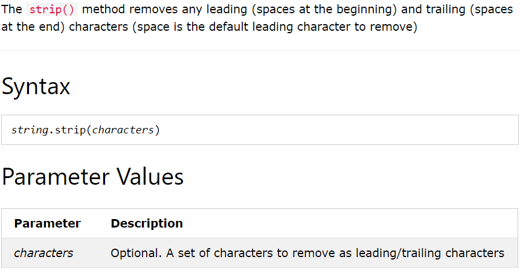
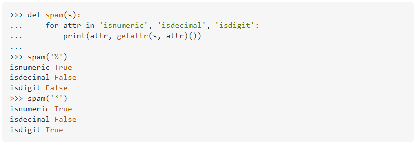
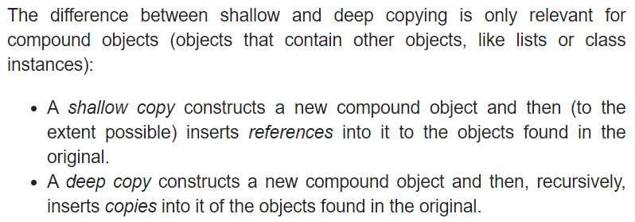
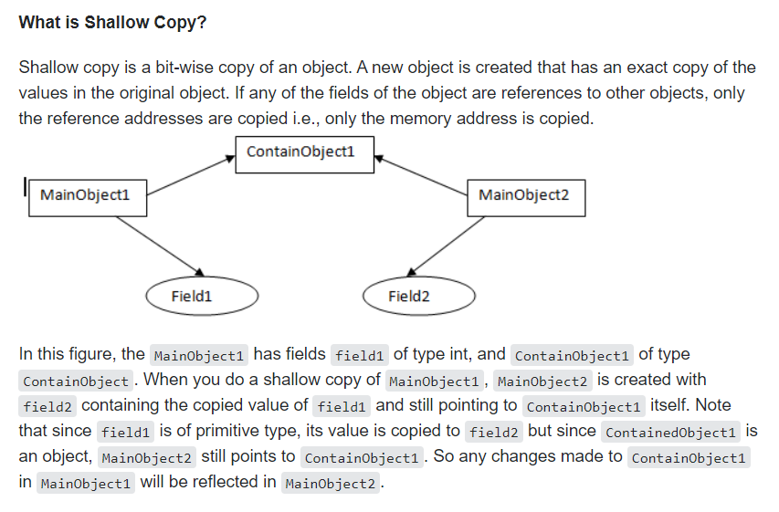
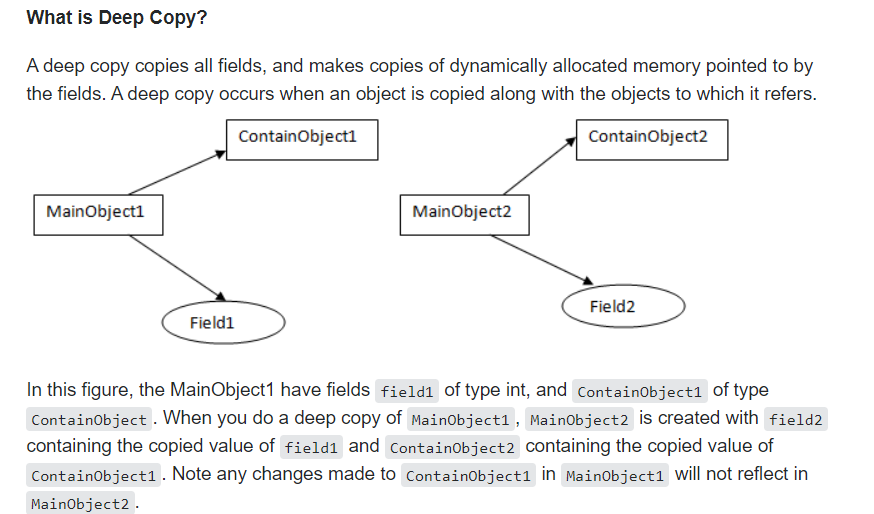

# 데이터 구조(Data Structure) 1

> 데이터에 편리하게 접근하고 변경하기 위해 데이터를 저장하거나 조작
>
> 데이터형식.행동()


## 1. 문자열(String)

> 변경할 수 없고(immutable), 순서가 있고(ordered), 순회 가능한(iterable)
>
> immutable 하기 때문에 주로 메소드는 값을 return한다


### 1.1 조회/탐색

#### `.find(x)`

- x의 첫 번째 위치를 반환
- 없으면 -1 반환


#### `.index(x)`

- x의 첫 번째 위치를 반환 
- 없으면 오류 발생


```python
sample = 'apple'

sample.find('a')   # 0
sample.find('f')   # -1
sample.index('p')  # 1
sample.index('f')  # error
```


### 1.2 값 변경

#### `.replace(old, new [,count])`

- 대상 글자(old)를 새로운 글자로 바꾸어 반환
- count 지정 시 count만큼만 replace 한다. (optional)
- replace의 결과가 return 된다


#### `.stript([chars])`

- 공백제거
- lstrip 왼쪽 공백 제거
- rstrip 오른쪽 공백 제거




#### `.split`

- 구분자를 기준으로 나누어 리스트로 반환
- str.split(',')
- 구분자 기본은 공백
- str ='123456'.split('') 는 에러 발생한다
  - list(str)로 대신한다.

```python
sample = 'I,love,you'

result = sample.split(',') # ['I', 'love', 'you']
```


#### `'separator'.join(iterable)`

- 특정한 문자열로 만들어 반환한다
- iterable한 컨테이너의 요소들을 separator를 구분자로 합쳐 문자열로 반환

```python
sample = ['정', '유', '진']
'!'.join(sample)  # '정!유!진'
```


### 1.3 문자변형

#### .capitalize(), title(), upper()

- capitalize 첫 글자만 대문자
- title 은 initial caps
- upper 은 모두 대문자


#### lower(), swapcase()

- lower 모두 소문자로
- swapcase 소문자 대문자 교환


#### 문자열 관련 검증 메소드 (참/거짓 반환)

| 함수 이름 | 기능               | 비고 |
| --------- | ------------------ | ---- |
| isalpha   | 알파벳인지?        |      |
| isdecimal | 10진수인지         |      |
| isdigit   | digit인지 (윗첨자) |      |
| isnumeric | 숫자인지           |      |
| isspace   | 공백인지           |      |
| isupper   | 대문자인지         |      |
| istitle   | initalcaps인지     |      |
| islower   | 소문자인지         |      |




## 2. 리스트 (List)

> 변경 가능하고(mutable), 순서가 있고(ordered), 순회가능한(iterable)


### 2.1 값 추가 및 삭제

#### `.append(x)`

- 값 추가
- 반환값 없고 원본을 변경한다 (주의)
  - [1,2].append(3) >> 무의미하다. 재사용할 수가 없음.


#### `.extend(iterable)`

- 리스트에 iterable(list, range, tuple, string) 값을 붙일 수 있다.

- concatenate와 동일하다

- cafe.extend([val1, val2, val3])

- `str`문자열 extend 시, character 하나하나 쪼개어 삽입된다. (append와의 차이)

  ```python
  students.extend('정유진') # '정', '유', '진' 추가
  students.append('정유진') #'정유진' 추가
  ```

  

#### `.insert(i, x)`

- 정해진 위치 i에 값을 추가
- index = 0 가장 앞에  아이템 추가
- index = -1 뒤에서 2번째에 아이템 추가
- index = len(list) 가장 뒤에 아이템 추가
- len을 초과한 index 입력 시 마지막에 아이템 추가


#### `.remove(x)`

- 리스트에서 값이 x인 것을 삭제 (original destruction)
- 삭제할 값이 존재하지 않을 경우 오류 발생


#### `.pop(x)`

- index x에 해당하는 값을 삭제
- index 특정하지 않으면 가장 마지막 항목을 삭제하고, 삭제한 값을 return


#### `.clear()`

- list의 모든 항목 삭제


### 2.2 탐색 및 정렬

#### `.index(x)`

- x 값을 찾아 해당 index 반환
- 존재하지 않는 값일 경우 오류 발생


#### `.count(x)`

- 원하는 값의 개수 확인
- 원하는 값 모두 삭제하기


```python
a = [1, 2, 5, 1, 5, 1]

# 1의 개수만큼 range
for i in range(a.count(1)):
    a.remove(1)
```


#### `.sort()`

- 원본 리스트를 정렬하고 None을 return한다
- sorted()는 정렬된 list를 반환하는 것과 차이가 있다
- 기본 오름차순


#### `.reverse()`

- list 순서를 뒤집는다. (정렬 아님)
- 원본이 수정된다


### 2.3 리스트 복사

`중요`

```python
original_list = [1, 2, 3]
copy_list = original_list
copy_list[0] = 'A'
print(copy_list, original_list)  # ['A', 2, 3] ['A', 2, 3]
print(id(copy_list)== id(original_list))  # True
```


- copy_list의 값을 수정했는데 원본 또한 수정된다.
- copy_list는 주소를 복사하고 같은 주소를 pointing 하고 있다.


##### 어떻게 복사하면 좋을까?

1. slice 연산자 

   ```python
   a = [1, 2, 3, 4]
   b = a[:]
   b[0] = 100
   print(a)  # [1, 2, 3, 4]
   print(b)  # [100, 2, 3, 4]
   ```

   

2. list()

   - shallow copy 

   ```python
   a = [1, 2, 3, 4]
   b = list(a) # list를 새로운 list로 형변환
   b[0] = 100
   print(a)  # [1, 2, 3, 4]
   print(b)  # [100, 2, 3, 4]
   ```

   - 2차원 배열에서 원소가 list일 경우 같은 list를 pointing하기 때문에 원본이 변경되는 문제

   ```python
   a = [[1, 2, 3], 2, 3]
   b = list(a)
   print(a, b)  # [[1, 2, 3], 2, 3] [[1, 2, 3], 2, 3]
   b[0][0] = 100
   print(a, b)  # [[100, 2, 3], 2, 3] [[100, 2, 3], 2, 3]
   ```

   - 이 경우 deep copy(원본 복사) 필요하다.

   ```python
   import copy
   
   a = [[1, 2, 3], 2, 3]
   b = copy.deepcopy(a)
   print(a, b)
   b[0][0] = 100
   print(a, b)
   ```




https://docs.python.org/3/library/copy.html#:~:text=A%20shallow%20copy%20constructs%20a,objects%20found%20in%20the%20original.


https://stackoverflow.com/questions/184710/what-is-the-difference-between-a-deep-copy-and-a-shallow-copy#:~:text=A%20deep%20copy%20occurs%20when,objects%20to%20which%20it%20refers.&text=Shallow%20copy%20is%20a%20bit%2Dwise%20copy%20of%20an%20object.&text=If%20any%20of%20the%20fields,the%20memory%20address%20is%20copied.






### list comprehesion

- [expression `for` 변수 `in` iterable]
- list(expression `for` 변수 `in` iterable)

```python
numbers = range(1, 11)
[number**3 for number in numbers]  # [1, 8, 27, 64, 125, 216, 343, 512, 729, 1000]
```


### list comprehension + 조건문

- [expression `for` 변수 `in` iterable `if `조건식]
- [expression `if` 조건식 `else` 식 `for` 변수 `in` iterable]

```python
[i for i in range(1,11) if i%2 == 0]  # [2, 4, 6, 8, 10]
```

1. for in 문 작성
2. if 조건문 작성 (조건표현식이 expression으로 들어간다고 생각한다.)
   - (true value if  <조건식> else false value ) for  <변수>  in  <iterable>
   - 뒤에 붙는 조건식으로 else 사용할 수 없다.
3. 변수 사용


##### 피타고라스 해 찾기

```python
result = []

for x in range(1, 50):
    for y in range(x, 50):  # x < y
        for z in range(z, 50):  # y < z
            if x**2 + y**2 = z**2:
                result.append((x, y, z))
                
[(x, y, z) for x in range(1, 50) for y in (x, 50) for z in (y, 50) 
 if x**2 + y**2 == z**2]
```


##### 바둑판 만들기

```python
[[0 for j in range(10)] for i in range(10)]  # 10 * 10 바둑판
```


## Built-in Function

> 순회가능한 (iterable) 데이터 구조에 적용 가능한 built-in function
>
> list, dict, set, str, bytes, tuple, range


### map(funciton, iterable)

- 함수 자체가 인자로 넘어간다
- 순회 가능한 데이터 구조(iterable)의 모든 요소에 function을 적용한 후 그 결과를 return 
- return은 map_object 형태이므로 list()하여 확인하자
- 사용자 정의 함수도 가능하다.
- 입력값을 처리할 때 자주 사용한다.

```python
numbers = [1, 2, 3]
[str(number) for number in numbers]
new_numbers= list(map(str, numbers))
print(new_numbers)
```


```python
sample = '3 5'

# 공백을 기준으로 쪼개어 list로 반환
# list의 요소 하나하나에 int 함수를 mapping한다.
a, b=map(int,sample.split())
print(a+b)
```


### filter(function, iterable)

- function의 반환된 결과가 True인 것들만 구성하여 반환

- filter object 반환

  ```python
  def is_odd(number):  # 참, 거짓을 반환하는 함수
      return number%2
  
  sample = [1, 2, 3]
  
  result = list(filter(is_odd, sample))  # 인자로 전달했을 때 참을 반환하는 요소만 list에
  ```


##### map과 filter과 zip은 generator

`3대 or`

1. generator  object:  만드는 객체, 재료로 만들고 한 번 소비하면 끝, 하나의 값  ex)  i for i in range(10)
   1. [] 안에 넣으면 list가 된다 (한 번 쓰면 사라지니 list로 만들어 재사용하자)
   2. 한 번 list로 만들고 set, tuple로 만들 수는 없다.
   3. genarator에는 만드는 로직이 담겨있고 결과물의 크기와 상관없이 generator 자체의 크기는 동일
   4. next를 통해 조금씩 크기를 늘려나간다.
2. iterator
3. decorator
   1. @classmethod 처럼 @가 붙어 꾸며준다.
   2. 어노테이션


### zip(*iterables)

- 복수의 iterable 객체를 모아준다

- 결과는 튜플의 모음으로 구성된 zip object 반환

- index가 같은 객체끼리 짝 지어주기 

  ```python
  a = ['a', 'b', 'c']
  b = [1, 2, 3]
  
  result = list(zip(a, b))  # [('a', 1), ('b', 2), ('c', 3)]
  ```

  

