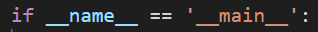

# 모듈(Module)

> 파일 단위의 코드 재사용


| 단어                   | 의미                                                         |
| ---------------------- | ------------------------------------------------------------ |
| 모듈                   | 특정 기능을  구현한 코드를 담고 있는 py 파일                 |
| 패키지                 | 특정 기능과 관련된 모듈의 집합, 패키지 안에 서브패키지가 있을 수 있다. |
| 파이썬 표준 라이브러리 | 파이썬 내부 기본 설치된 모듈과 내장 함수                     |
| 패키지 관리자(pip)     | 외부 패키지를 설치할 수 있도록 도와주는 패키지               |


##  모듈(Module)

> 특정 기능을 하는 코드를 담은 파일 (또는 스크립트)


### 모듈 활용

#### `import`

- 모듈을 활용하기 위해 import로 내장 모듈을 이름 공간으로 가져온다.

- 함수를 자주 사용할 경우, 변수에 할당하여 사용할 수 있다.

```python
import requests

requests.get(url)

get = requests.get
get(url)
```


## 패키지(Package)

> 패키지는 (.)으로 구분된 모듈 이름을 써서 모듈을 구조화한다.


- my_package.math
  - my_package 라는 이름의 패키지 하위에 있는 math 패키지를 의미한다.
- _ _init _ _.py
  - python 3.3 하위버전은 package 안의 init.py 파일을 통해 이것이 package 임을 인식한다.
  - 내용은 비워놓아도 무방하다.


### 패키지 활용

#### `from` *패키지*   `import`  *모듈*

```python
from my_package import intro
intro.intro()
```


#### `from` *패키지.모듈*   `import`  *데이터*

- 특정한 method나 attribute만 활용하고 싶을 때

```python
from my_package.math.tools import e
```


#### `from` *패키지.모듈*   `import`  *

- 해당하는 모듈 내의 모든 변수, 함수, 클래스를 import한다.
- wildcard (*)
- 안 쓰는 것은 안 꺼내는 것이 좋다.


#### `from` *패키지.모듈*   `import`  *데이터*  `as`  별명

- 별칭으로 데이터를 다룰 수 있다.
- 한 번 별칭으로 선언하면 원래의 이름은 인식하지 않는다.
- 변수에 담아서 쓰는 게 낫겠다.

```python
from my_package.statistics.tools import standard_deviation as sd
sd([val1, val2, val3])  # standard_deviation([val1, val2, val3]) 원래 이름 사용할 수 없다.
```


---


#### pycache.py

- java, c는 compile 언어 >> 파일을 처음부터 끝까지 훑고 파일로 만든다. c는 c파일을 실행할 수 없다. c파일을 compiler에 넘겨야 한다. compiler가 만든 프로그램을 실행한다. 코드 수정이 빈번할 경우 매번 컴파일을 거쳐야한다.

- python은 intepreter 언어라서 line by line으로 실행 가능하다. python은 py 파일을 실행할 수 있다. 때문에 속도 차이가 존재한다. 하지만 현재 컴퓨터 성능에서는 무의미한 차이

- 내장 모듈은 수정할 일이 없으니 최초 실행 후 실행파일로 저장하여 (pycache) 사용하게 된다. import한 package의 내부에 생성된다. 그러나 내가 만들지 않은 파일이고 git이 관리를 하게 되니 gitignore한다.


#### _ _ name _ _

- 지금 나를 실행하는 주체가 누구인지 확인한다.
- 파일을 직접 호출하면 name으로 '_ _main _ _'을 확인할 수 있다.
- import를 통해 실행하면 자기 소개를 한다.
- 




#### pip와 setuptools

- pip는 외부 패키지를 다운로드 한다.
- setuptools는 패키지를 업로드한다.

