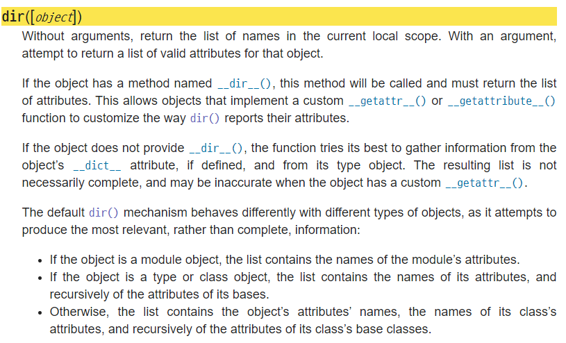

# OOP 2

> 인스턴스와 클래스 간의 name space


## 인스턴스 & 클래스 변수


### 인스턴스 변수

- 인스턴스의 속성

- 각 인스턴스 고유의 값 
- 메서드에서 `self.변수명`으로 정의한다. 
-  `인스턴스.변수명` 


### 클래스 변수

- 클래스의 속성
- 클래스의 모든 인스턴스가 공유한다.
- 클래스 내부에서 선언하고 정의한다.
- `클래스.변수명`


### namespace 탐색 순서

- 클래스 정의하면,  클래스가 생성되며 동시에 class namespace가 생성
- 인스턴스가 생성되면 해당되는 instance namespace가 생성
- 인스턴스의 attribute가 변경되면 변경된 데이터는 instance namespace에 저장
- 인스턴스에서 특정 attribute에 접근하면 
  1. instance namespace 탐색
  2. class namespace 탐색


```python
class Person:
    
    # 클래스 변수
    name = 'person'
    
    def say_your_name(self):
        print(f'{name}')
        
# yujin의 name을 정의하지 않았다.
yujin = Person()

yujin.say_your_name()  # 'person'
```


- method의 namespace와 object의 namespace는 다른 세계이다.
- method의 namespace는 LEGB를 따르고
- object의 namesplace는 instance-class-metaclass를 따른다.


local namespace를 확인하고 싶을 때에는 dir()을 쓴다.




## 인스턴스 & 클래스 & 정적 메서드


### Instance method

- 인스턴스가 사용하는 메서드
- 클래스 내부에서 정의하는 함수는 기본적으로 인스턴스 메서드
- 첫 번째 parameter는 반드시 self


### Class method

- 클래스가 사용하는 메서드
- 인스턴스도 호출할 수 있지만 하지 말자.
- 클래스 변수를 사용해야 할 때 사용한다.
- 첫 번째 parameter는 cls 
- @classmethod


### static method

- 클래스가 사용하는 메서드
- 인스턴스도 호출할 수 있지만 마찬가지로 하지 말자.
- 호출 시 self, cls같은 인자를 필요로 하지 않는다. 
- 인스턴스 변수, 클래스 변수를 사용하지 않을 때 사용한다. (ex.단순 연산)
- @staticmethod


```python
class Myclass:

	def instance_method(self):
        return self
    
    @classmethod
    def class_method(cls):
        return cls
    
    @staticmethod
    def static_method(arg):
        return arg
```

