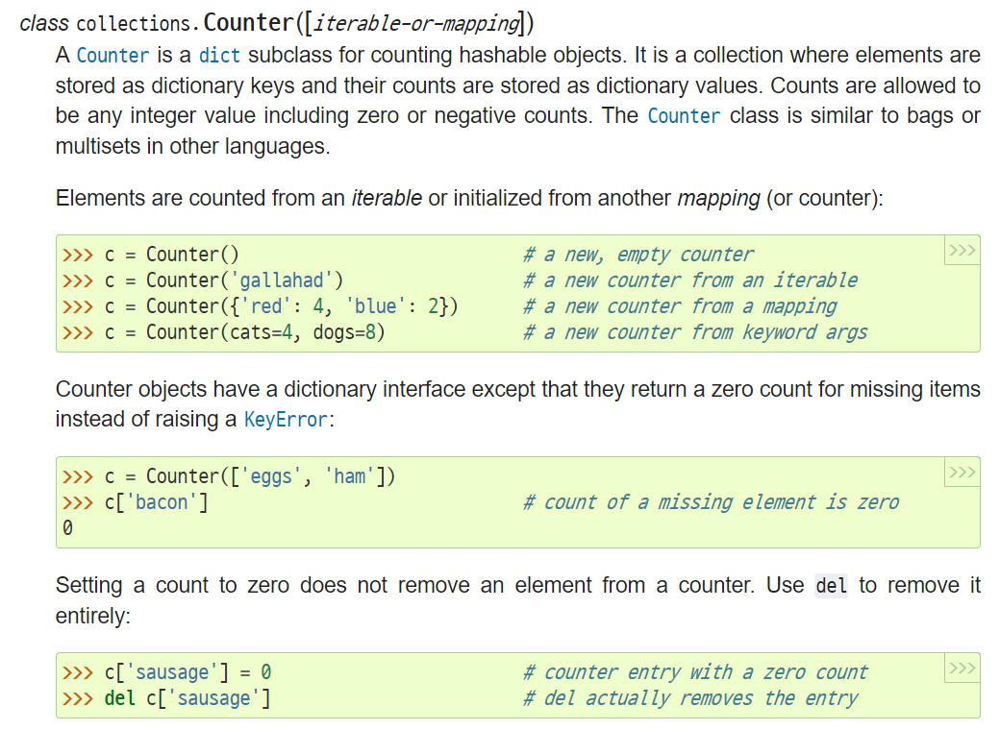
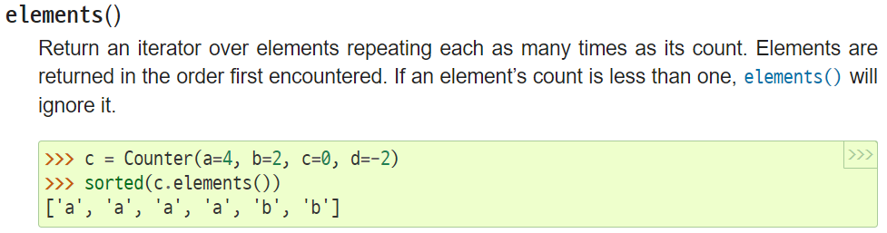
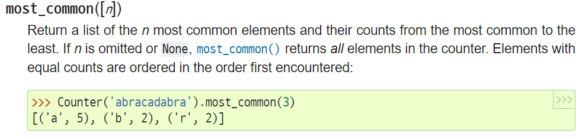
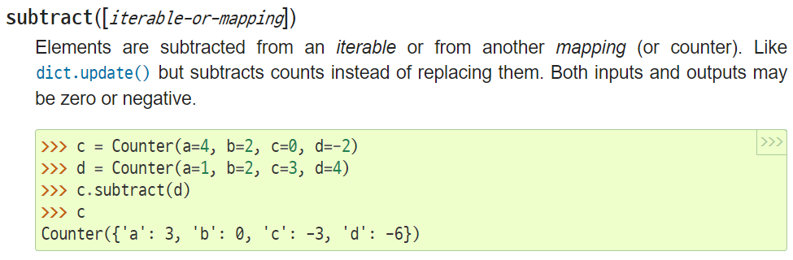
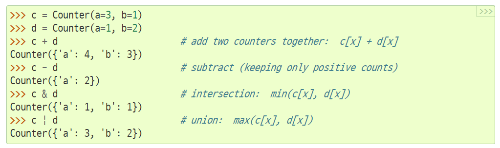

# collections

## 1 Counter

`Counter([iterable-or-mapping])`

- import collections

- dict의 subclass
- hashable objects를 count한다.
- elements를 key로 저장하고 counts가 value로 저장된다.
- insert 순서를 기억한다고 한다.

- methods

  - elements()
    - elements를 반환한다.
    - 

  - most_common
    - 출현의 빈도수를 내림차순 기준으로 반환한다.
    - 상위 몇개를 반환할지 지정할 수 있다.
    - 

  - subtract
    - key를 기준으로 value1에서 value2를 뺀 결과를 반환한다.
    - 

- 연산자 사용
- 