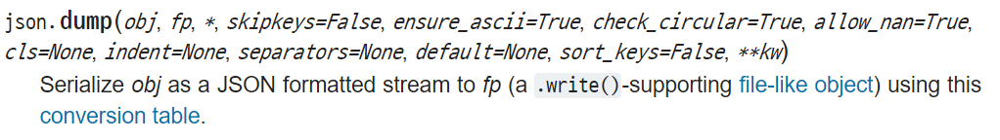
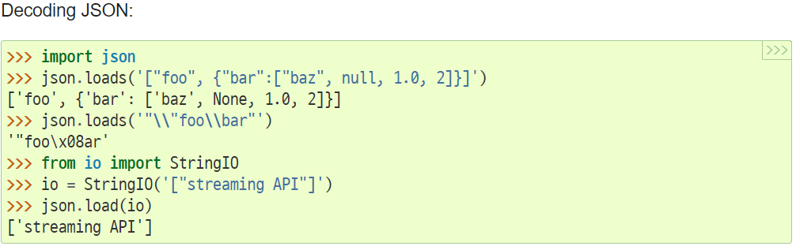

## json

- dictionary와 구조가 닮아있지만 다른 자료 구조

- 같은 역할과 목적

- key와 value의 구조

   

### python IO

`open()`

`open`(*file*, *mode='r'*, *buffering=-1*, *encoding=None*, *errors=None*, *newline=None*, *closefd=True*, *opener=None*)

- encoding = 'utf-8'
- mode = 'r' (read)


## json module

- python object to json




- json to python object





## git upload 시

- README.md
- .gitignore


## datetime 모듈

##### 

```python
from datetime import datetime  # datetime 모듈에서 datetime class 사용

date_str = '2021-01-22'
date_date = datetime.strptime(date_str, '%Y-%m-%d')
date_month = date_date.month
```

- 
- string parsing time이라서 strptime이라고 이해했다.
- format
  - %Y 4자리 연도, %y 2자리 연도
  - str의 format을 적어주어야 date로 변환이 된다. (비웠더니 에러났음)
- https://docs.python.org/3/library/datetime.html
- year, month, day 다 추출 가능하다. 시간도 가능

