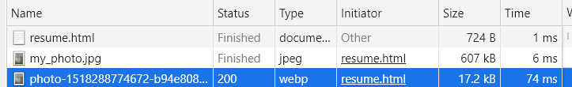

# HTML/CSS

> Hyper Text Markup Language
>
> 웹컨텐츠의 의미와 구조를 정의한다.


## HTML

### HTML 이란?

- Hyper Text
  - 정보가 동일선상에 있지 않고 다중으로 연결되어 있는 상태
  - 참조를 통해 한 문서에서 다른 문서로 이동할 수 있는 Text
  - HTML
  - HTTP
- Markup
  - 태그를 이용하여 문서나 데이터의 구조를 명시하는 언어
  - 프로그래밍 언어와는 다르게 단순하게 데이터를 표현하기만 한다.
  - 단순 텍스트 + 구조 및 의미
- 확장자
  - .`html`


### 기본구조

- `!` + `tab` :자동완성
- `ctrl` + `Enter` : 행바꿈 
- `ctrl` + `shift` + `Enter` : above
- `alt` + `방향키` : 줄바꿈 

```html
<html lang='ko'> <!--문서의 root-->
<head>
    <meta charset='UTF-8'/>
    브라우저에 나타나지 않는다.
    해당 문서 정보(문서 제목, 인코딩 정보 등)를 담고 있다.
</head>
    
    
<body>
    브라우저 화면에 나타나는 정보, 실제 내용
</body>

</html>
```


#### Open Graph Protocol

- 메타 데이터 표현 규약
- HTML 문서의 메타데이터를 통해 문서의 정보를 전달 

- 페이스 북에서 만들었고 메타정보에 해당하는 제목, 설명 등을 쓸 수 있도록 정의

- <meta property="og:title" content="Google 뉴스">


#### DOM (Document Object Model) 트리

- 문서의 객체 지향적 표현

- 문서를 조작할 수 있게 한다.

- 부모 관계, 형제 관계

```html
<body>  <!--tag들의 부모-->
    <ul> 
        <li>ul의 자식</li>
        <li>li의 형제</li>
        <li></li>
    </ul>
</body>
```


### 요소(element)

> 태그 + 내용(contents)

```html
<h1>
    contents
</h1>
```

- 태그 : 내용에 의미 부여
- 요소는 중첩될 수 있고 여러 요소의 집합으로 이루어져 있다.


### 속성 (attribute)

```html
<a href="https://google.com"></a>
```

- 속성명 = 속성값
- 태그별로 사용할 수 있는 속성은 다르다.
- 공백 사용하지 않고 쌍따옴표 사용
- 공통 속성 (몇몇 요소에는 아무 효과가 없을 수 있다.)
  - id, class
  - hidden
  - lang
  - style
  - tabindex
  - title


### 시맨틱 태그

- HTML5 에서 의미론적 요소를 담은 태그의 등장 (개발자, 사용자, 검색엔진에게 의미가 있는 정보의 그룹)
- 단순히 구역을 나누는 것 뿐만 아니라 '의미'를 가지는 태그들을 활용하기 위한 노력
- Non semantic 요소
  - div, span, 
- semantic 요소
  - h1, table
- 가독성이 높고 유지 및 보수가 쉬워진다.
- 접근성이 높아진다.
  - `header` : 문서 전체나 섹션의 헤더(머릿말 부분)
  - `nav` : navigation
  - `aside` : 사이드에 위치한 공간, 메인 콘텐츠와 관련성이 적은 콘텐츠
  - `section` : 문서의 일반적인 구분, 컨텐츠의 그룹을 표현
  - `article` : 문서, 페이지, 사이트 안에서 독립적으로 구분되는 영역
  - `footer` : 문서 전체나 섹션의 푸터(마지막 부분)


### 시맨틱 웹

- 웹 상에 존재하는 수많은 웹 페이지들에 메타데이터를 부여하여
- 기존의 단순한 데이터의 집합이었던 웹페이지를 <의미>, <관련성>을 가지는 거대한 데이터베이스로 구축


### HTML 문서 구조화

#### 인라인/블록요소

- 블록 요소 : 행 전체 공간 차지, 2차원
- 인라인 요소:  콘텐츠 만큼 공간 차지, 1차원

#### 그룹 콘텐츠

- p
- hr : headline
- ol, ul
  - ul>li*3 로 자동완성 가능
- pre, blockquote
- div

#### 텍스트 관련 요소

- `a`
  - anchor 페이지 이동
  - href = url주소
  - attribute 중 target = _blank 하면 새창에서 열린다.
  
    
- b, strong : bold
  - b  : 보여지는 것을 그냥 굵게
  - strong :  굵게 + 의미 강조
- i, em : italic
  - i : 보여지는 것을 기울여
  - em : emphasis 의미 
- span, br, img

  - br : line break 줄바꿈

  - `img`

    ```html
    <!--절대 경로(absolute path)-->
      
    
      <!--상대 경로(relative path)-->
      
    
      <!--Web 경로 (URI > URL)-->
      
    ```

    - 강력 새로고침을 하면 (ctrl+shift+r)  속도 차이가 있음을 확인할 수 있다.

    - 일반 새로고침을 하면 캐시 메모리를 사용하기 때문에 더 빨라진다.

      


#### table

- tr, td, th
  - table row
  - table data
  - table head
- thead, tbody, tfoot
- colspan, rowspan : 셀병합
- scope

#### form

- form은 서버에서 처리될 데이터를 제공하는 역할
- 기본 속성 (key와 value)
  - action = value
  - method

#### input

- 다양한 타입을 가지는 입력 데이터 필드
- label : 서식 입력 요소의 캡션
- 공통 속성
  - name, placeholder
- 굉장히 많은 type이 존재하고 요소의 동작이 type 마다 달라진다.


---


[참고]

- 선택자 with 개발자 도구
  - copy selector
  - python beautiful soup의 select 메서드와 함께 쓰면 의미가 있다.
  - 웹크롤링의 기초
  
- 임의의 text 채우기
  - `lorem` + `tab`