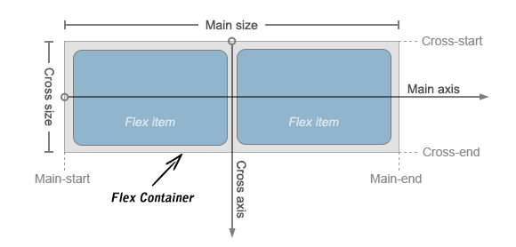
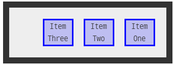
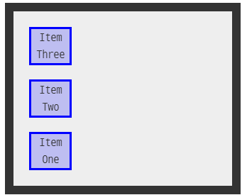
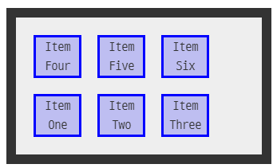
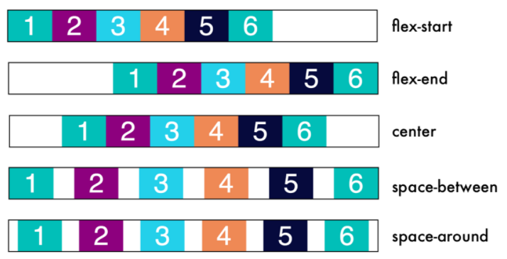

# CSS layout

> 화면 구성하기
>
> display, position을 넘어서서


## Float

> 한 요소가 정상 흐름으로부터 빠져나와 텍스트와 인라인 요소가 그 주위를 감싸 컨테이너의 좌, 우측을 따라 배치된다.


- 텍스트와 함께 어우러지게 이미지를 배치하기 위해 사용된다.
- 정상 흐름을 벗어난다. 비어있는 자리를 다른 요소가 차지할 수 있다.
- 응용하여 elem의 layout을 만드는 데에 사용할 수 있다.
- float이 하위 elem에 영향을 미치지 않도록 clear 하는 과정이 필요하다.


```css
<style>
.left{
      float: left;
    }

/*pseudo 선택자, cleafix 클래스를 가진 elem 이후에, 보이지 않는 elem을 만들어
float을 clear한다. => float된 elem의 빈자리를 다른 elem이 차지하는 것을 막는다.*/
.clearfix::after{
    /* 삽입할 내용을 정하는 property content */
    content: "";
    display: block;
    clear: both;
}
<style>

<body>
  <header class="clearfix">
    <div class="box1 left">div</div>
  </header>
  <div class="box2">div</div>
</body>
```


- 나는 전설이다. (새로운 기술이 많이 나왔기 때문)


## Flex Box

> Css Flexible Box

- 일차원 정렬 레이아웃 모델
- 컨테이너 안의 아이템들의 폭, 높이, 순서를 변경하여 곤간을 채운다.


##### 연습하기

https://flexboxfroggy.com/#ko


### 0) 구성

- flex container : 부모
- flex items :자식

- main axis : 메인축
- cross axis : 교차축





### 1) 시작하기

- container (부모 elem)에 display :flex 또는 inline-flex
- 기본값
  - row
  - 좌에서 우로 
  - nowrap


### 2) 속성

- `flex direction`

  - main axis를 결정한다. (쌓이는 방향)

  - row

    - 행으로 나열된다. (123---->)

  - row-reverse

    - 행으로 나열되는데 뒤에서부터 시작한다. (<----321)

      

  - column

    - 열로 나열된다.

  - column-reverse

    - 열로 나열되는데 뒤에서부터 시작한다. 

      

- `flex-wrap`

  - 넘치는 한 줄을 여러줄로 만든다.

  - nowrap

    - 기본값, 한 줄에 나열한다. (자리 없으면 튀어나옴)

  - wrap

    - items가 container를 벗어날 경우, 다음줄에 이어서 나열한다.

  - wrap-reverse

    - wrap일때 마지막 줄이 첫 줄이 된다.

      

- `justify`

  - main-axis 기준으로 정렬한다.

- `align`

  - cross-axis 기준으로 정렬한다.

- `flex-flow`

  - flex direction + flex-wrap

    ```css
    flex-flow: column wrap;
    ```

    


- `content`
  - 여러줄 사이의 간격을 정한다.
    - flex-start
      - 시작점에 붙여 정렬
    - flex-end
      - 끝점에 붙여 정렬 (순서가 바뀌는 것이 아님)
    - center
      - 가운데 정렬
    - space-between
      - items 양 끝에 붙여 정렬
    - space-evenly
      - items 간격이 동일, 균등 분할
    - space-around
      - items 내부 간격이 외부 간격의 2배 
  - 


- `items`
  - 한 줄 안의 간격을 정한다.
    - flex-start
    - flex-end
    - center
    - baseline
      - item 내부의 text에 기준선을 맞춘다.
    - stretch
      - 컨테이너 공간을 최대한 채우며 늘린다.
- `self`
  - item 하나를 control한다.
    - order
      - 기본값 0
      - 숫자가 작을 수록 우선순위를 가진다.
    - flex-grow
      - 기본값 0
      - container 빈 공간을 채우며 숫자에 따라 차지하는 공간 비율이 달라진다.
      - 음수는 불가능


##### 주의

- justify-items, justify-self는 flex box 안에서 ignored된다.