# Bootstrap

> responsive grid system
>
> 오픈 소스 프론트엔드 라이브러리
>
> one source multi use


## 1 시작하기

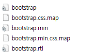

- 4개가 1세트
- bootstrap.css와 bootstrp.min.css는 같은 파일이지만 min은 한 줄로 줄인 것
- 부하가 덜 걸리도록
- bootstrap.css.map은 디버깅할 때 사용(우리는 신경쓰지 않을 것)
- 보기 편하니까 일반 css 파일을 쓰겠다.


##### 뭘 가져와야 하나요?

- 다 들어있는 것을 가져오자.

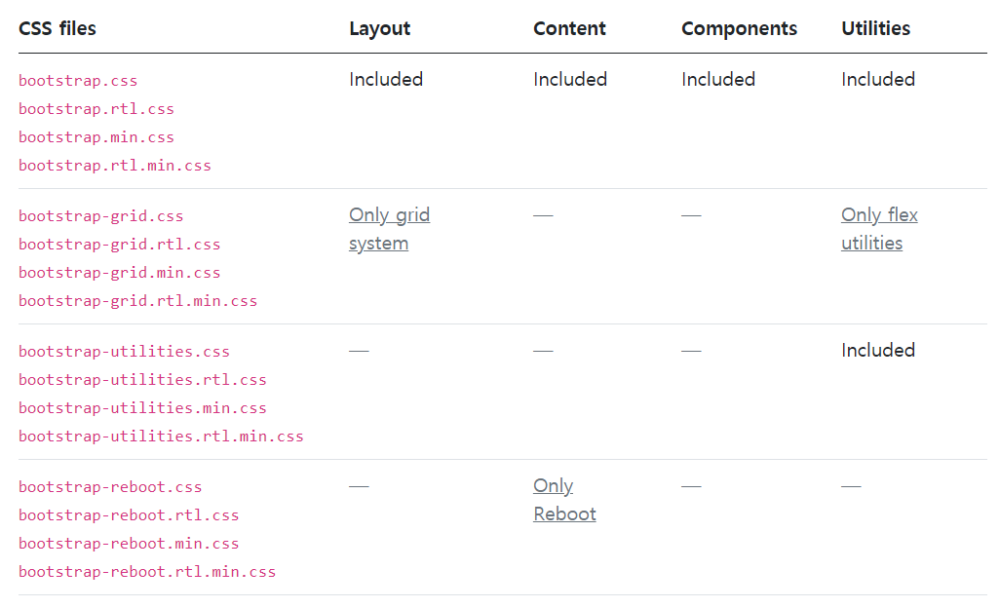

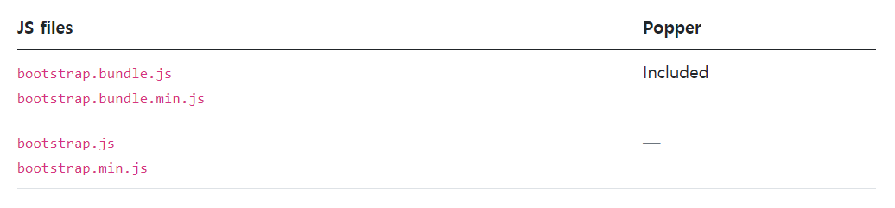


##### 브라우저의 기본 css를 reset하기


- Reset (Aggressive)
- Nomalize  (Gentle)
  - bootstrap은 nomalize를 cutomize했다.


### CDN

> Content Delivery (distribution) Network
>
> 콘텐츠를 효율적으로 전달하기 위해 여러 노드에 가진 네트워크에 데이터를 제공하는 시스템
>
> end-user의 가까운 서버를 통해 빠르게 전달 가능(지리적 이점)
>
> 외부 서버를 활용하기 때문에 본인 서버의 부하가 적어짐


```html
<link href="https://cdn.jsdelivr.net/npm/bootstrap@5.0.0-beta1/dist/css/bootstrap.min.css" rel="stylesheet" integrity="sha384-giJF6kkoqNQ00vy+HMDP7azOuL0xtbfIcaT9wjKHr8RbDVddVHyTfAAsrekwKmP1" crossorigin="anonymous">
```


```html
<script src="https://cdn.jsdelivr.net/npm/bootstrap@5.0.0-beta1/dist/js/bootstrap.bundle.min.js" integrity="sha384-ygbV9kiqUc6oa4msXn9868pTtWMgiQaeYH7/t7LECLbyPA2x65Kgf80OJFdroafW" crossorigin="anonymous"></script>
```


- minified된걸 가져온다.


## 2 사용하기


### 1) spacing

https://getbootstrap.com/docs/5.0/utilities/spacing/

```css
.mt-1{
	margin-top: 0.25rem !important
}
```


- bootstrap의 이름 규칙을 학습해야 한다.
- 0.25 rem = 16px * 0.25


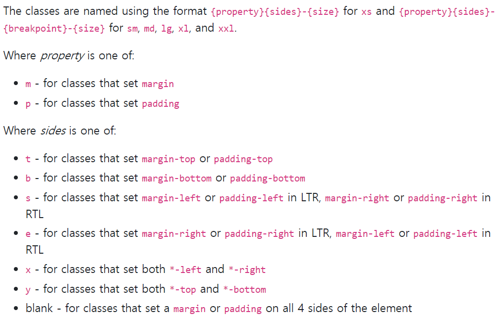

##### * s = start, e =end


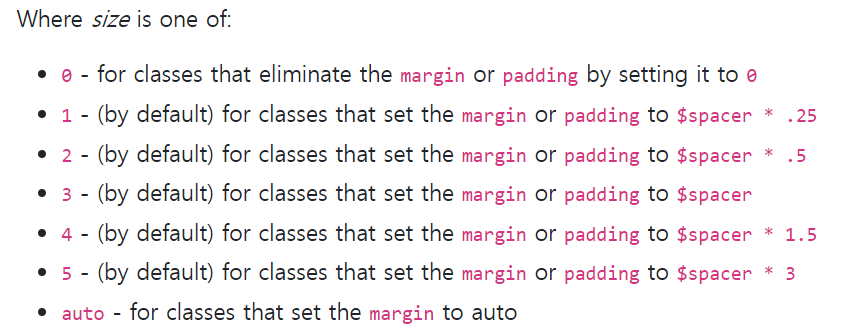

---


### 2) color

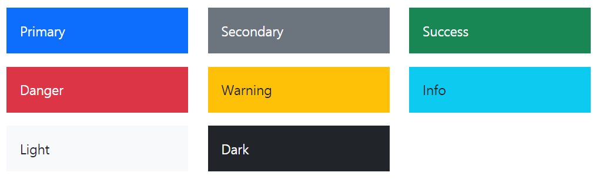


---


### 3) Display


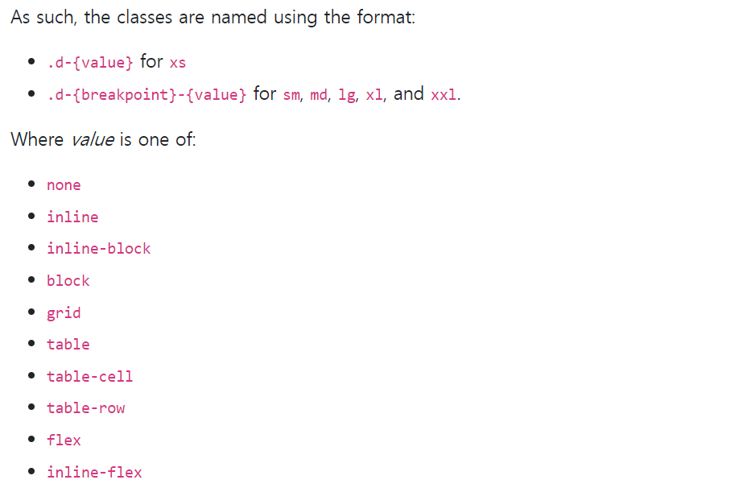


##### `breakpoint`

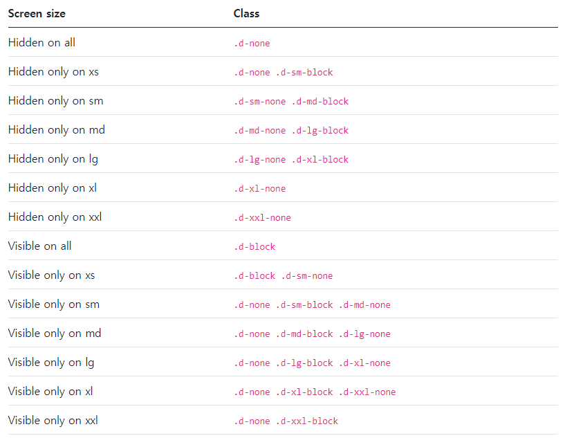


### 4) Position

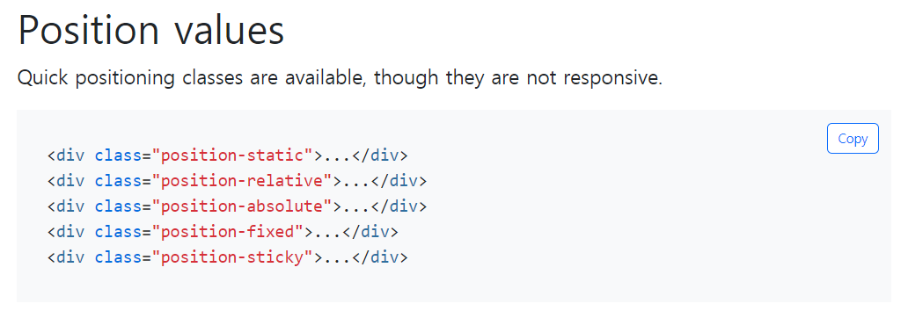

##### *fixed 고정된다

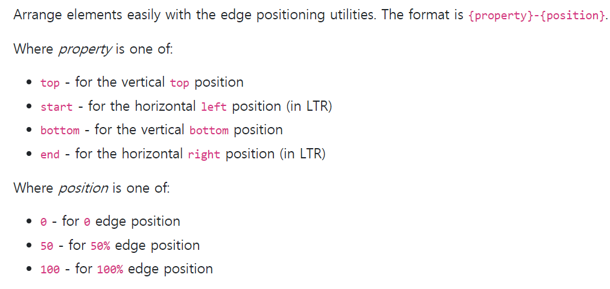


----


## 3 반응형 웹

> 다양한 화면 크기를 가진 디바이스들이 등장함게 따라 responsive web design 개념이 등장
>
> flex box, bootstrap grid box


### Grid System

> flexbox grid로 내부 구현/ 12 column system/ 6 default responsive tiers (계층 구조)


#### 1) 구성

1. container
2. rows
   1. columns의 wrapper
   2. columns 사이에 좌우 패딩이 있는데 gutter라고 하고 `no-gutter` 클래스 사용가능
3. column
   1. 12개의 column, 약수가 많아 나누기 좋다.
   2. column 숫자 생략 시 균등 분할 한다.
4. nesting 가능하다. (row안의 row안의 row)

```html
<div class="container">
  <div class="row">
    <div class="col-sm">
      One of three columns
    </div>
    <div class="col-sm">
      One of three columns
    </div>
    <div class="col-sm">
      One of three columns
    </div>
  </div>
</div>
```


#### 2) grid breakpoint

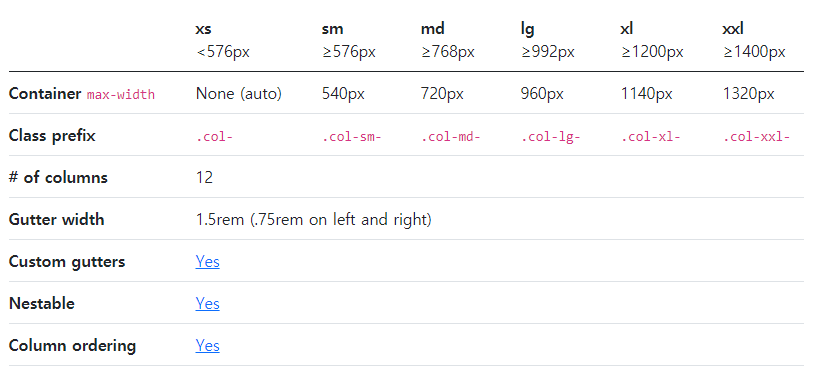


#### 3) offset

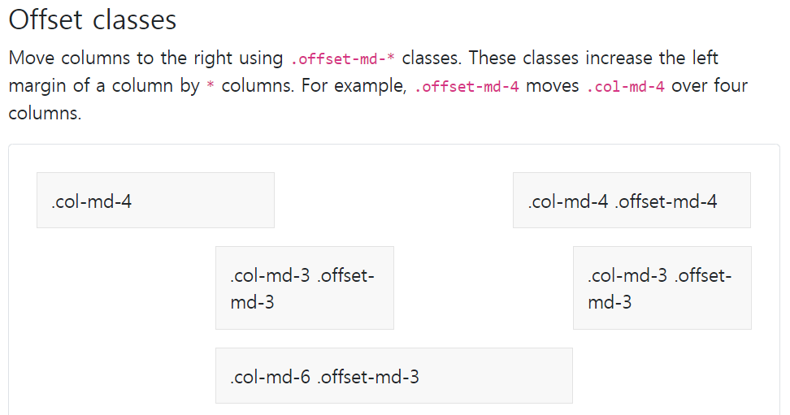


#### 4) alignment

##### 내부적으로 flex를 사용하고 있다.

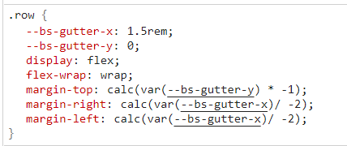


##### 따라서 display flex의 property를 row에서 사용할 수 있다. col에는 self property를 사용할 수 있다.

#### https://getbootstrap.com/docs/5.0/utilities/flex/


