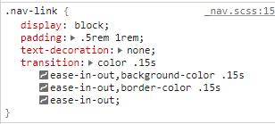
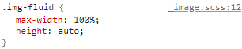
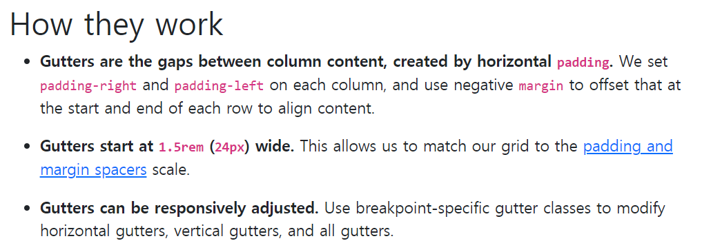
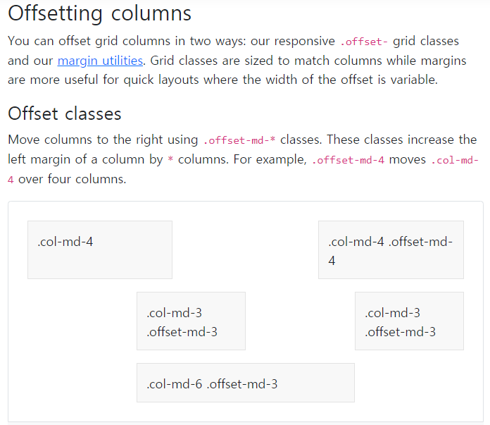
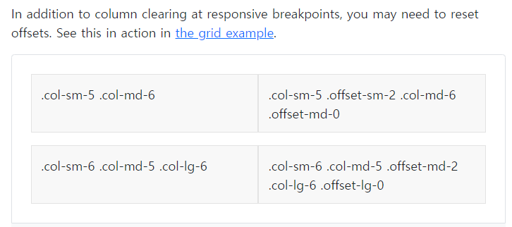

# Bootstrap practice


## 1. nav

- nav의 a 태그는 text decoration이 기본적으로 none으로 보이는데,
- class nav-link 덕분이다. 
- padding 값도 준다. 




## 2 Image

- img를 삽입할 때, 부모 elem의 크기에 맞게 100%로 맞추기 위해서는
- class img-fluid




## 3 Break point

- break point에 따라 화면 구성을 다르게 하기 위해서는
- media 쿼리를 사용할 수 있다.

```css
// X-Small devices (portrait phones, less than 576px)
@media (max-width: 575.98px) { ... }

// Small devices (landscape phones, less than 768px)
@media (max-width: 767.98px) { ... }

// Medium devices (tablets, less than 992px)
@media (max-width: 991.98px) { ... }

// Large devices (desktops, less than 1200px)
@media (max-width: 1199.98px) { ... }

// X-Large devices (large desktops, less than 1400px)
@media (max-width: 1399.98px) { ... }

// XX-Large devices (larger desktops)
// No media query since the xxl breakpoint has no upper bound on its width
```


- 하지만 더 쉬운 방법은 `row`와 `col`을 적절하게 사용하는 것이다.
- 혁신적!! 너무 신기하고 좋다!!
- `col`-{breakpoint}-number
- 해당 breakpoint에서 col의 비율이 어떻게 될지 결정할 수 있다.
- 아래대로 실행하면 sm일 때엔 1개씩, md일 때엔 2개씩, lg일 때엔 4개씩 보일 것이다

```html
 <section class="row mt-5">
          <article class="col-sm-12 col-md-6 col-lg-3">
            <a class="card text-decoration-none text-dark" href="#">
              
              <div class="card-body">
                <p class="card-text mb-0">Buds</p>
                <p class="card-text">179,000</p>
              </div>
            </a>
          </article>
          <article class="col-sm-12 col-md-6 col-lg-3">
            <a class="card text-decoration-none text-dark" href="#">
              
              <div class="card-body">
                <p class="card-text mb-0">Buds</p>
                <p class="card-text">179,000</p>
              </div>
            </a>
          </article>
          <article class="col-sm-12 col-md-6 col-lg-3">
            <a class="card text-decoration-none text-dark" href="#">
              
              <div class="card-body">
                <p class="card-text mb-0">Buds</p>
                <p class="card-text">179,000</p>
              </div>
            </a>
          </article>
          <article class="col-sm-12 col-md-6 col-lg-3">
            <a class="card text-decoration-none text-dark" href="#">
              
              <div class="card-body">
                <p class="card-text mb-0">Buds</p>
                <p class="card-text">179,000</p>
              </div>
            </a>
          </article>
      </section>
```


## 4 Row Column Gutters

- section, aside로 고정된 공간을 차지하는게 아니라 evenly하게 col을 가진다면 gutter를 사용할 수 있다.
- row에서 모든 것을 설정한다.
- `row-cols`-{breakpoint}-{col 개수}
- g-{breakpoint}-{숫자}
- col의 개수와 col 사이의 거리를 결정할 수 있다.

https://getbootstrap.com/docs/5.0/layout/gutters/#row-columns-gutters

```html
<div class="container">
  <div class="row row-cols-2 row-cols-lg-5 g-2 g-lg-3">
    <div class="col">
      <div class="p-3 border bg-light">Row column</div>
    </div>
    <div class="col">
      <div class="p-3 border bg-light">Row column</div>
    </div>
    <div class="col">
      <div class="p-3 border bg-light">Row column</div>
    </div>
    <div class="col">
      <div class="p-3 border bg-light">Row column</div>
    </div>
    <div class="col">
      <div class="p-3 border bg-light">Row column</div>
    </div>
    <div class="col">
      <div class="p-3 border bg-light">Row column</div>
    </div>
    <div class="col">
      <div class="p-3 border bg-light">Row column</div>
    </div>
    <div class="col">
      <div class="p-3 border bg-light">Row column</div>
    </div>
    <div class="col">
      <div class="p-3 border bg-light">Row column</div>
    </div>
    <div class="col">
      <div class="p-3 border bg-light">Row column</div>
    </div>
  </div>
</div>
```


- gutter를 주면 col 사이에 padding-left와 padding-rigth 값을 조절해준다.
- 1.5rem에서 시작한다.
- horizontal은 gx-{숫자} / vetical은 gy-{숫자}




## 5 Offset

- offset이 제대로 안 먹었다? 당황하지 말 것
- 작은 breakpoint에서 offset을 설정하면 clear하거나 새로 정의할 때까지 계속 적용된다.
- sm에서 offset을 적용하고 lg에서 새로운 offset을 적용해야 할 경우
- offset-{breakpoint}-0을 사용하여 기존의 offset을 상쇄시켜야 한다.


##### 기본 사용법



```html
<div class="container">
  <div class="row">
    <div class="col-md-4">.col-md-4</div>
    <div class="col-md-4 offset-md-4">.col-md-4 .offset-md-4</div>
  </div>
  <div class="row">
    <div class="col-md-3 offset-md-3">.col-md-3 .offset-md-3</div>
    <div class="col-md-3 offset-md-3">.col-md-3 .offset-md-3</div>
  </div>
  <div class="row">
    <div class="col-md-6 offset-md-3">.col-md-6 .offset-md-3</div>
  </div>
</div>
```


##### *offset clear하기



```html
<div class="container">
  <div class="row">
    <div class="col-sm-5 col-md-6">.col-sm-5 .col-md-6</div>
      
      <!--offset-sm이 적용되고 있기 때문에 offset-md-0으로 clear한다.-->
    <div class="col-sm-5 offset-sm-2 col-md-6 offset-md-0">.col-sm-5 .offset-sm-2 .col-md-6 .offset-md-0</div>
  </div>
  <div class="row">
    <div class="col-sm-6 col-md-5 col-lg-6">.col-sm-6 .col-md-5 .col-lg-6</div>
    <div class="col-sm-6 col-md-5 offset-md-2 col-lg-6 offset-lg-0">.col-sm-6 .col-md-5 .offset-md-2 .col-lg-6 .offset-lg-0</div>
  </div>
</div>
```

