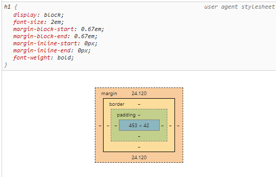
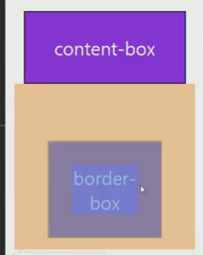

# HTML/CSS


## CSS 기본

> Cascading Style Sheet

- 스타일, 레이아웃 등을 통해 HTML 문서를 표시하는 방법을 지정하는 언어


#### CSS 구문

```css
h1 { /*선택자(Selector)*/
    color: blue; //선언(Declaration) = 속성(property) : 값(value)
    font-size: 15px;
}
```


#### 정의 방법

1. 인라인

   ```html
   <h1 sytle = font-size: 15px; color:blue;>heading 1</h1>
   ```

   

2. 내부 참조

   ```html
   <head>
   	<style>
   		h1 {
   			font-size: 15px;
               color: blue;
   		}
   	</style>
   </head>
   ```

   

3. 외부 참조

   - 제일 많이 쓰는 참조 방법 
   - 상황에 따라서 다르게 style을 적용할 수 있기 때문

   ```html
   <link rel="stylesheet" href="mystyle.css">
   ```

   

#### 선택자 (Selector)

> HTML 문서에서 특정한 요소를 선택하여 스타일링 하기 위해 반드시 선택자 개념이 필요하다


- 기본선택자

  - 전체 선택자 *

  - 요소 선택자 

    - h1, p

  - 클래스 선택자

  - 아이디 선택자

  - 속성 선택자

    

    ##### class 선택자

    - 클래스 선택자는 마침표(.)로 시작하며 해당 클래스가 적용된 문서의 모든 항목을 선택한다

    ##### id 선택자

    - 아아디 선택자는 우물정자(#)로 시작하며 기본적으로 클래스 선택자와 같은 방식으로 사용한다.
    - 그러나 id는 문서당 한 번만 사용할 수 있고 요소에는 단일 id 값만 적용할 수 있다.
    - 원칙적으로 한 문서에 한 아이디


- 결합자 (combinators)

  - 자손 결합자
  - 자식 결합자
  - 일반 형제
  - 인접 형제 결합자

- 의사 클래스/요소 (pseudo class)

  - 링크, 동적 의사 클래스
  - 구조적 의사 클래스


```html
<style>
    /* # ssafy 자식 중에 2번째 자식이 p라면 (if) */
    #ssafy> p:nth-child(2){
      color: red;
    }

    /* # ssafy 자식 중 2번째 p*/
    #ssafy> p:nth-of-type(2){
      color:blue;
    }
 </style>
```


#### 선택자의 우선순위

```
1. !important (사용 시 주의)
2. 인라인 sytle
3. id 선택자
4. class 선택자  # 주로 사용한다.
5. 요소 선택자
6. 소스 순서  # 마지막에 오는 소스가 덮어씌운다
```


#### CSS 상속

- CSS 는 상속을 통해 부모 요소의 속성을 자식에게 상속한다.
  - text 관련 요소(font, color, text-align)
  - opacity
  - visibility
- 상속되지 않는 예시
  - box model : width, height, margin, padding, border, box-sizing, display
  - position : position, top/right/bottom/left, z-index


#### (상대) 크기 단위

- px (픽셀)
  - 디바이스마다 px 달라질 수 있다.
- %
  - 브라우저 크기와의 비율
- em
  - 배수단위
  - 요소에 지정된 사이즈에 상대적인 사이즈를 가진다.
  - 부모의 사이즈에 영향을 받는다
- rem
  - Root인 HTML의 사이즈(16px)를 기준으로 배수 단위를 가진다.
  - 최상위 요소인 HTML이 기준이다.
- Viewport
  - vw, vh, vmin, vmax
  - 우리가 보는 viewport 기준으로 결정된다.


#### 색상 단위

1. 색상 키워드
2. RGB 색상
   1. ''#'000000' 
   2. rgb(0,0,0)
   3. rgba (a는 투명도)
3. HSL
   1. 색상, 채도, 명도


## CSS Box Model





1. margin
   1. 테두리 바깥의 여백
   2. 배경색 지정할 수 없다
2. border
3. padding
   1. 테두리와 콘텐츠 사이의 안쪽 여백
   2. 요소에 적용된 배경색
4. content 
   1. 글이나 이미지 요소의 실제 내용


```css
.margin{
    margin-top: 10px;
    margin-right: 20px;
    margin-bottom: 10px;
    margin-left: 20px
}

.margin-padding{
    margin:10px;
    padding:30px
}

.border{
    border-width:: 2px;
    border-style:dashed;
    border-color:black;
}

/*개수에 따라서 다르다. margin의 short hand*/
.margin-1{
    margin:10px; //상하좌우
}

.margin-2{
    margin: 10px 20px //상하, 좌우
}

.margin-3{
    margin: 10px 20px 30px; //상, 좌우, 하
}

.margin-4{
    margin: 10px 20px 30px 40px // 상, 우, 좌, 하
}

/*auto로 쉽게 가운데 정렬할 수 있다.*/
.box1{
    margin: 0 auto
}
```


### box size

- width 결정하기
  - content-box (기본값)
    - padding을 제외한 순수 contents 영역만을 box로 지정
  - border-box (우리가 원하는 것)
    - box-sizing을 border-box로 설정


```css
 *{
     box-sizing: border-box;
  }
```


### 마진 상쇄 (Margin collapsing)

- margin이 큰 형제의 margin으로 덮어씌워진다.
- top, bottom 경우에서 발생한다.
- content-box의 margin이 10이고 border-box의 margin이 50이라면 전체 margin은 60이 아니다.
- margin 50 으로 덮어쓴다.





## CSS Display

### display

- display: block

  - 줄바꿈이 일어나는 요소
  - 화면 크기 전체의 가로 폭을 차지한다
  - 블록 레벨 요소 안에 인라인 레벨 요소가 들어갈 수 있다
  - 기본은 너비 100%
  - margin으로 정렬한다

  

- display: inline

  - width, height, margin을 지정할 수 없다.
  - 콘텐츠 크기만큼 공간을 차지한다.
  - text-align으로 정렬한다

  

- display : inline-block

  - block과 inline 요소의 특징을 모두 갖는다
  - inline처럼 한 줄에 표시 가능하고
  - block처럼 width, height, margin 속성 지정 가능하다.

  

- display:none

  - 해당 요소를 화면에 표시하지 않는다 (공간이 사라진다.)
  - visibility: hidden은 해당요소가 공간은 차지하나 화면에 표시만 하지 않는다.


## CSS Position

