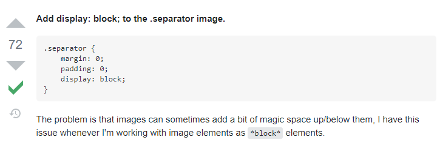
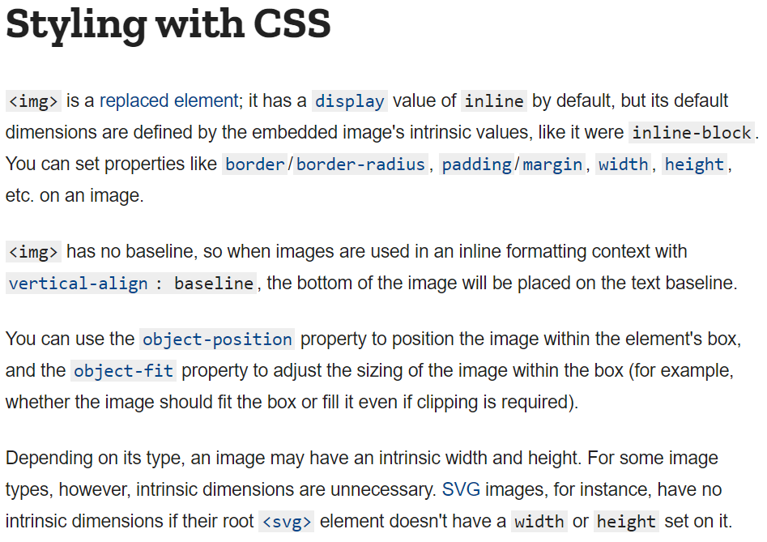
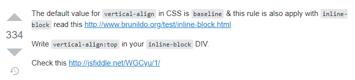
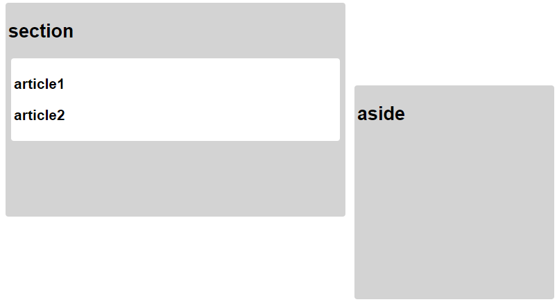

# CSS practice


## Property 다루기


### 1 box & text styling

```css
<style>
    div {
      /*box(div)에 관한 styling*/
      height: 100px;
      width: 100px;
      background-color: purple;
      margin: 0 auto;

      /*content(text)에 관한 styling*/
      color: white;
      line-height: 100px;  /*행간*/
      text-align: center;
    }
  </style>
```


### 2 magic space between img and div

- margin, padding을 0으로 줬는데도 img와 div 사이에 틈이 생겼다.
- 그럴땐 img의 display= block으로




- img는 기본적으로 inline 요소이지만 inline-block처럼 width, height를 지정할 수 있다.

  




### 3 inline-block element not on the same line

- aside 객체가 밑으로 내려가 있다.
- 왜냐하면 저 위치가 base line이기 때문이다. 
- vertical-align: top 해주면 올라온다.
- http://www.brunildo.org/test/inline-block.html



