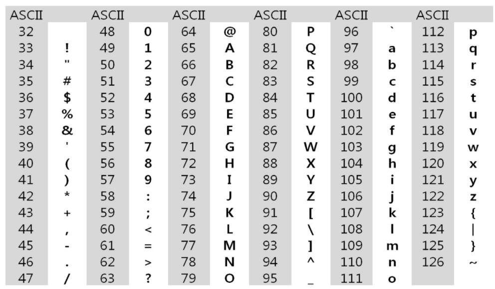

# String


## 문자열 


### 컴퓨터에서의 문자 표현

- 메모리는 숫자만을 저장하기 때문에 
- 각 문자에 대응하는숫자를 메모리에 저장
- 영어 대소문자 52자는 6비트로 모두 표현 가능하다
- ASCII
  - 문자 인코딩 표준
  - 7bit 인코딩으로 128문자 표현
  - ord()



- 유니코드
  - 다국어 처리를 위한 표준
  - Character Set으로 분류
  - 바이트 저장 순서가 표준화 되어 있지 않아 외부 인코딩 필요하다
  - UTF-8 (web)


### 문자열의 분류

- fixed length
  - 고정길이
- variable length
  - 가변길이
  - length controlled
    - java 언어에서의 문자열
  - delimited
    - c언어에서의 문자열
    - \0


### Python 에서의 문자열 처리
- char 타입 없음
- 텍스트 데이터의 취급 방법이 통일
- 문자열 기호
  - `'` , `"`, `'''`, `"""`
  - `+`
    - concatenation
  - `*`
  - `\`
    - escape 문자
  - sequence 자료형
    - 인덱싱
    - 슬라이싱 연산
  - immutable


#### C와 Java String 처리

- c는 아스키 코드로 저장
- java는 유니코드 (UTF16, 2byte)
- python은 유니코드(UTF8)


## 문자열 뒤집기

- 자기 문자열에서 뒤집기
  - swap을 위한 임시변수 필요하고 (java)
  - 반복 수행은 문자열 길이의 절반만을 수행한다.
- 새로운 빈 문자열을 만들어 뒤에서 읽어 타켓에 쓰기


- reverse()
- [::-1]


## 문자열 비교

- `==`
  - 내부적으로 _ eq _() 를 호출한다
- is
  - 같은 객체인지 확인한다.


## 문자의 표현


### 문자열 숫자를 정수로 변환하기

- atoi
  - askii to int


```python
def atoi(str_num):
    
    value = 0
    for i in range(len(str_num)):
        value += value*10 + ord(str_num[i])-ord('0')
        
    return value
```


### 정수를 문자열 숫자로 변환하기

- itoa

```python
def i_to_a(number):
    value = ''

    arr = []
    while number>0:
        arr.append(number%10)
        number //= 10

    for i in range(len(arr)//2):
        arr[i], arr[len(arr)-1-i] = arr[len(arr)-1-i], arr[i]

    for n in arr:
        value += chr(n+ord('0'))
    return value
```


## 패턴 매칭

### 1 고지식한 패턴 검색 알고리즘 (Brute Force)

> 본문 문자열을 처음부터 끝까지 차례대로 순회하면서 패턴 내의 문자들을 일일이 비교한다.

```python
p = 'is'  # 찾을 패턴
t = 'This is a book'  # 전체 텍스트
M = len(p)  # 찾을 패턴의 길이
N = len(t)  # 전체 텍스트의 길이

def BruteForce(p, t):
    i = 0  # t의 인덱스
    j =0  # p의 인덱스
    while j < M and i < N:
        
        if t[i] != p[j]:
            i = i-j  # 원점으로 돌아온다
            j = -1
            
        i = i+1  # 다음으로 간다
        j = j+1
        
    if j == M: 
        return i-M  # 검색성공
    else:
        return -1  # 검색실패
```


#### 시간복잡도

- 최악의 경우
  - O(MN)


### 2 KMP

> 불일치가 발생한 텍스트 문자열의 앞부분에 어떤 문자가 있는지를 미리 알고 있으므로
>
> 불일치가 발생한 앞 부분에 대해서 다시 비교하지 않는다.

- 패턴을 전처리 한다
- 잘못된 시작을 최소화한다.
- next[M]
  - 불일치가 발생했을 경우 이동할 다음 위치를 계산한다


#### 시간복잡도

- O(M+N)


### 3 보이어-무어

> 오른쪽에서 왼쪽으로 비교
>
> 대부분의 상용 소프트웨어에서 채택


- 패턴에 오른쪽 끝에 있는 문자가 불일치하고 
- 이 문자가 패턴 내에 존재하지 않는 경우
- 이동 거리는 패턴의 길이만큼


#### 시간복잡도

- 최악의 경우
  - O(MN)