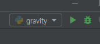

# pycharm으로 debugging하기

## 1. debugging 시작

- 검사할 breaking point 선택

- run 버튼 옆의 debug 버튼 클릭
- F9

- input 값 입력 후 enter하면 debugging 창이 뜬다.

- 현재 선언되어 있는 변수의 상태를 한 눈에 확인할 수 있다.

- F8을 누르면서 한 단계씩 검증해볼 수 있다 (변수의 변화)

