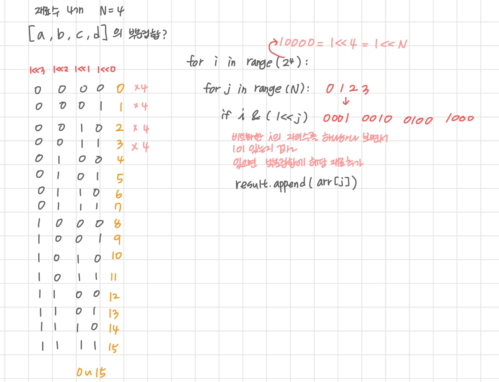

# list2


## 2차원 배열


### 2차원 배열의 선언

- 1차원 list를 묶어놓은 list
- 세로길이(행의 개수), 가로 길이 (열의 개수)를 필요로 함
- 데이터 초기화를 통해 변수선언과 초기화


### 배열 순회

> nxm 배열의 n*m개의 모든 원소를 빠짐없이 조사하는 방법

#### 행 우선 순회

```python
# i 행, j 열
for i in range (len(array)):
	for j in range(len(array[i])):
		array[i][j]
```


#### 열 우선순회 

```python
# i 행, j 열
for j in range(len(array[0])):
    for i in range(len(array)):
        array[i][j]
```


#### 지그재그 순회

```python
# i 행, j 열
for i in range(len(array)):
    for j in range(len(array[0])):
        array[i][len(array[0]-1-j)] if j%2 else array[i][j]
        
        # array[i][j + (m-1-2*j)*(i%2)]
            
```


#### 델타를 이용한 2차 배열 탐색

- 2차 배열의 한 좌표에서 4방향의 인접 배열 요소를 탐색한다

```python
array[0...n-1][0...n-1]
dr[] = [-1, 1, 0, 0]  # 헹
dc[] = [0, 0, -1, 1]  # 열

for x in range(len(array)):
    for y in range(len(array[x])):
        for i in range(4):
            tx = x + dr[i]
            ty = y + dc[i]
            
            print(array[tx][ty])
            
# 범위에 따라 조건문으로 제어 작업 필요하다.
```


#### 전치 행렬

```python
# arr은 3x3 행렬

for i in range(3):
    for j in range(3):
        if i<j:
            arr[i][j], arr[j][i] = arr[j][i], arr[i][j]
```


## 부분집합 합 (Subset Sum) 문제

- 유한 개의 정수로 이루어진 집합이 있을 때 
- 이 집합의 부분집합 중에서 그 집합의 원소를 모두 더한 값이 0이 되는 경우
- 완전 검색 기법
- 모든 부분 집합을 생성한다.


##### 라면 + (계란, 치즈, 떡)

- 2 * 2 * 2
- 재료가 들어가거나 안 들어가거나 


### 부분집합의 수

- 집합의 원소가 n개 일 때, 공집합을 포함한 부분집합의 개수는 2**n 개


### 생성하기

```python
bit = [0, 0, 0, 0]

for i in range(2):
    bit[0] = i
    for j in range(2):
        bit[1] = j
        for k in range(2):
            bit[2] = k
            for l in range(2):
                bit[3] = l
```


### 비트 연산자

- `&`
  - 비트 단위로 AND 연산
  - 둘 다 참일 때 참
  - i & (1<<j)
  - i의 j번째 비트가 1인지 아닌지 리턴한다.
- `|`
  - 비트 단위로 OR 연산
  - 둘 중 하나라도 참이면 참
- `<<`
  - 피연산자의 비트 열을 왼쪽으로 이동
  - 1 << n = 2**n
  - 원소가 n개일 경우의 모든 부분집합의 수
  - 1 번 연산할 때 마다 값이 2배씩 높아진다
  - 2 << 3 = 16
- `>>`
  - 피연산자의 비트 열을 오른쪽으로 이동
  - 1 번 연산할 때마다 값이 2배씩 낮아진다


```python
arr = [1, 2, 3, 4]
n = 4  # 원소의 수
for i in range(1<<n):  # 1 << n 부분집합의 개수 0000 ~ 1111 (10000-1)
    answer = ''
	for j in range(n): # 원소의 수 만큼 비트 비교
        if i & (1<<j):  # i의 j번째 비트가 있는지 확인 0001 0010 0100 1000
            answer += arr[j]
   	print(answer)
```





## 검색 (Search)

> 저장되어 있는 자료 중에서 원하는 항목 찾기


- 목적하는 탐색 키를 가진 항목을 찾기
  - 탐색 키 (search key)
  - 자료를 구별하여 인식할 수 있는 키


- 순차검색 (sequential search)
- 이진 검색 (binary search)
- 인덱싱(Indexing)


### 순차 검색

> 일렬로 되어 있는 자료를 순서대로 검색하는 직관적인  검색 방법
>
> 배열이나 연결리스트 등 순차구조로 구현된 자료 구조에 유용함
>
> 검색 대상의 수가 많은 경우 수행시간이 급격히 증가하여 비효율적임


#### 정렬되어 있지 않은 경우

- 첫번 째 원소부터 순서대로 검색 대상과 키 값이 같은 원소가 있는가?
- 키 값이 동일한 원소를 찾으면 원소의 인덱스 반환
- 마지막까지 찾지 못할 경우 검색 실패
- 찾고자 하는 원소 순서에 따라 비교 횟수가 결정된다
- 시간 복잡도 O(n)


```python
def sequentialSearch(a, n, key):
    i = 0
    while i<n and a[i] != key:
        i += 1
        
   	if i< n: 
        return i
    else: 
        return -1
```


#### 정렬이 되어 있는 경우

- 오름차순 정렬된 상태라면?
- 순차적으로 검색하면서 키 값을 비교
- 원소의 값이 검색 대상의 키 값보다 크면 검색을 종료 
- 찾고자 하는 원소의 순서에 따라 비교 횟수가 결정
- 정렬이 되어있으므로 검색 실패 반환하는 경우, 평균 비교 횟수가 절반
- 시간 복잡도 O(n)

```python
def sequentialSearch2(a, n, key):
    i = 0
    
    while i < n and a[i]<key:
        i += 1
    if i< n and a[i] = key:
        return i
    else:
        return -1
```


### 이진검색 (Binary Search)

> 자료의 가운데에 있는 항목의 값과 비교하여 다음 검색의 위치를 결정하고
>
> 검색을 계속 진행한다.
>
> 목적 키를 찾을 때까지 이진 검색을 순환적으로 반복 수행하며 검색 범위를 반으로 줄여간다.


- 이진 검색을 하기 위해서는 자료가 정렬된 상태여야 한다.


#### 검색 과정

- 자료의 중앙 원소 고른다
- 중앙 원소의 값과 목표 값을 비교
- 목표 값이 중앙 원소 값보다 작으면 왼쪽 반에서 검색
- 목표 값이 중앙 원소 값보다 크면 오른쪽 반에서 검색
- 찾을 때 까지 반복


#### 구현

- 검색 범위의 시작점과 종료점을 이용하여 검색 반복 수행
- 자료 삽입, 삭제 발생시 정렬을 유지하는 추가 작업 필요

```python
def binarySearch(a, key):
    start = 0
    end = len(a) - 1
    
    while start <= end:
        middle = (start + end)/2
        
        if a[middle] = key:
            return True
        elif a[middle] > key:
            end = middle - 1
        else:
            start = middle + 1
            
    return False
```


##### 재귀 함수 이용

```python
def binarySearch(a, low, high, key):
    if low > high:
        return False
    else:
        middle = (low + high)//2
        if key == a[middle]:
            return True
        elif key < a[middle]:
            return binarySearch(a, low, middle-1, key)
        elif a[middle] < key:
            return binarySearch(a, middle+1, high, key)
```


## 셀렉션 알고리즘(Selection Algorithm)

> 저장된 자료로 부터 k번째로 큰 혹은 작은 원소를 찾는 방법


- k 번째로 작은 원소 찾는 알고리즘
  - 1~ k번째 까지 작은 원소들을 찾아 배열 앞쪽으로 이동시키고 배열의 k 번째 반환
  - O(kn)


```python
def select(list, k):
    for i in range(0, k) :
        minIndex = i
        for j in range(i+1, len(list)):
            if list[minIndex] > list[j]:
                minIndex = j
        list[i], list[minIndex] = list[minIndex], list[i]
    return list[k-1]
```


## 선택 정렬

> 주어진 자료들 중 가장 작은 값의 원소부터 차례대로 선택하여 위치를 교환하는 방식
>
> 셀렉션 알고리즘을 전체 자료에 적용한 것


### 정렬 과정

- 주어진 리스트에서 최솟값 찾기
- 그 값을 리스트 맨 앞에 위치한 값과 교환
- 맨 처음 위치를 제외한 나머지 리스트 대상으로 과정 반복


### 시간복잡도

- O(n**2)


```python
def selectionSort(a):
    # 미정렬 원소가 하나 남은 상황에서는 마지막 원소가 가장 큰 값을 가지므로 
    # i는 len(a)-2 까지 
    for i in range(0, len(a)-1):
        min = i
        for j in range(i+1, len(a)):
            if a[min] > a[j]:
                min = j
        a[i], a[min] = a[min], a[i]
```


- 버블, 삽입 정렬보다 교환 횟수가 적다.