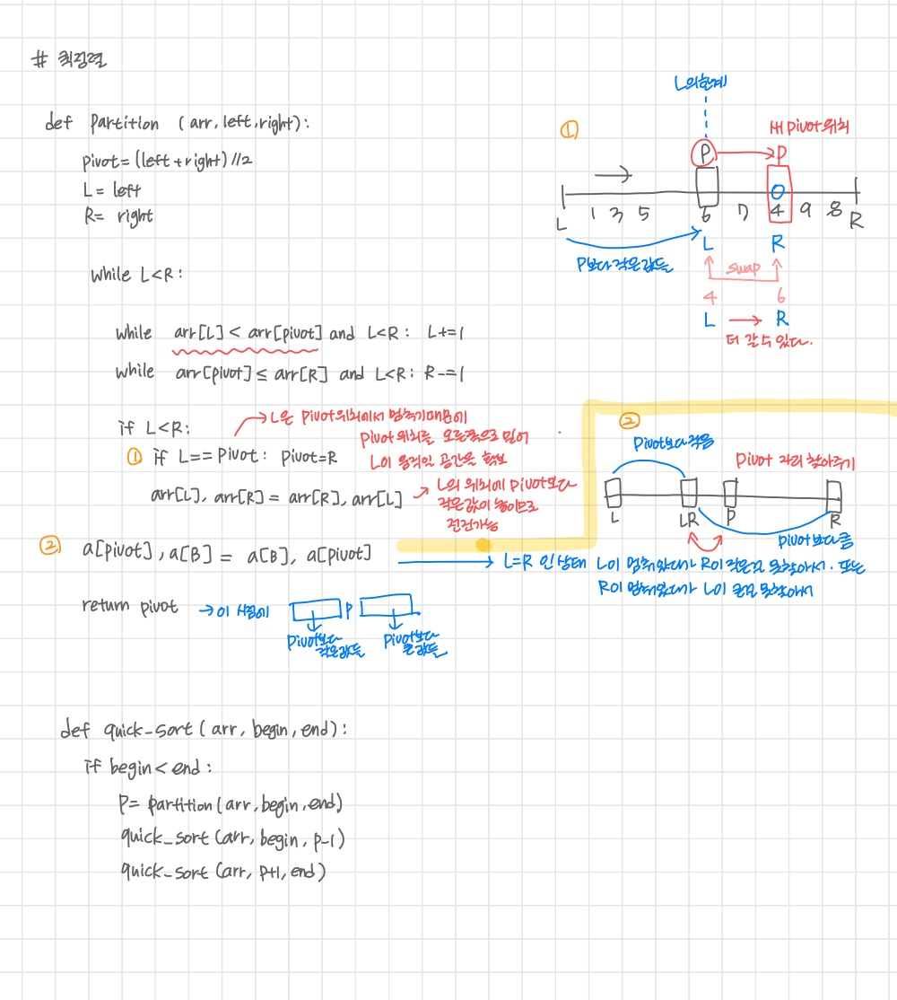

# Stack 2


## 계산기


### 문자열 수식 계산의 일반적 방법

1. 중위 표기법의 수식을 후위 표기법으로 변경 (스택 이용)
   1. 중위 표기법 : 연산자를 피연산자의 가운데 표기하는 방법
      1. A+B
   2. 후위 표기법 :  연산자를 피연산자의 뒤에 표기하는 방법 
      1. AB+
2. 후위 표기법의 수식을 스택을 이용하여 계산한다.


### 중위표기식 -> 후위표기식 변환방법

#### 1

1. 수식의 각 연산자에 대해 우선순위에 따라 괄호를 사용해 다시 표현
2. 연산자를 그에 대응하는 오른쪽 괄호 뒤로 이동
3. 괄호 제거


```
A*B-C/D
1. ((A*B)-(C/D))
2. ((AB)*(CD)/)-
3. AB*CD/-
```


#### 2 스택 이용

##### step1

1. 입력받은 중위 표기식에서 토큰을 읽는다
2. 토큰이 피연산자이면 토큰을 출력
3. 토큰이 연산자일 때, 이 토큰이 top에 저장되어 있는 연산자보다 우선순위가 높으면 push, 그렇지 않다면 스택 top의 연산자의 우선순위가 토큰의 우선순위 보다 작을 때까지 스택에서 pop한 후(출력) push (값이 없을 때에는 push)
4. 토큰이 ')' 이면 스택 top에 '(' 가 올 때까지 스택에 pop 수행하고 출력
5. 왼쪽 괄호는 pop만 하고 출력하지 않는다
6. 중위 표기식에 더 읽을 것이 없다면 중지하고 더 읽을 것이 있다면 1부터 다시 반복
7. 스택에 남아있는 연산자를 모두 pop하여 출력


##### 스택 밖의 왼쪽 괄호는 우선순위가 가장 높고, 스택 안의 왼쪽 괄호는 우선순위가 가장 낮다


##### step2

1. 피연산자를 만나면 스택에 push
2. ,연산자를 만나면 필요한 만큼의 피연산자를 스택에서 pop하여 연산하고 연산 결과를 다시 스택에 push
3. 수식이 끝나면 마지막으로 스택을 pop하여 출력


## 🧶백트래킹

> 해를 찾는 도중에 막히면 되돌아가서 다시 해를 찾아 가는 기법
>
> 최적화(optimization) 문제와 결정(decision) 문제를 해결한다
>
> 결정 문제: 문제의 조건을 만족하는 해가 존재하는지 여부를 yes/no 답한다


### 백트래킹과 깊이 우선 탐색과의 차이

- 어떤 노드에서 출발하는 경로가 해결책으로 이어질 것 같지 않으면 더 이상 그 경로를 따라가지 않고 시도의 횟수를 줄임 (Prunning 가지치기)
- 깊이우선탐색이 모든 경로를 추적하는 데 비해 백트래킹은 불필요한 경로를 조기 차단
- 깊이우선탐색은 경우의 수가 너무 많다 (N!)
- 백트래킹 알고리즘은 일반적으로 경우의 수가 줄어들지만 최악의 경우에는 지수 함수 시간(Exponential Time) 요하므로 처리 불가능


##### 백트래킹은 알고리즘이 아닌 기법, DFS 와 같이 사용하여 경우의 수를 줄인다.


### 백트래킹 기법

- 노드의 유망성을 점검한 후에 유망하지 않다면 노드의 부모로 돌아가 다음 자식 노드로 간다
- 어떤 노드를 방문했을 때 그 노드를 포함한 경로가 해답이 될 수 없다면 그 노드는 유망하지 않다
- 가지치기 (pruning) :  유망하지 않은 노드가 포함되는 경로는 더 이상 고려하지 않는다.


### 절차

1. 상태 공간 트리의 깊이 우선 검색을 실시한다
2. 각 노드가 유망한지 점검한다 (promising)
3. 유망하지 않은 노드이면, 부모 노드로 돌아가 검색을 계속한다. (pruning)


```
def checknode(v):
	if promising(v):
		if there is a solution at v:
			write the solution
		else:
			for u in each child of v:
				checknode(u)
```


## 부분집합 구하기

> 어떤 집합의 공집합과 자기 자신을 포함한 모든 부분집합 : powerset (2^n)


### 백트래킹 기법으로 powerset 구하기

- n개의 원소가 들어있는 집합의 2^n  부분집합을 만들 때, true/false 값 가지는 항목들로 구성된 n 개의 배열을 만든다.
- 배열의 i 번째 항목은 i 번째 원소가 부분집합의 값인지 아닌지 나타낸다.


```
def backtrack(a, k, input): // k 인덱스, input 몇개까지 뽑을지
	global MAXCANDIDATES
	c = [0] * MAXCANDIDATES
	
	if k == input:
		process_solution(a, k)  // 답이라면 원하는 작업을 한다
	else:
		k += 1
		ncandidates = construct_candidates(a, k, input, c)
		for i in range(ncandidates): // 2
			a[k] = c[i] // True, False
			backtrack(a, k, input)
			
def construct_candidates(a, k, input, c):
	c[0] = True
	c[1] = False
	return 2
	
MAXCANDIDATES = 100
NMAX = 100
a = [0] * NMAX  // 원소 사용 여부를 저장하는 배열
backtrack(a, 0, 3)  
```


- 재귀로 부분집합 구하기

```python
N = 3

arr = [1, 2, 3]  # 우리가 활용할 데이터

sel = [0] * N  # a 리스트 (내가 해당 원소를 뽑았는지?)


def power_set(idx):
    if idx == N:
        print(sel, ":", end=' ')
        for i in range(N):
            if sel[i]:
                print(arr[i], end='')
        print()

    else:
        # idx 자리의 원소를 뽑고 (True) 간다.
        sel[idx] = 1
        power_set(idx+1)

        # idx 자리의 원소를 안 뽑고(False) 간다.
        sel[idx] = 0
        power_set(idx+1)


power_set(0)
```


## 순열 생성하기


### 1 단순하게 순열 생성하기

- 동일한 숫자가 포함되지 않았을 때, 각 자리 수 별로 loop 이용해 구현

```
for i1 in range(1, 4):
	for i2 in range(1, 4):
		if i1 != i2:
			for i3 in range(1,4):
				if i1 != i2 != i3:
					print(i1, i2, i3)
```


### 2 백트래킹을 이용하여 순열 구하기

```
def backtrack(a, k, input): // sel, idx, 순열의 수
	global MAXCANDIDATES
	c = [0] * MAXCANDIDATES
	
	if k == input:
		for i in range(1, k+1):
			print(a[i], end = '')
		print()
	else:
		 k += 1
		 ncandidates = construct_candidates(a, k, input, c)
		 for i in range(ncandidates):
		 	a[k] = c[i]
		 	backtrack(a, k, input)
		 
		 
def construct_cnadidates(a, k, input, c):
	in_perm = [False] * NMAX // visited 같은
	
	for i in range(1, k):
		in_perm[a[i]] = True // 이제까지의 k를 True로 표시
		
	ncandidates=0
	for i in range(1, input+1):
		if in_perm[i] == False:
			c[ncandidates] = i
			ncandidates += 1
	return ncandidates
```


```python
arr = [1, 2, 3]
N = 3  # 몇개 길이의 순열을 만들지
sel = [0]*N  # 결과들이 저장될 리스트
check = [0]*N  # 해당 원소를 이미 사용했는지 안 했는지에 대한 체크


# idx 는 깊이를 의미하고 순열의 길이가 최대 깊이를 결정한다.
def perm(idx):

    # 다 뽑아서 정리했다면
    if idx == N:
        print(sel)
    else:
        for i in range(N):
            if check[i] == 0:  # 해당 원소를 아직 쓰지 않았다
                sel[idx] = arr[i]  # 값을 써라
                check[i] = 1  # 사용을 했다는 표시
                perm(idx+1)
                check[i] = 0  # 다음 반복문을 위한 원상복구


perm(0)
```


### 3 비트 사용하기

```python
arr = [1, 2, 3]
N = 3
sel = [0]*N  # 뽑은 결과를 적음


# 여기서 사용하는 check 는 10진수 정수
def perm(idx, check):
    if idx == N:
        print(sel)
        return

    for j in range(N):

        # j 번째 원소를 활용을 했다면 그걸 쓰면 안 되지
        if check & (1 << j):
            continue

        sel[idx] = arr[j]
        perm(idx+1, check | (1 << j))  # 1회성 사용이라 원상복귀가 필요없다.


perm(0, 0)
```


### 4 SWAP

```python
arr = [1, 2, 3]
N = 3


def perm(idx):
    if idx == N:
        print(arr)

    else:
        for i in range(idx, N):  # 현재 위치부터 N-1 까지 순회

            arr[idx], arr[i] = arr[i], arr[idx]  # 순서 바꾸기 0,0 바꿔보고 0,1 바꿔보고 0,2 바꿔보고...반복
            perm(idx+1)
            arr[idx], arr[i] = arr[i], arr[idx]  # 다음 반복문을 위해해 원상 복귀


perm(0)
```


## 분할정복 알고리즘


- 분할 (Devide) : 해결할 문제를 여러 개의 작은 부분으로 나눈다
- 정복(Conquer) : 나눈 작은 문제를 각각 해결한다
- 통합(Combine) : 필요하다면 해결된 해답을 모은다


### 예제

1. 거듭제곱 O(n)

```
def power(base, exponent):

	if base == 0:
		return 1
	
	result = 1
	for i in range(exponent):
		result *= base
	
	return result
```


- O(logn)

```
def power(base, exp):
	if exp == 0 or base == 0:
		return 1
	
	if exp % 2 == 0:
		newbase = power(base, exponent/2)
		return newbase * newbase
	else:
		newbase = power(base, (exp-1)/2)
		return newbase*newbase*base
```


## 퀵정렬

> 주어진 배열을 두 개로 분할하고 각각을 정렬한다.


- 합병정렬과의 차이
  - 합병 정렬은 그냥 두 부분으로 나눈다
  - 퀵정렬은 분할 할 때 기준 아이템 중심으로 이보다 작은 것은 왼쪽, 큰 것은 오른쪽에 위치시킨다 (원본을 수정한다)
  - 분할하면서 정렬되어 간다.
  - 각 부분 정렬이 끝난 후 합병 정렬은 합병이라는 후처리 작업이 필요하다.


```python
def quick_sort(a, begin, end):
	if begin < end:
		p = partition(a, begin, end) # pivot 기준으로 좌우로 나누어 분할
		quick_sort(a, begin, p-1)
		quick_sort(a, p+1, end)
```


- 호어 파티션
  - pivot 의 위치에 따라서 그림이 달라진다.

```python
def partition(a, begin, end):
	pivot = (begin+end)//2
	L = begin
	R = end
	while L < R:
		while(a[L]<a[pivot] and L<R) : L += 1  # L은 pivot 값 과 같거나 클때 멈춘다
		
		while(a[R]>=a[pivot] and L<R) : R -= 1  # R은 pivot 값 보다 작을 때 멈춘다
		
		if L < R:
			if L == pivot:
				pivot = R  
                # 새로운 피벗 (L이 중간이라는건 왼쪽이 다 pivot보다 작다는 뜻이고)
                # 피벗 이상 ~ R 사이의 요소를 살펴보기 위해 pivot을 R의 위치로 민다.
			a[L], a[R] = a[R], a[L]
			
	# L==R인 상태	
	a[pivot], a[R] = a[R], a[pivot]  # 피봇 위치를 확정
    # 피봇과 같았다면 자기 자신과 바꾸는 것이고
    # 피봇과 다른 위치였다면 피봇보다 작은 값이거나 피봇보다 큰 값에서 멈췄을 것이기 때문
	
	return R		
```


### 시간 복잡도

- 최악 : O(n^2)
- 평균 : O(nlogn)


