# Django 1

> dynamic web application program


- static web
  - 미리 저장된 정적 파일 제공 (HTML, CSS, JS)
- dynamic web
  - 사용자의 요청에 따라 server-side에서 정보를 만들어 반환
  - jsp, sql, php


- client
  - 사용자가 브라우저를 통해 서버에 요청(request)
- server
  - 요청에 따른 응답(response)
  - django로 서버 제작


1. python web framework
   - 웹페이지 개발의 어려움을 줄인다. 수레바퀴를 다시 만들지 않게 도와준다.
   - URL parsing
   - DB setting
   - object relation mapping
   - security
   - caching 
2. 모델-뷰-컨트롤러 모델 패턴 (MVC)
   - 소프트웨어 디자인 패턴
   - 사용자 인터페이스와 비즈니스 로직 분리하여 서로의 영향없이 고칠 수 있다
3. MTV
   1. model
      - 데이터 베이스 관리
   2. template
      - 레이아웃
   3. view
      - 중심 컨트롤러 (모델과 템플릿 사이에서 관리자 역할)


## 1 주요 명령어

### django-admin startproject 프로젝트 이름

프로젝트를 생성한다

명령어의 구성은 삼등분된다.


프로젝트 이름으로 파이썬의 예약어를 쓰지 않도록 한다.


1. init
   1. 우리가 생성한 프로젝트를 하나의 패키지로 인식하게 한다.
   2. 비어있는 것이 정상이다.
   3. 파일에 접근할 수 있게 해준다.
2. asgi.py
   1. django 3에서 생긴 신생 파일
   2. 비동기 웹서버와 연동할 때 사용 
   3. 우리가 따로 건드리지 않는다
3. **settings.py **
   1. 장고 웹사이트의 모든 설정을 포함한다
   2. 앱 등록
   3. 파일 위치 (media, static)
   4. 데이터베이스 세부 사항
   5. 보안 
4. **urls.py **
   1. 사용자의 요청을 가장 먼저 만난다
   2. 알맞은 view로 전달해야 한다. 요청에 따라 적절한 함수를 찾아낸다.
   3. 사이트 내부 URL 연결을 지정한다
5. wsgi
   1. 배포와 관련


- 이 프로젝트 자체는 기능을 구현하지 않는다.


### python manage.py runserver

만들어진 서버를 run 해보자 (서버 활성화)


### python manage.py startapp articles

- 실제 목적을 가지고 동작하는 기능
- 하나의 프로젝트는 여러 개의 어플리케이션을 갖는다
- 실제적인 역할 담당 
- 요청에 대해 비즈니스 로직 구현
- 👓 복수형으로 작명한다
- 👓 앱 생성 후 등록한다


#### 🎯앱을 프로젝트에 등록하기  (settings.py)

> 반드시 출생신고


##### *app order

1. local apps
2. 3rd- party apps
3. django apps

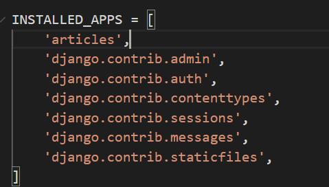

- trailing comma


#### internalization

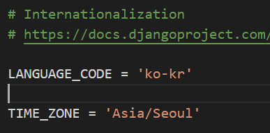


#### template 생성

- ✨template이 들어있는 폴더의 이름은 반드시 templates
- django 는 html 파일을 찾을 때 특정 앱 안의 templates 폴더를 탐색하기 때문이다. (INSTALLED_APPS 에 등록된) 

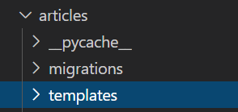


## 2 주요 파일

#### urls.py

- 🎃end slash 주의!
- (요청을 받은 URL, 호출할 view 함수) 를 연결
- 작성한 app 안의 view를 package 처럼 접근한다.

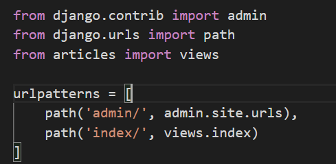


#### views.py

1. ✨첫번째 인자는 무조건 request : URL로부터 받아온 요청

2. 데이터를 조합해 완성된 문서를 응답으로 반환한다

   1. render()

   2. ✨첫번째 인자는 무조건 request

   3. 두번째 인자는 template 파일 이름

   4. django는 templates 까지의 경로는 이해하고 있으므로 그 이후의 경로를 작성한다.

      - app_name/tempates/ 까지는 알고 있다는 뜻 (기본 활성화)
      - APP_DIRS : True 이므로

      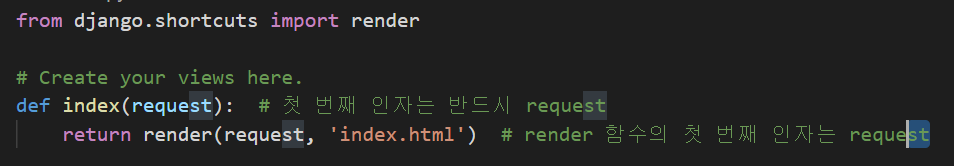

   5. context 

      - template 안에서 사용할 변수

      - dictionary로 전달한다.

   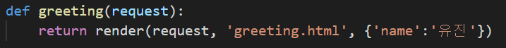

   6. response를 직접 반환할 수도 있다.
      - `from django.http.response import HttpResponse`
      - `return HttpResponse('string')`


##### # get_object_or_404(Student, pk=pk)

- import 요구
- 객체가 존재하면 get 하고 아니면 404 를 클라이언트에게 반환한다.


##### 🎃 redirect

- views 내의 한 메서드에서 처리가 끝난 후 다른 로직을 호출해야 할 때 사용한다.
- ex) 객체를 생성한 후, 다시 목록 페이지를 보여줄 경우
- `from` `django.shortcuts` `import`  `redirect`
- 전달인자로 절대 경로를 넘기거나, path name을 전달한다.
- URL이 변수를 필요로 하는 경우 함께 전달하는데, 혼동을 피하기 위해 키워드 인자로 전달한다.


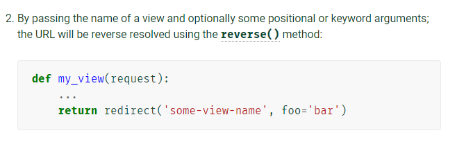


https://docs.djangoproject.com/en/3.1/topics/http/shortcuts/#redirect


## 3 DTL

> 데이터 표현을 제어하는 도구이자 표현에 관련된 로직
>
> DTL (Django Template Language)
>
> built-in template system
>
> template을 위한 언어


- 조건, 반복, 변수 치환, 필터 등의 기능을 제공
- 파이썬 처럼 비슷한 구조를 DTL에서 사용하지만 파이썬 코드로 실행되는 것은 아니다


### 1 DTL Syntax - Variable

- {{  `variable` }}

- render() 를 사용하여 view.py 에서 정의한 변수를 template 파일로 넘겨 사용한다

  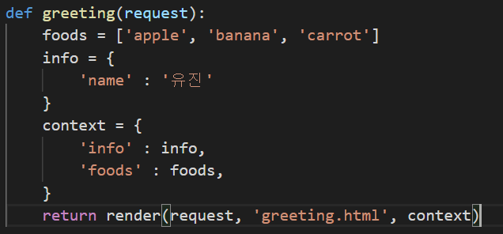

  

- 변수명은 영어, 숫자, _ 의 조합

- dot(.) 를 사용해 변수 속성에 접근한다

- render() 의 세번째 인자로 {'key' : 'value'} 와 같이 딕셔너리로 전달되고 key로 접근한다.

  ​				
- 약 60개 정도의 필터가 존재
- chained 가 가능하고 일부 필터는 인자를 받는다

```python
{{name|lower}}
{{variable|truncatewords:30}}
```


공식문서 참고 : https://docs.djangoproject.com/en/3.1/ref/templates/builtins/#built-in-filter-reference


### 3 DTL Syntax - Tags

- 
- 출력 텍스트를 만들거나, 반복 또는 논리를 수행하여 제어 흐름을 만든다.
- 일부 태그는 시작, 종료 태그가 필요
  - ... 
- 약 24개의 built in 태그가 존재 + custom 도 가능하다
- 로직으로 존재하고 문서에 출력되지는 않는다


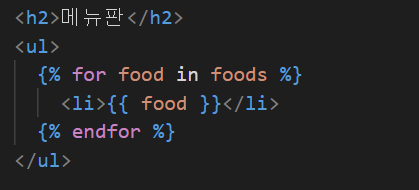


### 4 DTL Syntax - Comments

- 주석
- { # lorem ipsum #} : 한 줄 주석
-  여러 행 주석 


## 4 Template inheritance

> 코드의 재사용성에 초점
>
> 사이트의 고옹 요소를 포함하고 하위 템플릿이 재정의 (override) 할 수 있는 블록을 정의
>
> skeleton 템플릿


### skeleton templates 의 위치를 어디에 둘까?

1. master app 안에 
2. 프로젝트 ROOT 안에 (공식문서 제안)


- 

  - 🎈템플릿의 최상단에 작성

  - 부모 템플릿의 경로 작성

  - 부모 templates 위치는 알지 못하므로 새로운 templates 경로를 추가한다.

    - `settings.py`

    - 추가 경로를 작성할 일이 많기 때문에 최상위 폴더 경로를 상수로 선언 `BASE_DIR` (OS에 영향받지 않는 작성 방법)

    - 내가 파일을 아무리 옮긴다고 해도 ROOT 의 위치를 잡아준다.

      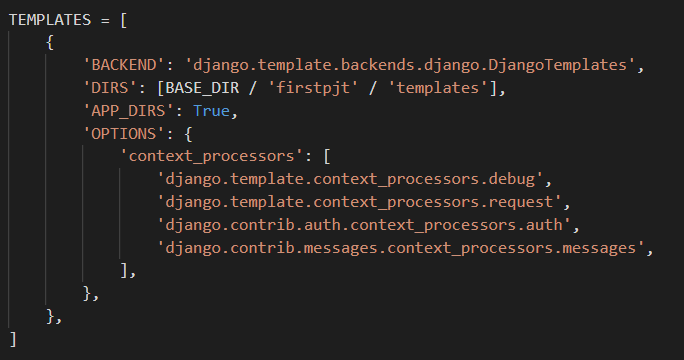

      ##### python pathlib 참고
    
      


- 
  - 블록 내부에 override 한다.
  - 여러 개의 블록을 구분하기 위해 이름을 지정한다
    - body 는 content 로 짓는 것이 국룰
  - 자식의 고유 영역


- 부모

  - 자식이 override 할 구역을 지정한다.

  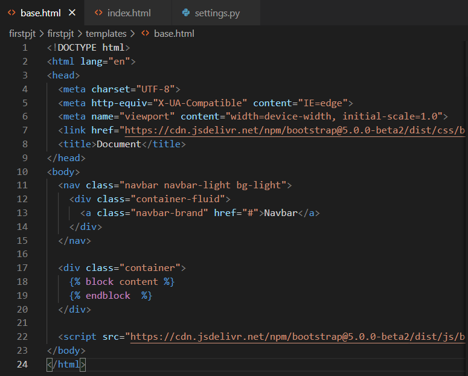

- 자식

  - 템플릿 최상단에 extends 태그 작성
    - 무조건 최상단, comment tag 도 있으면 안 된다
- block 태그 내부에 재정의
  
  

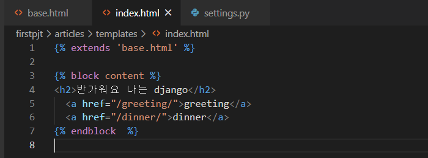


### 🎀설계 철학

#### 1 표현과 로직(view) 을 분리

템플릿은 표현을 제어하는 도구일 뿐이다.

기본 목표를 넘어서는 기능을 지원하지 말아야 한다. (가능하더라도)


#### 2 중복을 배제

대다수의 웹사이트는 header footer navbar 와 같은 공통 디자인을 가진다. 

템플릿 상속을 통해 중복 코드를 제거한다.


## 5 HTML form element

### form 핵심 속성

- action
  - form 이 전달될 URL
- method
  - 정보 전달 방식
  - "/index/"
    - 앞의 / 는 root를 함축한다.


### input 핵심 속성

> 사용자로부터 데이터를 입력 받기 위해 사용한다.

- name
  - 데이터의 key
  - key를 통해 value에 접근한다. 
  - ?key=value&key=value 형식으로 전달된다.


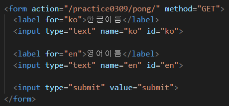


### HTTP

> Hyper Text Transfer Protocol


- 주어진 리소스가 수행하게 될 원하는 작업을 나타내는 request methods 를 정의
  - GET
  - POST
  - PUT
  - DELETE


#### GET

1. 서버에서 정보를 조회하는 데에 사용한다.
2. 데이터를 가져올 때에만 사용한다
3. 데이터를 서버로 전송할 때 Query String Parameters 를 통해 전송한다. 
   - URL의 parameter 로 붙어서 전달된다.


- request 내부에 GET으로 전달된 데이터가 dictionary 형태로 들어있다.
  - `request.GET`  = {key:value, key:value}
  - request 의 멤버
  - get() 함수를 사용하는 이유는 해당하는 key 값이 없을 때 발생할 수 있는 예외를 방지하기 위함

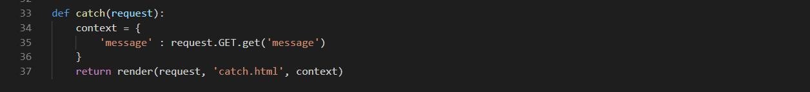


#### POST

1. 보안 처리 

2. URL에 입력 정보가 노출되지 않는다.

3. `csrf_token` 이 필요하다.

   1. Cross Site Request Forgery

   - `CsrfViewMiddleware`가 검증할 수 있도록

4. request에서 꺼낼 때 

   - `request.POST`

5. views 에서 처리할 때

   1. `request.method` 가 `POST` 일 때만 로직을 실행한다.
   2. `else` : redirect() 


### Data Validation

> 데이터 유효성 검사

- cleaned data인지 DB 저장 전에 점검이 끝나야 한다.
- 하지만 사용자가 개발자도구를 사용해 HTML의 attribute를 수정한다면 곤란하다.


## 6 URL

> Dispatcher (발송자) 로서의 URL
>
> 웹앱은 URL을 통한 클라이언트의 요청에서 시작된다.


### URL mapping

- app 의 view 함수가 많아지면서 사용하는 path() 가 많아지고, app 도 더 작성되기 때문에 프로젝트의 url.py. 에서 모두 관리할 수 없다.
- 각 app 에 url.py 를 작성한다.

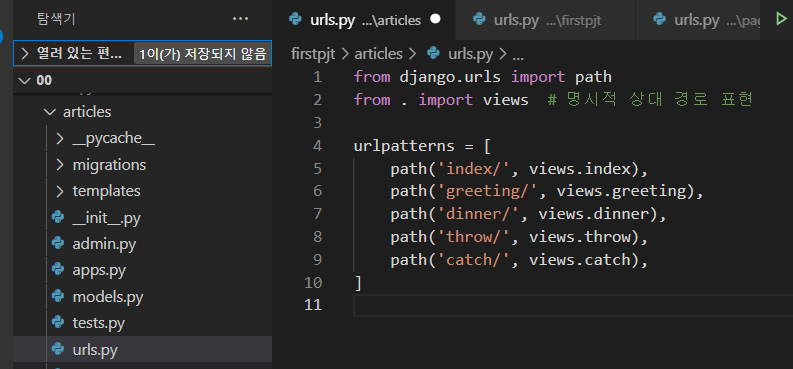

- 기존의 project urls.py 는 중앙 컨트롤을 담당한다. 

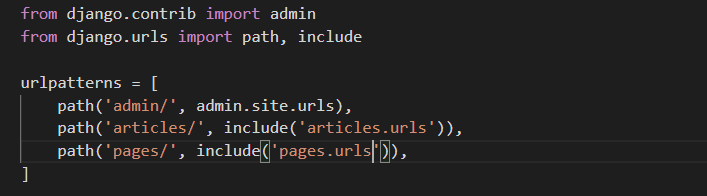


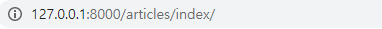

- articles 까지는 프로젝트의 urls.py 가 처리하고
- 그 이후는 각각의 app이 가진 urls.py 가 처리한다.


### Variable routing

> 동적 라우팅
>
> 주소 자체를 변수처럼 사용해서 동적으로 주소를 만든다.


- url주소/<<자료형:이름>>/
- 기본값 str 이므로 생략 가능하다
  - <name>
  - 입력값은 string인 것이 룰
  - 하지만 django는 int:name 을 지원한다.
- views 의 함수에 keyword 인자로 넘어온다.  (이름을 key값으로 하여)
  - name = '입력값'
  - 따라서 함수 정의 할 때, parameter로 넣어주어야 한다.
- 전달 인자로 넘어온 변수를 바로 사용할 수 있다. 


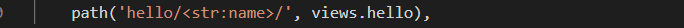

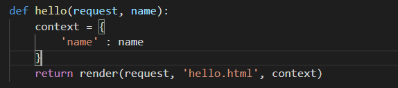


### 🎁Naming URL patterns

> href = "articles/greeting/" 이런 식으로 일일이 다 바꾸고 싶지 않다.


- 하드코딩으로 url 을 직접 작성하지 않고 path() 함수의 name 인자를 정의해서 사용한다.

  - name은 view 의 함수 이름과 일치시켜야 헷갈리지 않는다.

- **DTL 의 `url` 태그를 사용한다.**

  - url 태그는 매칭되는 이름을 가진 view의 절대경로를 반환한다.

  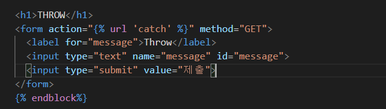

  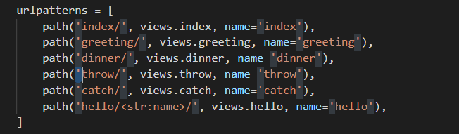

  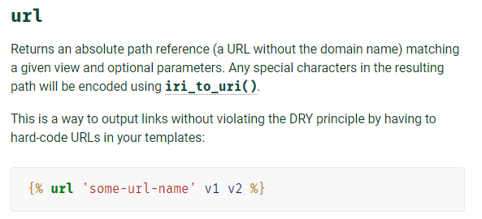

##### * 다른 App에 같은 name을 가진 path가 있다면?

- *namespace* 를 고려해보자
- `app_name` 변수를 설정하는 순간부터 name space 적용된다.
- ``

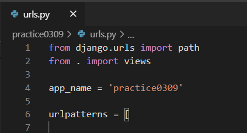

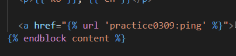


##### * variable routing을 사용하는 URL이라면? 

- 한 칸 띄어쓰고 전달할 변수를 입력한다.

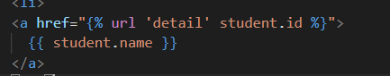


 


## 7 Namespace

> 내가 원하는 template 이 아니라, 동명의 다른 template 이 나와버렸다.
>
> INSTALLED_APPS에 등록되어 있는 순서대로 template을 탐색하기 때문에..


##### template의 이름을 고치거나, App 등록 순서를 바꾸는 것은 미봉책

- django가 각 app의 templates 내부를 ctrl+a, ctrl+c, ctrl+v 하는 것을 이용한다.
- templates 내부에 app 이름과 동일한 폴더를 만들어 그 안에 파일을 둔다.

- app_name > templates > app_name > html 파일

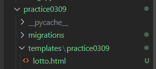


##### views에서 render() 에 html 파일 이름을 넘길 때, 상위 폴더 경로와 함께 넘긴다.

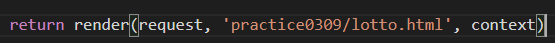


##### app을 만들면, 출생신고 후에 templates/<app_name> 으로 폴더를 만들고 시작

- `$ mkdir -p app_name/templates/app_name`


---


## venv

> 가상 환경 (독립 환경)
>
> 파이썬 인터프리터, 라이브러리 및 스크립트가 시스템 파이썬에 설치된 모든 라이브러리와 격리 되어있는 파이썬 환경
>
> 각 가상 환경은 고유한 파이썬 환경을 가지며 독립적으로 설치된 패키지 집합을 가짐


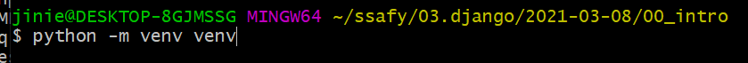

- module
- venv 명령어
- venv 폴더명


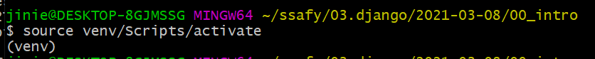

- venv 활성화
  - python version, pip 에만 영향을 미친다
  - 터미널 단위로 활성화 된다.

- venv 비활성화
  - 터미널 종료
  - deactivate


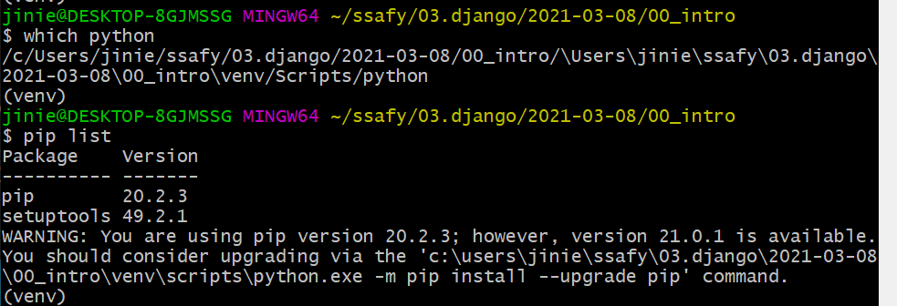


- 경로의 차이
- pip list 의 차이


- .ignore 주의

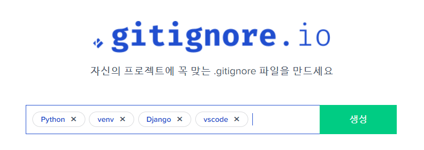

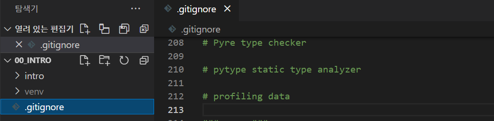


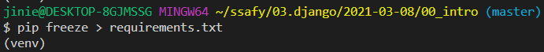

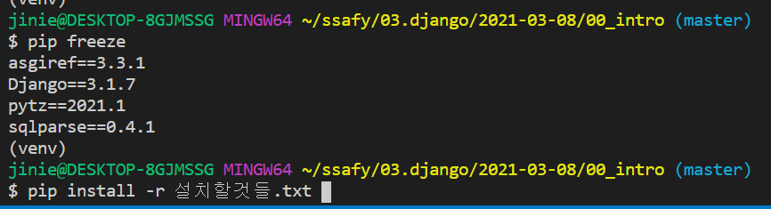


- 추후에 pip list를 공유하기 위한 txt 파일과 설치 명령어

  - pip freeze > requirements.txt

- requirements.txt
  
  - 이름 이렇게 하는 것이 국룰
  - `pip` `install` `-r` `requirements.txt`
  


---


## RECAP


### 프로젝트 파일 생성하기

> 프로젝트 = app + app + ... + app


- 잘못 만들었을 때 프로젝트 삭제하기
  - rm -rf intro
- 굳이 한 depth 안에 프로젝트 파일을 만들고 싶지 않고 현재 위치에서 만들고 싶다


- 현재 내 위치에 신경 쓰자. 내가 프로젝트 root 에 있는지, 집사 (manage.py 가 있는지)
- 최초 생성 이후에는 manage.py 에게 일임한다
  - python manage.py [명령어]
- settings.py 를 가지고 있는 app을 master app 이라고 부르기로 약속했다.


### App 생성하기

1. 앱의 탄생
   1. python manage.py startapp [이름]
2. 앱의 등록
   1. master app 의 settings.py 에서 생성한 앱 등록하기


### urls.py 생성하기

1. 요청에 따라 알맞은 view를 찾아가도록 urls.py 를 app 내부에 생성한다.

2. 기본적으로 필요한 코드

   - from django.urls import path
   - **urlpatterns**

   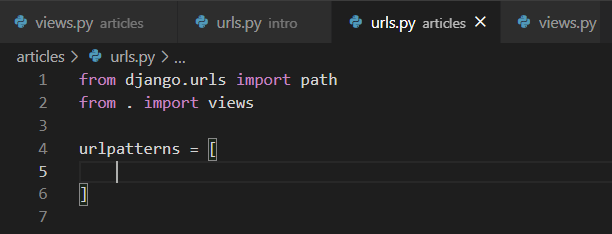