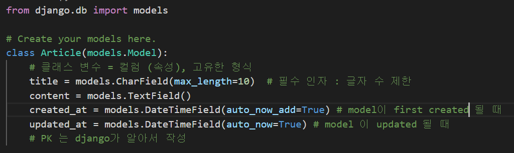
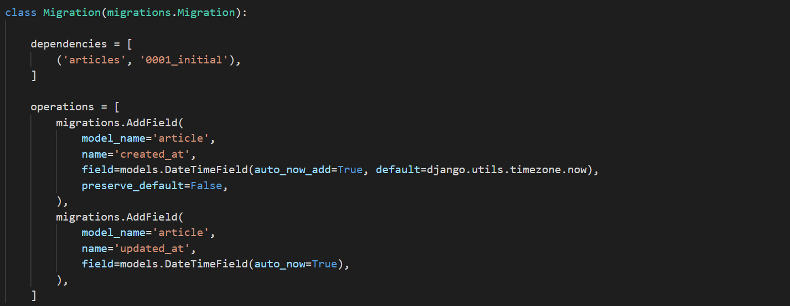
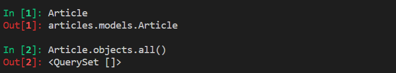
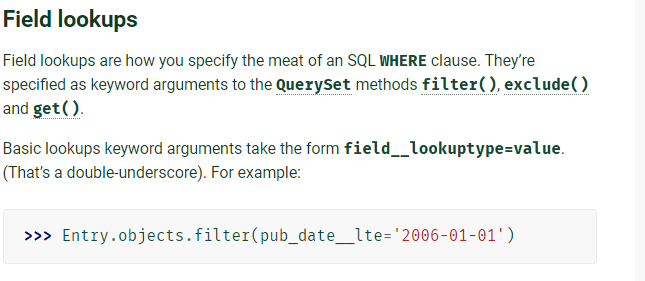

# Django 02


## Model

> 데이터 구조화 + 조작
>
> 사용자가 저장하는 데이터의 필드 + 동작
>
> 데이터 베이스의 구조 (일반적으로 1 model : 1 table 매칭)
>
> django 는 model 을 통해 데이터에 접속하고 관리한다.
>
> Skinny Controller Fat Model


- model != DB

  - DB 는 체계화된 데이터의 모임
  - 쿼리 : 데이터를 조회하기 위한 명령어

- Database 의 기본 구조

  - 스키마 (Schema)

    - 데이터베이스의 자료 구조, 표현 방법, 관계 정의 구조

  - 테이블 (Table)

    - 필드, 컬럼, 속성
    - 레코드, 행, 튜플

  - PK 

    - 기본키 (Primary Key)
    - 각 행 (레코드)의 고유 값
    - 데이터 베이스 관리 및 관계 설정 시 주요하게 활용

    

##### Model 은 이러한 데이터를 다루기 위한 도구



- 매직 메서드 str 을 수정하여 출력될 때 보여줄 필드를 정할 수 있다.
- Field에 여러 option이 들어갈 수 있다
  - auto_now_add = True
  - auto_now = True
  - default
  - null = True
    - 하지만 DB에 null이 난무하는 건 바람직하지 않다.


##### django model field

https://docs.djangoproject.com/en/3.1/ref/models/fields/


##### 프로젝트가 시작되면 model 스키마부터 구성하자


## ORM

> Object - Relational - Mapping 
>
> 객체 지향 프로그래밍 언어를 사용하여 Django - SQL 데이터를 변환하는 프로그래밍 기술
>
> DB와 django 사이에서 호환 담당


- SQL 을 잘 알지 못해도 DB 조작 가능
- 절차적 접근이 아닌 객체 지향적 접근으로 높은 **생산성**
- ORM 만으로 완전한 서비스 구현이 어려운 경우가 있음


##### DB를 객체(Object)로 조작하기 위해 ORM 을 사용한다





## Migrations

> django가 model 에 생긴 변화를 반영 (필드 추가, 모델 삭제 등)
>
> 버전관리 가능


- **makemigrations**
- **migrate**
- sqlmigrate
- showmigrations


### Migrations 명령어

#### 🎃makemigrations

model 변경에 기반한 새로운 마이그레이션을 만들 때 사용 

우리가 설계한 클래스를 기반으로 ORM이 해석할 수 있는 설계도를 만든다.

- `python` `manage.py`  `makemigrations` `app_name`
- class variable 만 확인하여 DB의 column화 한다.
  - 기타 매직 메서드 등은 migration의 change로 취급하지 않는다.


#### 🎃migrate

마이그레이션을 DB에 반영하기 위해 사용

위에서 만든 마이그레이션을 실제 DB에 반영한다. (설계도 전달)

모델에서의 변경 사항과 DB가 **동기화** 


- db.sqlite3 의 django_migrations 에 적용된 migrations의 버전이 기록되어 있다.
- 그 기록을 기반으로 migrate 한다.


#### sqlmigrate

마이그레이션에 대한 SQL 구문을 보기

SQL 문으로 어떻게 해석되어서 동작할 지 미리 확인 

- `python` `manage.py` `sqlmigrate` `articles` `0001`


#### showmigrations

프로젝트 전체의 마이그레이션 상태 확인

마이그레이션 파일들이 migrate 되었는지 여부 확인


1. models.py
   - model 변경 사항 발생
2. python manage.py makemigrations [app_name]
   - migrations 파일 생성
   - 특정 app 이름 지정 가능
3. python manage.py migrate [app_name]
   - DB 적용
   - 특정 app 이름 지정 가능


## Database API

> DB 조작하기 위한 도구
>
> django 가 기본적으로 ORM 을 제공하기 때문에 따라오는
>
> model 을 생성하면 database-abstract API 자동 생성
>
> database-abstract API, database-access API


```python
# Class Name.Manager.QuerySet API
# Manager django에 의해 자동 생성
# method 가 핵심 명령

Article.objects.all()
```


- Manager

  - django 모델에 데이터 베이스 query 작업이 제공되는 중간 인터페이스
  - 기본적으로 django 모델 클래스에 objects 라는 manager를 가지고 있다.

- QuerySet

  - 데이터베이스로부터 전달받은 객체 목록 (0..N)
  - 조회, 필터, 정렬 수행

  

##### queryset api

https://docs.djangoproject.com/en/3.1/ref/models/querysets/

- Methods that return new Queryset
  - all() : 전체 조회
  - filter() : 조건 조회
- Methods that do not return Querysets
  - 단일 객체 return 
  - get()


##### django extension

> 간략한 코드 테스트를 위해 shell 을 사용한다.
>
> view에 쓸 코드를 실험

https://django-extensions.readthedocs.io/en/latest/installation_instructions.html#installing

third party app 설치 후엔 꼭 등록한다.

- django shell - plus 를 사용할 것
- `python` `manage.py` `shell_plus`
- 기본 shell 과 달리 사용할 모델과 패키지를 자동으로 import 해준다.



- ORM 이 Querysets 을 반환했다
- 리스트 처럼 사용이 가능하다


## CRUD

> 기본적인 데이터 처리 기능
>
> Create, Read, Update, Delete


### Create

```python
#1
article = Article()
article.title = 'first'
article.content = 'django'
article.save()

# 2
article = Article(title= 'second', content='django')
article.save()

#3
Article.objects.create(title='third', content='django')

Article.objects.all()  # 객체가 저장된 것을 확인할 수 있다.
Article.objects.get(pk=1)  # pk가 1인 객체 반환
```

1. create
2. get_or_create
3. bulk_create

- article 이라는 모델이 django Model 을 extends 하고 있기 때문에
- 기본적으로 save() 라는 인스턴스 메서드를 들고 있다. 
- objects의 querysets 을 사용할 경우 인스턴스 생성하지 않고 1-스텝으로 저장 가능하다.
- save the current instance 
- 실제 DB에 저장된 것을 확인할 수 있다.


### Read

> QuerySet API method 를 사용한 다양한 조회


#### 1. all()

- 모든 객체를 조회


#### 2 . get()


- 특정 조건을 지정하여 조회하고 객체 반환

- 중복되는 조건으로 객체를 조회할 경우 MultipleObjectReturned error

- 존재하지 않는 객체를 조회할 경우 does not exist error

- unique 하거나 not null 조건인 경우에만 사용 가능 하다.

- PK 로 조회할 경우에만 사용한다.

  - get(pk=1)

  

#### 3. filter()

- 지정된 매개변수가 포함된 모든 객체를 반환한다.
- QuerySet 을 주는 메서드
- 조회 결과가 하나여도 QuerySet으로 반환한다.


#### Field lookups

> 조회 시 특정 조건을 적용시키기 위해 사용 (=where)

- QuerySet Method (get, filter, exclude) 에 대한 키워드 인수로 사용한다.
- field__lookuptype = value

https://docs.djangoproject.com/en/3.1/topics/db/queries/#field-lookups




### Update

```python
article = Article.objects.get(pk=1)
article.title = 'updated'
article.save()
```

- 수정할 객체를 특정하여 조회하고 수정한다.

- PK 기준으로 기존에 존재하던 객체일 경우,  save() 하면 수정이 된다.


### Delete

```python
article.delete()
```


## Admin site

- automatic admin interface
  - 사용자가 아닌 서버의 관리자가 활용
  - Article class 를 admin. py 에 등록하고 관리
  - django.contrib.auth 모듈에서 제공
  - record 생성 여부 확인
  - **직접 record 삽입 가능**


### 1) 관리자 생성

```python
$ python manage.py createsuperuser
```

- id, password 설정


### 2) model 등록

- admin.py

```python
from django.contrib import admin
from .models import Article
# Register your models here.

#admin site에 register 하겠다.
admin.site.register(Article)

```


##### ModelAdmin option 참고 (interface customize)

```python
from django.contrib import admin

class AuthorAdmin(admin.ModelAdmin):
    list_display = ('pk', 'title', 'content', 'created_at', 'updated_at',)
    

admin.site.register(Article, ArticleAdmin)
```


https://docs.djangoproject.com/en/3.1/ref/contrib/admin/


## fixture

- 모델의 초기 데이터 제공하기
- json file
- `python` `manage.py` `dumpdata` --indent 4 `movies.movie` > movies.json
- data base 의 파일을 json 파일로 추출
- movies에 fixtures 폴더를 생성 (django가 인식할 수 있도록)
  - movies 폴더를 만들고
  - json 파일을 폴더에 옮긴다
- `python` `manage.py` `migrate` 후에
  - migrations가 이미 만들어져서 git으로 넘어왔기 때문에 
- `python` `manage.py` `loaddata` `movies.movies.json`


## DB 초기화

- `rm app_name/migrations/0*`
- rm db.sqlite3`
- 다시 migration