## Django 03


## Forms

> 1. data validation
> 2. html form 쉽게 만들기
>
> 
>
> django 프로젝트의 주요 유효성 검사 도구들 중 하나
>
> 공격 및 우연한 데이터 손상 방지


1. 렌더링을 위한 데이터 준비 및 재구성
2. 데이터에 대한 HTML forms 생성
3. 클라이언트로부터 받은 데이터 수신 및 처리


### Form

> 모델과 연결되지 않은 form


#### Form Class

- django Form 관리 시스템의 핵심
- form 내 field, field 배치, 디스플레이 widget, label, 초기값, 유효하지 않은 field 에 대한 에러 메세지 결정
- 사용자 데이터 받을 때 해야할 작업 (데이터 유효성 검증, 검증 결과 재출력) 처리
- forms.py


#### forms.Form

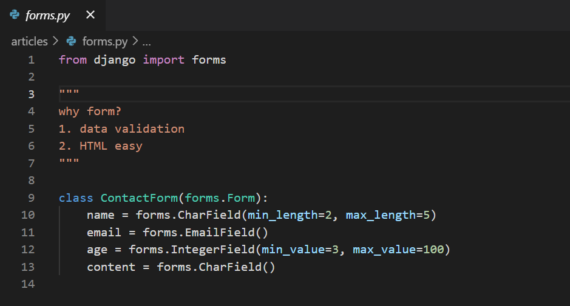

- Form fields 지정을 통해 나중에 validate 하게 된다.
  - input 에 대한 유효성 검사 로직을 처리하여 템플릿에서 직접 사용
  - model field 에 대응 되는 form field
  - https://docs.djangoproject.com/en/3.1/topics/forms/modelforms/
- 변수명이 input 태그의 name이 된다.
- widget 사용 
  - HTML input 요소 렌더링 및 제출 된 원시 데이터 추출 처리
  - 반드시 form fields 에 할당 (독자적 사용 X)

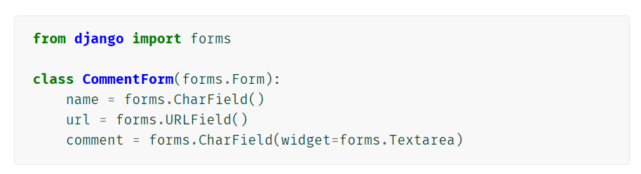


#### Widgets🎀

- Form Fields 와 혼동되어서는 안 됨 (Form Fields 내부에서 사용)
- input element 의 단순 raw 한 렌더링 처리
- https://docs.djangoproject.com/en/3.1/ref/forms/widgets/


##### 사용하기

- multiple choices 하는 input 태그 만들기

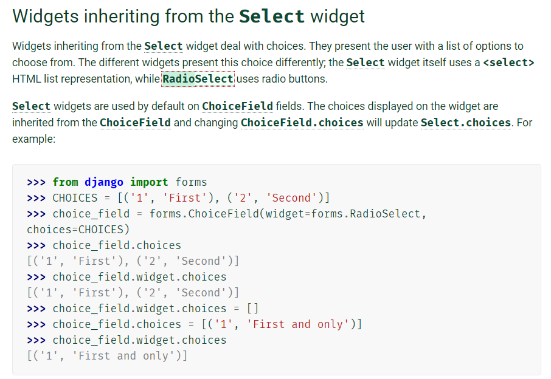


- input 태그에 개별 속성(attribute) 주기 (style)

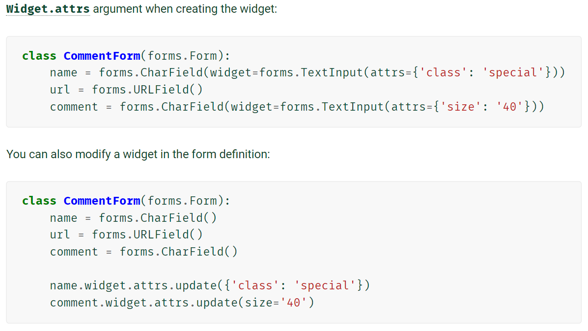


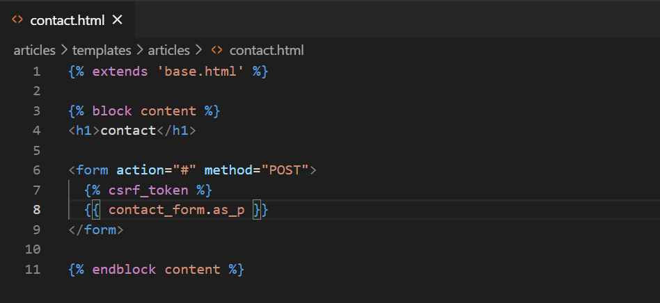

- `form.as_p`
- `form.as_table`
- `form.as_ul`


## ModelForm🎁

> 모델과 연동하여 사용하는 form
>
> model을 통해 Form Class 를 만들 수 있는 Helper


#### Meta Class

- 필드 재정의 하는 대신에 model 을 등록한다.
- 모델 클래스에 대한 정보 작성


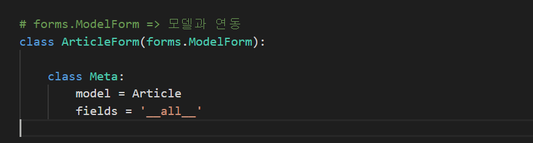

- django 가 제공하는 Meta 클래스
- model 변수
  - 연동할 모델 클래스 지정 
  - 사용하기 위해서는 import 필수
- fields 변수
  - 사용할 필드 지정


#### ModelForm 매개변수 

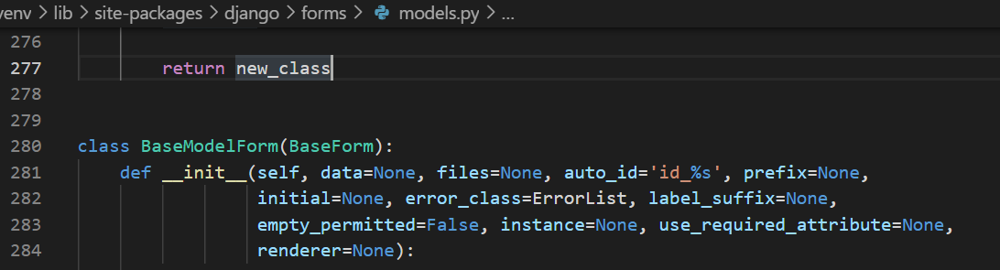

- `data`는 `request`에서 꺼낸 data로 form을 채운다.

- `instance`는 개별 객체를 매개변수로 받아서 form을 채운다.

  - 키워드 변수로 사용한다.
  


#### 사용예시

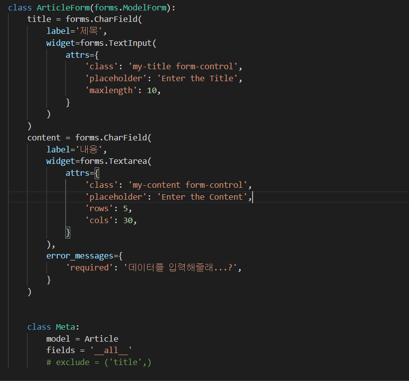


## Form & ModelForm

#### Form

- 어떤 모델에 저장해야 하는지 알 수 없으므로 유효성 검사 이후
- cleaned_data 딕셔너리 생성
- 딕셔너리에서 데이터를 가져온 후 save() 호출

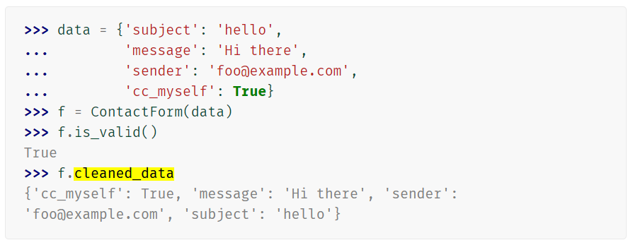


#### ModelForm

- django가 해당 model에서 양식에 필요한 대부분의 정보를 이미 정의
- 어떤 레코드를 만들어야 할 지 알고 있으므로 바로 .save() 호출 가능


## Create

##### * 하나의 URL 로 요청(request)의 종류에 따라 다른 일 처리하기

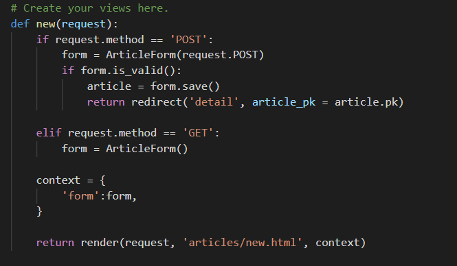


- POST 요청이 들어올 때,
  - 모델과 연동된 Form 클래스를 init 
    - data = request.POST
  - `is_valid()` 함수 통하여 유효성 검사
    - Boolean 값 반환
  - save() 로직 실행
- GET 요청이 들어왔을 때,
  - 비어있는 Form 생성


## Update

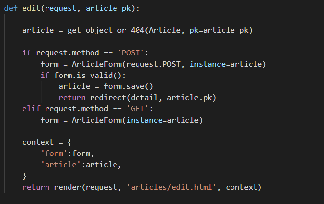


- get_object_or_404(Class, pk=pk)
  - pk 이름을 구체적으로 쓴 것에 주의 (추후 이름이 중복될 것을 대비한다)
  - 객체가 존재한다면 객체를 반환하고 존재하지 않는다면 404 결과 반환


##### create와의 차이

```python
# POST 요청이 들어왔을 경우, 수정
form = ArticleForm(request.POST, instance = article)

# GET 요청이 들어왔을 경우, 수정 양식 제공
form = ArticleForm(instance = article)
```

- 기존의 객체를 수정하는 것이기 때문에 참조할 객체 instance를 매개변수로 넘긴다.
- instance 를 지정하지 않으면 save() 했을 때 create를 하게된다.


## Form rendering


### 개별 field 추출하기

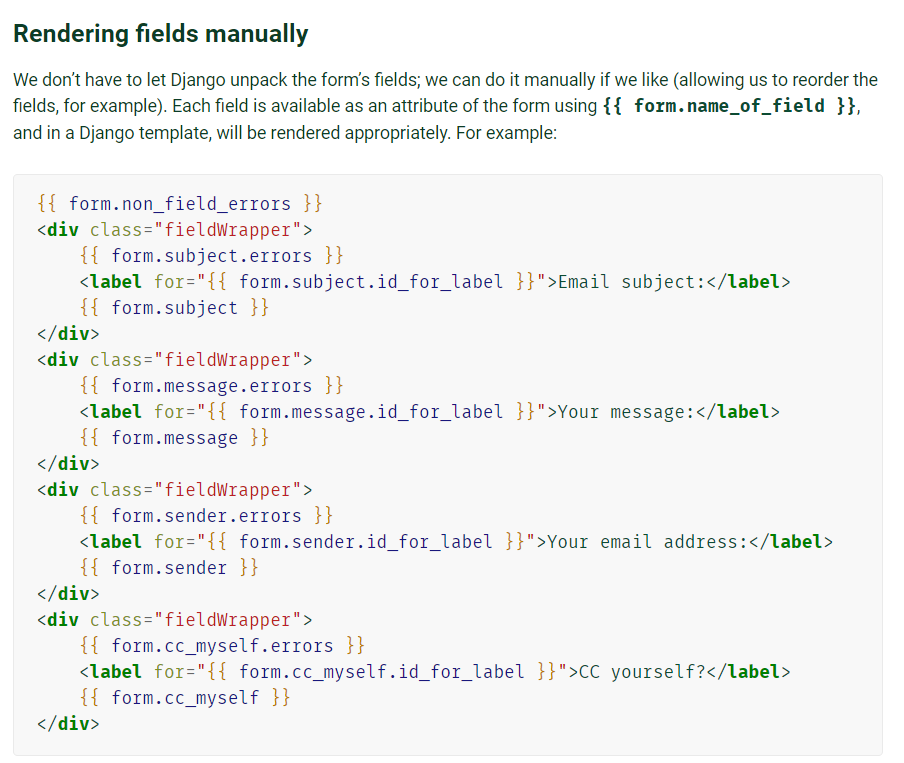


### for loop 사용해서 field 쓰기


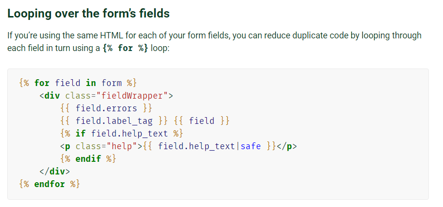


### Bootstrap 적용하기

#### 클래스 적용하기

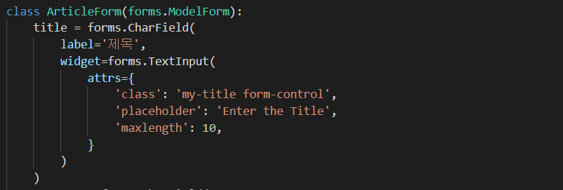


#### third party app 설치하여 라이브러리 사용하기

- https://pypi.org/project/django-bootstrap-v5/
- https://django-bootstrap-v5.readthedocs.io/en/latest/quickstart.html


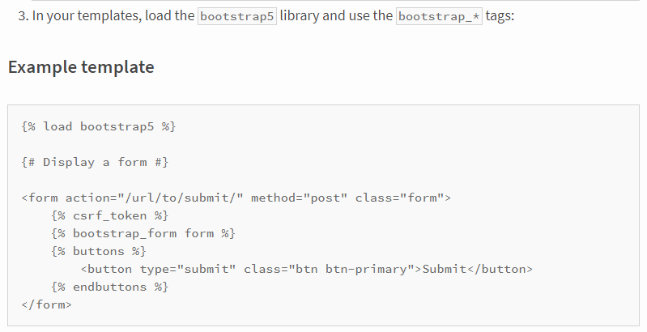

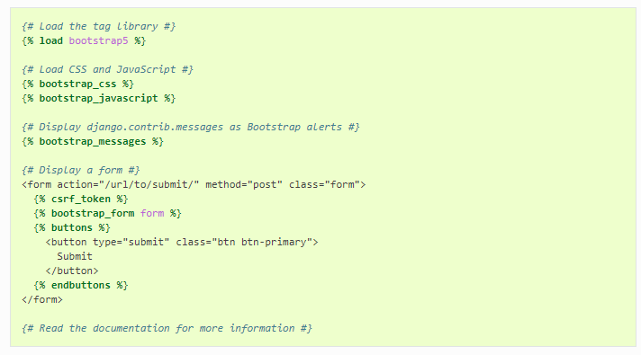

- load tag 사용 주의


##### include tag

- 유지 보수를 위해 사용한다.
- 템플릿 내에서 다른 템플릿을 포함하는 방법

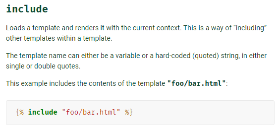


## Django View decorators


- 어떤 함수에 기능 추가 하고자 할 때 해당 함수를 수정하지 않고 기능을 연장
- django 는 다양한 기능 지원하기 위해 view 함수에 적용할 수 있는 여러 데코레이터 제공
- Allowed HTTP methods
  - 요청 메서드에 따라 view 함수에 대한 엑세스를 제한
  - 요청이 조건을 충족시키지 못하면 HttpResponseNotAllowed 을 return
  - require_http_methods()
  - require_POST()
  - require_safe()


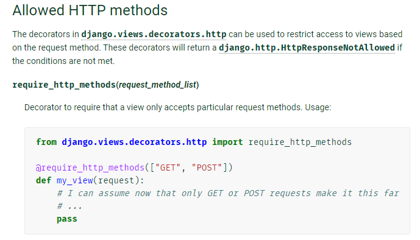


##### postman

- method 를 변경해 django에 요청을 보낼 수 있다.