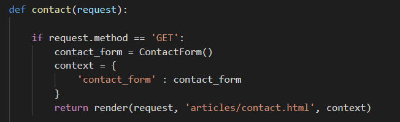

## Django 03


## Forms

> 1. data validation
> 2. html form 쉽게 만들기


- forms.py
- 손쉽게 form 만들기


### Form

> 모델과 연결되지 않은 form


- forms.Form


- field 지정을 통해 나중에 validate 하게 된다.
- 변수명이 input 태그의 name이 된다.




- `form.as_p`
- `form.as_table`
- `form.as_ul`


## 🎁ModelForm

> 모델과 연동하여 사용하는 form


- django 가 제공하는 Meta 클래스
- model 변수
  - 연동할 모델 클래스 지정 
  - 사용하기 위해서는 import 필수
- fields 변수
  - 사용할 필드 지정


##### ModelForm 매개변수 


- `data`는 `request`에서 꺼낸 data로 form을 채운다.

- `instance`는 개별 객체를 매개변수로 받아서 form을 채운다.

  - 키워드 변수로 사용한다.
  
  


## Create

##### * 하나의 URL 로 요청(request)의 종류에 따라 다른 일 처리하기


- POST 요청이 들어올 때,
  - 모델과 연동된 Form 클래스를 init 
    - data = request.POST
  - `is_valid()` 함수 통하여 유효성 검사
    - Boolean 값 반환
  - save() 로직 실행
- GET 요청이 들어왔을 때,
  - 비어있는 Form 생성


## Update


- get_object_or_404(Class, pk=pk)
  - pk 이름을 구체적으로 쓴 것에 주의 (추후 이름이 중복될 것을 대비한다)
  - 객체가 존재한다면 객체를 반환하고 존재하지 않는다면 404 결과 반환


##### create와의 차이

```python
# POST 요청이 들어왔을 경우, 수정
form = ArticleForm(request.POST, instance = article)

# GET 요청이 들어왔을 경우, 수정 양식 제공
form = ArticleForm(instance = article)
```

- 기존의 객체를 수정하는 것이기 때문에 참조할 객체 instance를 매개변수로 넘긴다.
- instance 를 지정하지 않으면 save() 했을 때 create를 하게된다.

