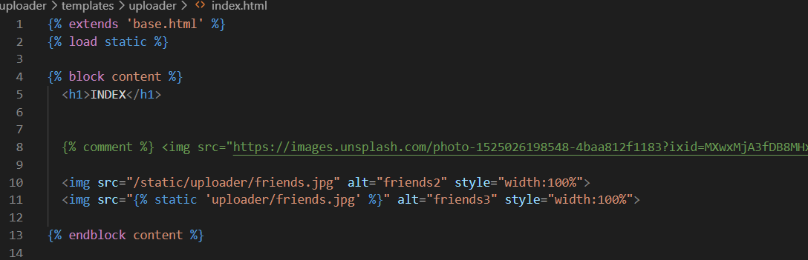
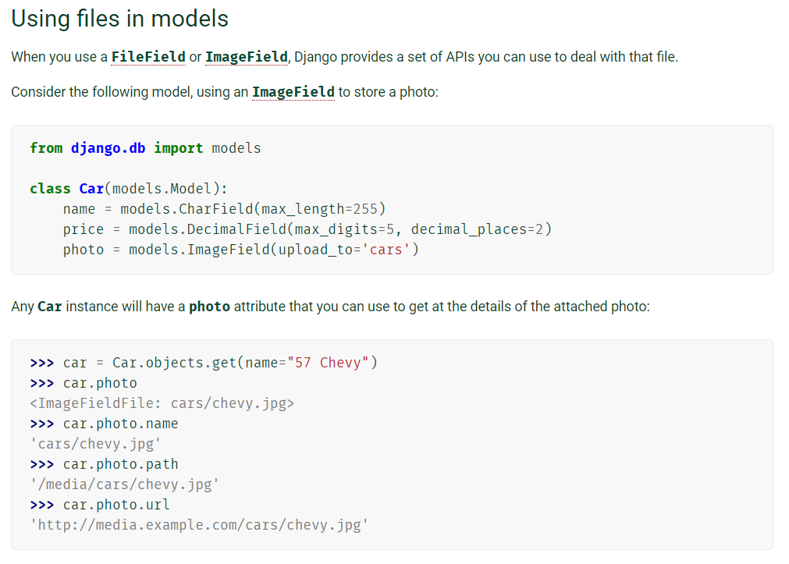

# Django 04

## STATIC MEDIA

> 정적 파일을 어떻게 업로드 하고 어디에 업로드 할까?
>
> django에게 정적 파일 경로 알리기

### 1. Image

#### settings.py

- urls pattern 중에서 /static/ 으로 요청이 오면,

- /app_name/static 폴더를 탐색한다.

- 그 외의 경로를 등록할 경우

  - STATICFILES_DIRS = []
  - templates 폴더 등록할 때 처럼 등록

  

#### html 

- django 가 이해할 수 있도록 이미지 경로의 URL을 `/static/` 으로 시작한다.
- 그러면 django 는 기본적으로 모든 app의 static 폴더를 탐색한다.
- `url` 태그를 쓰듯이 `static` 태그를 사용할 수 있다. (권장)
- `namespace` 때문에 폴더명/파일명인 것 주의
- **`load static` 한 것 주의**

### 2. css

#### html

- 외부 css 파일을 참조할 때, css 파일을 찾기 위해 static을 사용한다.

##### 파일 구조 참고

css, images, javascript 폴더로 구분하여 분류한다.

## File Upload

> input type file 사용하기

### 1. install pillow 

- pip install `pillow`
- 이외에도 `pilkit`, `django-imagekit` 가 있어야 이미지 파일을 다룰 수 있다.

### 2. MEDIA_ROOT & MEDIA_URL

- 업로드된 파일이 저장되는 위치 기록
- 반대로 사용자가 다운로드 받을 때 url pattern도 등록한다

### 3. ImageField (models.py)

- model 의 field
- 기본적으로 FileField 를 상속받고 있기 때문에 공식문서 참고할 것
- 여러가지 attr 을 가진다.

### 4. form enctype = "multipart/form-data" (forms.html)

- 파일 업로드 시 꼭 form 태그에 명시해주어야 한다.

### 5. request.FILES (views.py)

- ModelForm 을 상속하는 Form 클래스는 2번째 매개변수로 files를 받는다.
- request 에서 FILES로 추출할 수 있다.
- DB에 저장한다.

## Media Serving

### 기본 준비 코드

- 기계적으로 필요한 코드
- settings 의 MEDIA_ROOT 를 기반으로 MEDIA_URL 을 정하여 serving한다.

### 업로드한 이미지 serving

- ImageField 에서 추출할 수 있는 데이터

  - name

  - url 

    - img 태그의 src에 대입하여 사용할 수 있다.

    

- 개발자 모드에서 확인해보면 src = "/media/file_name" 으로 되어있다
- 해당 URL 을 기반으로 django는 MEDIA_URL을 통해 MEDIA_ROOT에서 해당 파일을 검색

## Image resizing

> 기존 이미지 필드의 한계를 넘기 위해
>
> 파일을 그대로 업로드 받는 다면 파일 사이즈가 너무 크다

### Image kit 사용하기

- ## Installation

  1. Install [PIL](http://pypi.python.org/pypi/PIL) or [Pillow](http://pypi.python.org/pypi/Pillow). If you’re using an `ImageField` in Django, you should have already done this.
  2. `pip install django-imagekit` (or clone the source and put the imagekit module on your path)
  3. Add `'imagekit'` to your `INSTALLED_APPS` list in your project’s settings.py

### ProcessedImageField

- 업로드한 원본을 저장할 경우
  - Image Spec Field 
    - 원본 source 가 되는 field 를 지정하는 것이 필요하다.
- 원본 저장없이 process하고 결과물이 필요한 경우
  - Processed Image Field
- Specs
  - 세부 설정
    - 기본적으로 django ImageField 가 가지고 있는 속성이 대부분이다.
  - upload_to
    - 폴더 생성하여 이 객체를 통해 저장되는 이미지를 따로 관리할 수 있다
    - media to 경로 이하의 폴더
    - upload_to = 'images/%Y/%m/%d'
  - blank
    - ORM이 비어있는 것을 허용할지 여부 결정
  - processors 
    - 이미지를 처리한다
    - 공식문서 참고
    - https://github.com/matthewwithanm/pilkit/tree/master/pilkit/processors
  - format
    - 이미지 확장자를 결정한다
  - options
    - 이미지의 품질을 결정한다

##### https://django-imagekit.readthedocs.io/en/latest/#usage-overview

