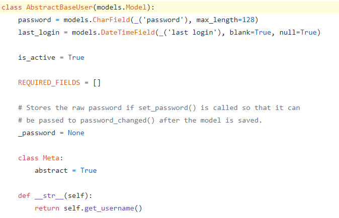
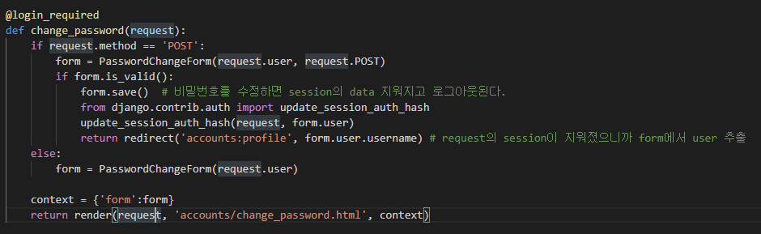

# Django 05


## Authentication & Authorization


- Authentication
  - 인증
  - 신원 확인
- Authorization
  - 권한, 허가
  - 가고 싶은 곳으로 가도록 혹은 원하는 정보를 얻도록 허용하는 과정


### Django Authentication System

- 인증, 권한 부여를 함께 결합하여 제공
- User object
- Web request


### Authentication Built-in Forms

- built in form
- UserCreationForm
  - 회원가입
- AuthenticationForm
  - 로그인


## Login &Logout


### Authentication in Web requests

> Django는 세션과 미들웨어를 사용해 
>
> 이미 인증 시스템을 request 객체에 연결


- 사용자가 나타내는 모든 요청에 `request.user` 제공
- 사용자가 로그인 하지 않은 경우 `AnonymousUser`  클래스의 인스턴스로 설정되고
- 로그인 한 경우, `User` 클래스의 인스턴스로 설정


### 로그인

- 로그인은 Session 을 create 하는 로직과 같다
- `login()`
  - 현재 세션에 연결하려는 인증된 사용자가 있는 경우 login() 함수로 로그인 진행
  - **request** 객체와 **User** 객체를 통해 로그인 진행
  - session framework를 통해 사용자 ID 를 세션에 저장


### 로그아웃

- 로그아웃은 세션을 delete 하는 로직과 같다
- logout()
  - request 객체를 받으며 return이 없음
  - 현재 요청에 대한 DB의 세션 데이터를 삭제하고 
  - 클라이언트 쿠키에서 `sessionid` 삭제


### HTTP(HyperText Transfer Protocol)

- HTML 문서와 같은 리소스들을 가져올 수 있도록 해주는 프로토콜 (규칙, 약속)
- 웹에서 이루어지는 모든 데이터 교환의 기초
- 클라이언트 - 서버 프로토콜
- requests
  - 클라이언트(브라우저)에 의해 전송되는 메시지
- response
  - 서버에서 응답으로 전송되는 메시지

- HTTP 특징
  - **비연결지향(connectionless)**
    - 서버는 응답 후 접속을 끊음
  - **무상태(stateless)**
    - 접속이 끊어지면 클라이언트와 서버 간의 통신이 끝나며 **상태를 저장하지 않음**

##### 이 특징을 뛰어 넘기 위한 해결 책? cookie

##### opposite: socket io 통신

- 게임, 채팅 등 실시간 양방향 통신
- HTTP 와 다르다
- request 가 없어도 response 를 줄 수 있는
- web hook (telegram bot 처럼 남의 컴퓨터로 response 보내기)


### Cookie

- 서버가 사용자의 웹 브라우저에 전송하는 작은 데이터 조각
- 브라우저(클라이언트)는 전송받은 쿠키를 로컬에 key-value 의 데이터 형식으로 저장
  - 동일한 서버에 재 요청시 저장된 쿠키를 함께 전송
- 웹페이지에 접속하면 요청한 웹페이지를 받으며 쿠키를 로컬에 저장하고
- 클라이언트가 재요청시 마다 웹페이지 요청과 함께 쿠키 값도 같이 전송


#### 사용 목적

- **세션관리**
  - 로그인, 아이디 자동완성, 공지 하루 안 보기, 팝업 체크, 장바구니 등의 정보 관리
  - 상태를 만들기 위함
- 개인화
  - 사용자 선호, 테마 등의 세팅
  - 개인정보 수집을 통해 맞춤 콘텐츠 제공
- 트래킹
  - 사용자 행동을 기록 및 분석하는 용도
  - 개인정보 보호를 위해 쿠키 사용에 대한 선택권을 주는 편


#### Session

- 사이트와 특정 브라우저 사이의 **state** 를 유지시키는 것 (opposite  of 무상태)
- 클라이언트가 서버에 접속하면 서버가 특정 `session id` 발급
- 클라이언트는 `session id`를 쿠키를 사용해 저장
- 클라이언트가 다시 서버 접속 할 때 해당 쿠키 ( session id 저장된)를 이용해 서버에 session id 전달
- django 는 특정 session id를 포함하는 쿠키를 사용해서 각각의 브라우저와 사이트가 연결된 세션을 알아냄
  - 세션 정보는 django DB의 `django_session` 테이블에 저장되어 있다.
- 주로 로그인 상태 유지에 사용


#### lifetime

1. Session cookie

   - 현재 세션(current session)이 종료되면 삭제
   - 브라우저는 현재 세션이 종료되는 시기를 정의
   - 일부 브라우저는 다시 시작할 때 세션 복원(session restoring)을 사용해 계속 지속되게 함

2. Permanent cookie

   - 유통기한을 지정

   - Expires 속성에 지정된 날짜
   - Max-age 속성에 지정된 기간이 지나면 삭제

- setting.py에 session 유효기간 지정하기
  - https://docs.djangoproject.com/en/3.1/ref/settings/


##### 정리

- cookie
  - 클라이언트 로컬에 파일로 저장
- session
  - django는 서버에 저장
  - 이때 서버에 저장된 세션 데이터를 구별하기 위한 session id는 쿠키에 저장
- HTTP 쿠키는 상태가 있는 세션을 만들도록 해준다.


## 1) login

### views

- django 가 제공하는 `AuthenticationForm` 사용


- GET 요청일 경우

  - 비어있는 AuthenticationForm 을 제공한다

- POST 요청일 경우

  - AuthenticationForm 는 request와 data를 인자로 받는다.

    - 기존 일반 form 과 다른 점 : request를 매개변수로 필요로 한다.

      

  - 유효한 form 의 내용일 경우 (DB의 user의 Id, Password 와 일치한다면)

  - user 객체는 `form.get_user()` 메서드로 반환받는다.

  - login() 함수는 request 와 user 객체를 인자로 받는다.

    

- 로그인에 성공할 경우

  - 브라우저의 cookie에 session id가 저장된 것을 확인 할 수 있다.

  - session id 는 django 의 django_session 테이블에 저장되어 있다.

  - 저장된 session의 속성을 기반으로 template에서 정보를 추출할 수 있다

    - django는 request에 authentication 정보를 가지고 있기 때문

      

    - `request.user` 통해 user id가 항상 출력되게 할 수 있다.

    - 바로 `user`로 쓸 수도 있다.

    - 로그인 여부에 따라 다른 로직을 실행하기 원한다면 아래의 내용 참고

      


##### * context 에 따로 request를 넘겨주지 않았는데 어떻게 사용할 수 있지?

> 내장되어 있는 context 가 있기 때문


- debug
- request
- auth
- messages


##### * request.user 을 사용했는데 어떻게 바로 username 이 나오지?

- 미들웨어(SessionMiddleware) 를 거치며 cookie 에 담긴 session_id 를 통해 decode 된 user 객체를 
-  request.user 로 가질 수 있게 되고

- 클래스 내부 str (매직메서드)가 username 을 return 하고 있기 때문




## 2) logout

### views

```python
from django.contrib.auth import logout as auth_logout
```


### * 로그인 사용자에 대한 접근 제한

#### 1) is_authenticated (attribute) <template에서 처리>

- User class 의 속성 (attributes) (메서드가 아님 주의)
- 사용자가 인증되었는지 확인하는 방법
- User 에 항상 True , AnonymousUser 에 대해서만 항상 False
- 이것은 권한 (permission) 과는 관련이 없다
- 사용자가 활성화 상태(active) 이거나 유효한 세션(valid session)을 가지고 있는지도 확인하지 않는다.
- 버튼을 가린 것 뿐이지 URL 로는 접근이 가능하다
  - 따라서 view에서 추가 처리가 필요하다.

```python
def login(request):

    if request.user.is_authenticated:  # 메서드 확인 전에 로그인 여부 부터 확인한다. (로그인한 유저는 다시 로그인할 수 없다.)
        return redirect('articles:index')

    ...
```


#### 2) login_required (decorator) <view에서 처리>

- 사용자가 로그인 했는지 확인하는 view를 위한 데코레이터
- 로그인 된 사용자의 경우 해당 view 함수 실행
- 로그인 하지 않은 사용자는 settings.LOGIN_URL 에 설정된 경로로 redirect 시킴
  - LOGIN_URL 의 기본값은 `/accounts/login/`
  - 우리가 app의 이름을 accounts를 사용한 이유, django가 기본 URL 설정을 위와 같이 했기 때문
  - create, update, delete

```python
from django.contrib.auth.decorators import login_required
```


- 로그인 하지 않고 URL 로 create에 접근할 경우 login url로 redirect


- 주소창에 주목, 
- 돌아오기 직전에 접근했던 경로가 담겨있다. 
- 작성해서 사용해야하는 것은 우리! (자동으로 되지는 않음)
- **현재 next가 붙은 URL 을 사용하기 위해서는 form 의 action이 비워져있어야 한다!** 
- action = '#'  (현재 주소창에 입력되어 있는 URL로 이동한다.) 


##### 주의! delete 논리의 상충


- 해결하기

  - 내부에서 if 문 분기로 해결

  ```python
  # @login_required (GET으로 요청되기 때문에 논리가 상충된다.)
  @require_POST
  def delete(request, pk):
  
      if request.user.is_authenticated:
          article = get_object_or_404(Article, pk=pk)
          article.delete()
      return redirect('articles:index')
  ```

  

## 3) SignUp (create)

- 로그인하지 않은 상태일 때, 회원가입을 진행한다.
- `UserCreationForm`


- form 객체의 save 메서드는 저장한 user 객체를 반환한다
- https://github.com/django/django/blob/main/django/contrib/auth/forms.py


## 4) Delete

- 로그인한 유저인지 확인
- 현재의 요청을 보낸 user = `request.user` 를 삭제한다.


## 5) Update

> custom 하지 않으면 너무 많은 필드를
>
> 필요 이상으로 수정할 수 있기 때문에 (staff 권한 까지 수정할 수 있다.)
>
> custom 이 필요하다


### forms

- `UserChangeForm`을 상속받아 CustomUserChangeForm 을 정의한다.
- user의 생성과 수정의 form 이 나뉘는 이유는 비밀번호 수정 때문이다.
- **class Meta**
- user를 직접 인용하는 것을 권장하지 않고 `get_user_model()` 함수를 사용한다.
- fields '__ all __'  대신에 사용할 attribute 만 튜플 형태로 가져온다.
- trailing comma 주의


### views

- custom 한 `CustomUserChangeForm` 을 import 하여 사용
  - data = request.POST
  - instance = request.user
- is_valid()


## 6) Change Password

### Views

- 변경된 비밀번호를 save 하면 로그아웃 된다.

- 로그아웃을 방지하기 위해서 `update_session_auth_hash` 메서드 사용

- PasswordChangeForm 은 self.user 필드를 가지고 있으므로 `form.user` 와 같이 사용할 수 있다.

  


----


## 1. class User

> 현재 따로 추가할 필드가 존재하지 않더라도 
>
> 추후의 확장을 위해 설계해둔다.


### 1-1. User objects

- django 인증 시스템의 핵심
- Users 가 django 인증 시스템에서 표현되는 모델
- 일반적으로 사이트와 상호작용 하는 사람들을 나타냄
- django 인증 시스템에서는 오직 하나의 User Class 만 존재
- **AbstractUser** 클래스의 상속을 받음
  - User model을 구현하는 완전한 기능을 갖춘 기본 클래스
- https://github.com/django/django/blob/main/django/contrib/auth/models.py
- 어떠한 경우에도 user 객체를 직접적으로 import 하여 사용하지 않는다 (직접 참조 하지 않는다.)


#### 기본 필드

- https://docs.djangoproject.com/en/3.1/topics/auth/default/


- `from django.contrib.auth.models` `import User`

  


- settings 에서 설정되어 있는 AUTH_USER_MODEL 에 등록된 User 를 사용하게 된다.
- 따라서 custom User를 사용할 경우, 저 settings 값을 변환


##### 🎃 AUTH_USER_MODEL

- 사용자 관리 모델의 조건
  - **`AbstractUser` 을 상속받아야 한다.**
  - default 는` auth` 모듈 내부의 User
- Django project 는 단 1 개의 사용자 관리 모델만 활성화 가능하다
- 확장을 위해 커스텀 사용자 관리 모델을 사용할 경우 (`accounts.models.User`) 
- get_user_model() 함수의 return 대상이 된다.

```python
# 패키지 참조하는 것과 모양이 다른 것에 주의
# 이걸 swap 하는 그 순간 부터 기존 코드에 auth.User 를 사용하는게 있다면 다 바꾸어줘야 한다.
# 기본 UserCreationForm, UserChangeForm 도 custom 해서 model=get_user_model()로 갱신
# 기존의 UserCreationForm을 쓰면서 is_valid() 를 썼더니 
# manager is not available 이라는 에러 메시지를 만났다.
# 왜냐하면 기존의 form 은 auth.User를 참조하기 때문이다.

AUTH_USER_MODEL = 'accounts.User'
```


### 1-2. AbstractUser

- User 의 super class


- customize 하기 위해서는 상속 받아서 model 을 생성할것 


### 1-3. 프로젝트의 User 만들기

#### models.py


#### settings.py

- 내가 custom 하여 작성한 model의 클래스를 등록한다.
- get_user_model 메서드는 이를 기반으로 객체를 가져온다.


#### migrate

- model 작성

- `AUTH_USER_MODEL` 등록 후 migrate 하면 

- auth 관련 테이블이 생성되는 것을 확인 할 수 있다.

  


## 2. Class UserCreationForm

> 회원 가입 양식


### 2-1. UserCreationForm


### 2-2. 프로젝트 회원가입 Form 만들기


## 3 Class UserChangeForm


### 3-1. UserChangeForm


##### get_user_model

- **User 는 직접 참조하지 않는다.**
- `django.contrib.auth.get_user_model`
- 현재 프로젝트에서 활성화(active) 된 user model을 return
- 커스텀한 user model 이 있을 경우는 커스텀 user model을 사용하고, 그렇지 않으면 User 참조


## Social Login


### OAuth

> 인터넷 사용자들이 비밀번호를 제공하지 않고 다른 우베사이트 상의 자신들의 정보에 대해 웹사이트나 애플리 케이션의 접근 권한을 부여할 수 있는 공통적인 수단으로 사용된다.

https://d2.naver.com/helloworld/24942


### Allauth

https://django-allauth.readthedocs.io/en/latest/installation.html


### Google

- clientid
  - 950935977272-moivirth52q1k0pa2191aeeol26i4khg.apps.googleusercontent.com
- secretkey
  - W0mc80qBoGFL249s1oSjW-L3

