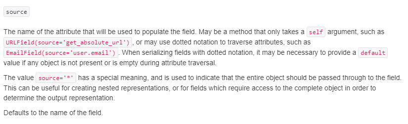

# Django 06


## REST API

- API (Application Programming Interface)
  - 프로그래밍 언어가 제공하는 기능을 수행할 수 있게 만든 인터페이스
    - 어플리케이션과 프로그래밍으로 소통하는 방법
  - 프로그래밍을 활용해서 할 수 있는 어떤 것
  - CLI, GUI 는 각각 명령줄과 그래픽(아이콘)을 통해서 특정 기능을 수행하는 것이며 API 는 프로그래밍을 통해 그 일을 수행


- Web API
  - 웹 어플리케이션 개발에서 다른 서비스에 요청을 보내고 응답을 받기 위해 정의된 명세
  - 현재 웹 개발은 추가로 직접 모든 것을 개발하지 않고 여러 Open API 를 가져와서 활용하는 추세
  - 구글, 카카오 지도 API, 우편번호, 도로명, 지번 소 검색 API 등


- youtube data api
- naver papago 번역 api
- kakao map api
- tmdb api


프로그래밍을 통한 요청에 JSON 을 응답하는 서버를 만들자


### REST API

> Representational State Transfer


- 웹 설계 상의 장점을 최대한 활용 할 수 있는 아키텍처 방법론
- 네트워크 아키텍처 원리의 모음
  - 자원을 정의
    - 자원 : resource (data)
  - 자원에 대한 주소를 지정하는 방법
- REST 원리를 따르는 시스템 혹은 API 를 RESTful API 라고 하기도 함


`자원과 주소를 지정하는 방법`


#### REST 구성

1. 자원 (URI)
2. 행위 (HTTP Method)
3. 표현 (Representations)


### URI

- Uniform Resource Identifier
- 통합 자원 식별자
- 인터넷의 자원을 나타내는 유일한 주소
- 인터넷에서 자원을 식별하거나 이름을 지정하는 데 사용되는 간단한 문자열
- 하위 개념
  - URL URN


#### URL

- Uniform Resource Locator
- 통합 자원 위치
- 네트워크 상에 자원(리소스)이 어디 있는지 (주소)를 알려주기 위한 약속
- 자원은 HTML 페이지, CSS 문서, 이미지 등이 될 수 있다
- 웹주소, 또는 링크 라고도 불린다


#### URN

- Uniform Resource Name
- 통합 자원 이름
- URL 과 달리 자원의 위치에 영향을 받지 않는 유일한 이름 역할 (독립적 이름)
- 자원의 이름이 변하지 않는 한 자원의 위치를 옮겨도 문제없이 동작


#### URL , URN

- URL 은 자원의 ID 를 정의하고 URL 은 자원을 찾는 방법을 제공
- 상호 보완적


#### URI 구조

> 스키마


**Protocol/Host/Port/Path**

- http://localhost:3000/posts/3
- http://google.com/search?q=http
  - query
- http://getbootstrap/docs/5.0/getting-started/introduction/#quick-start
  - fragment
  - 브라우저가 특정 위치를 인식하기 위한 것 (서버에 보내지 않는다)


#### 설계 주의 사항

- 밑줄이 아닌 하이픈 사용
  - 가독성
- 소문자 사용
  - 대소문자에 따라 다른 자원으로 인식
- 파일 확장자는포함시키지 않음


### HTTP Method

#### HTTP (HyperText Transfer Protocol)

- HTML 문서와 같은 자원들을 가져올 수 있도록 해주는 프로토콜 (규칙, 약속)
- 웹에서 이루어지는 모든 데이터 교환의 기초
- 클라이언트 - 서버 프로토콜
- 요청 (requests)
  - 클라이언트(브라우저)에 의해 전송되는 메시지
- 응답(responses)
  - 서버에서 응답으로 전송되는 메시지


#### HTTP 특징

- 비연결 지향(connectionless)
  - 서버는 응답후 접속을 끊음
- 무상태(stateless)
  - 접속이 끊어지면 클라이언트와 서버 간의 통신이 끝나며 상태를 저장하지 않는다


#### HTTP Method

- 자원에 대한 행위
- 즉 HTTP 는 HTTP Method 를 정의하여 주어진 자원에 수행하길 원하는 행동
- 의미론적으로 행위를 규정하기 때문에 **실제 그 행위 자체가 수행됨을 보장하진  않는다**
- HTTP verbs 라고도 함


#### HTTP Method

- GET
  - 특정 자원의 표시를 요청하며 오직 데이터를 받기만 한다
- POST
  - 서버로 데이터를 전송하며, 서버에 변경사항을 만든다
- PUT
  - 요청한 주소의 자원을 수정한다
- DELETE
  - 지정한 자원을 삭제한다


### Representation

#### JSON

- JavaScript Object Notation
  - light weight data-interchange format
  - 자바스크립트 객체 문법을 따르며, 구조화된 데이터를 표현하기 위한 **문자 기반** 데이터 포캣
  - 일반적으로 웹 어플리케이션에서 클라이언트로 데이터를 전송할 때 사용


#### 특징

- 사람이 읽고 쓰기 쉽고 기계가 파싱(해석&분석)하고 만들어 내기 쉬움
  - 파이썬의 dictionary, 자바스크립트의 object 처럼 c 계열의 언어가 갖고 있는 자료구조로 쉽게 변환이 가능하다
  - Parsing
    - 문자열 -> JSON 객체 (dictionary)
  - Stringifactation
    - JSON 객체 -> 문자열


### REST 핵심 규칙

1. URI 는 정보의 자원을 표현해야 한다
2. 자원에 대한 행위는 HTTP Method 로 표현한다


`프로그래밍을 통해 RESTful 하게 응답하는 서버 만들기`


## Django REST Framework


### Serialization (직렬화)

- 데이터 구조나 객체 상태를 동일하거나 다른 컴퓨터 환경에 저장하고 나중에 재구성할 수 있는 포맷으로 변환하는 과정
- 예를 들어 DRF 의 Serializer는 Django 의 Queryset 및 Model Instance 와 같은 복잡한 데이터를 JSON, XML 등의 유형으로 쉽게 변환할 수 있는 Python 데이터 타입으로 만들어 준다
- DRF 의 Serializer 는 Djano 의 Form 및 ModelForm 클래스와 유사하게 작동

https://docs.djangoproject.com/en/3.2/topics/serialization/


### DRF 기본

- Web API 구축을 위한 강력한 toolkit


#### JSON

1. Key : Value
2. dictionary, list 로 해석(parsing) 이 가능한 String


#### Serializer

1. 데이터 검증
2. JSON 생성

```python
from rest_framework import serializers
from .models import Article, Comment


class ArticleListSerializer(serializers.ModelSerializer):  # 목록
    # 없는 필드(댓글 개수)를 만들어서 JSON 을 구성하자.
    comment_count = serializers.IntegerField(source='comment_set.count')  # article.comment_set.count
    class Meta:
        model = Article
        # fields = '__all__'
        fields = ('id', 'title', 'comment_set', 'comment_count')
        read_only_fields = fields

```

보여줄 항목에 따라서 `Serializer` 를 다르게 생성한다.

- article 을 목록 조회 하는지 단일 조회 하는지에 따라 다른 Serializer 사용


```python
# 1. 데이터 검증 2. JSON 생성
class ArticleSerializer(serializers.ModelSerializer):  # 단일
    title = serializers.CharField(min_length=2, max_length=100)
    content = serializers.CharField(min_length=2)
    # comment 관련 JSON 포함해야 한다 => comment serializer 필요 (import 해서 쓰는 것이 아니기 때문에 함수 순서 주의)
    # related_name 과 동일하게 작성해야 한다.
    comment_set = CommentSerializer(many=True, read_only=True) # Article 을 통해 수정할 수 없다
    class Meta:
        model = Article
        fields = '__all__'
```

- 외래키로 연결되어 있는 모델을 역참조 할 때, 필드명을 related_name 과 동일하게 작성한다
- 다른 모델과 연결되어 있는 Serializer 를 참조할 수 있다.


```python
# comment 관련 JSON + validation 담당
class CommentSerializer(serializers.ModelSerializer):
    content = serializers.CharField(min_length=1, max_length=200)

    class Meta:
        model = Comment
        fields = '__all__'  # JSON에 모든 필드가 포함된다
        read_only_fields = ('article',)  # CUD 관련 validation 에 포함하지 않는다

        # exclude = ('article',)  # Write(CUD)/ Read(R) 에서 모두 없는 취급
        # 과거 코드에서는 object 간의 연결 관계가 있어 call 하는 게 가능했지만 지금은 String 으로 만들어야 하기 때문에
        # 처음 부터 있거나 처음 부터 없어야,
        # 따라서 article 을 read_only 처리하여 검증하지 않도록 한다

```

- `read_only_fields`
  - 외래키인 article_id 가 아직 설정되기 전에 
  - is_valid() 함수로 검증하게 되면, 값이 비어있는 것이 문제가 되므로 
  - read_only 로 생성, 수정 하지 않도록 설정하여 검증 과정에 포함시키지 않고
  - save 할 때 추가한다.


##### 참고: save() 메서드


#### api_view decorator

- view 함수가 응답해야 하는 http method 목록을 설정
- 작성하지 않으면 기본적으로 GET 메서드 허용
- 목록에 작성하지 않은 method 일 경우 405 error 반환


```python
from django.shortcuts import render, get_object_or_404
# from django.http.response import HttpResponseForbidden, HttpResponse
from .serializers import ArticleSerializer, ArticleListSerializer  # 이전의 ArticleForm 과 유사하게 
from rest_framework.response import Response  # render 를 대신하는
from rest_framework.decorators import api_view  # require_mehods 와 같다
from .models import Article


@api_view(['GET'])
def article_list(request):
    articles = Article.objects.all()
    serializer = ArticleSerializer(articles, many=True)
    return Response(serializer.data)

@api_view(['GET'])
def article_detail(requet, article_pk):
    article = get_object_or_404(Article, pk=article_pk)
    serializer = ArticleSerializer(article)
    return Response(serializer.data)

```

- 여러 개의 JSON 객체를 반환할 때, `many = True` 필요


##### PUT 과 PATCH 의 차이

- PUT: 자원의 전체 교체
- PATCH: 자원의 부분 교체


##### POST, PUT 요청 보내기

*POSTMAN* 을 사용하자


### Nested relationships

> 외래키 관계 표현하기

https://www.django-rest-framework.org/api-guide/relations/#nested-relationships


- 1: N 관계일 때, `many=True`


### Core Argument

https://www.django-rest-framework.org/api-guide/fields/#core-arguments





---

##### 참고 (drf 과제 하기)

- legacy database 가 주어졌을 경우
  - $ python manage.py inspectdb > models.py
  - app 의 models.py 를 대체하고
  - urls, views 를 작성한다
  - 정규화가 필요할 수도 있다


##### 당신의 API 가 RESTful 하지 않은 이유 5가지

https://beyondj2ee.wordpress.com/2013/03/21/%EB%8B%B9%EC%8B%A0%EC%9D%98-api%EA%B0%80-restful-%ED%95%98%EC%A7%80-%EC%95%8A%EC%9D%80-5%EA%B0%80%EC%A7%80-%EC%A6%9D%EA%B1%B0/

