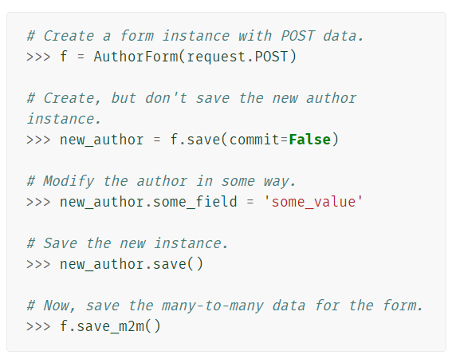
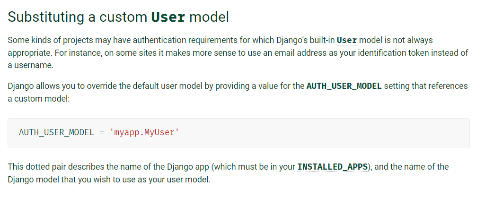
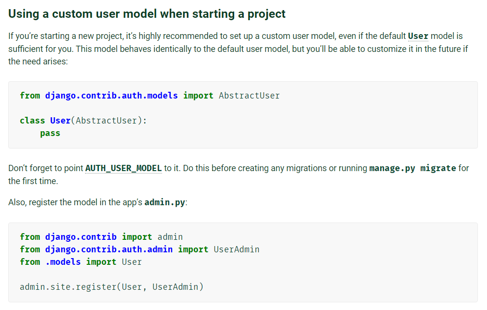
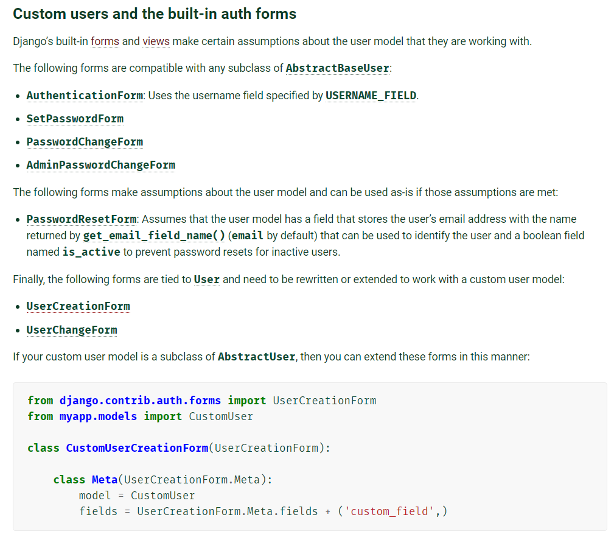
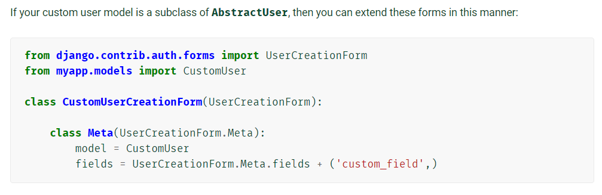
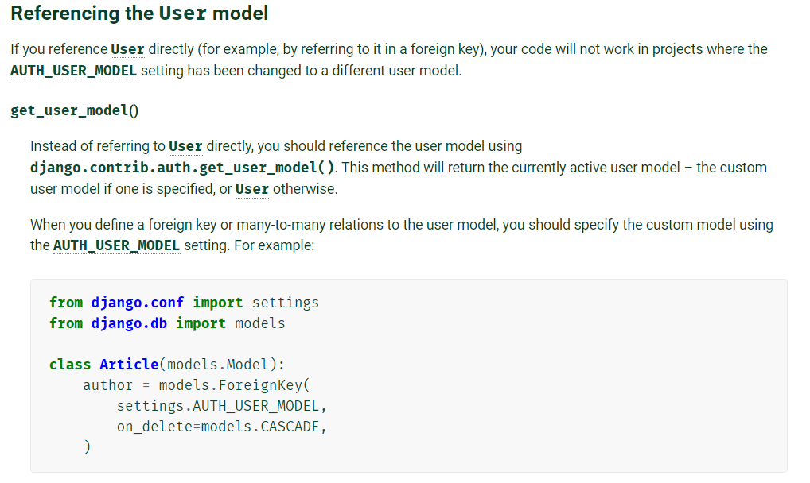

# DB 01


## Model Relationship 1


### Relationship fields

- Many to one (1:N)
  - ForeignKey()
- Many to Many (N:N)
  - ManyToManyField()
- One to One (1:1)
  - OneToOneField()


## A many to one relationship

### A many-to-one relationship in RDBMS

- Foreign Key 
  - RDBMS 에서 한 테이블의 필드 중 다른 테이블의 행(row)을 식별할 수 있는 키
  - 참조하는 테이블에서 1개의 키에 해당하고 이는 참조되는 테이블의 기본키
  - 하나의 테이블이 여러 개의 외래 키를 포함할 수 있음
    - 이러한 외래키들은 각각 서로 다른 테이블을 참조할 수 있음
  - 참조하는 테이블의 행 여러 개가 참조되는 테이블의 동일한 행을 참조할 수 있음
    - 여러 개의 댓글이 하나의 게시글을 참조하는 경우
  - 참조하는 테이블과 참조되는 테이블이 동일할 수도 있음 (재귀적 외래 키)
    - 대댓글
- 특징
  - 참조 무결성
    - 키를 사용하여 부모 테이블의 유일한 값을 참조
  - 외래 키의 값이 반드시 부모 테이블의 기본 키일 필요는 없지만 유일해야 한다


- 데이터 무결성
  - 데이터의 정확성과 일관성 보장
  - 참조 무결성
  - 개체 무결성
  - 범위 무결성


#### ForeignKey()

- model field
- 필수 인자 2개
  - 참조하는 모델 클래스
    - Union (type or str)
  - on_delete 옵션


```python
class Comment(models.Model):
    article = models.ForeignKey(Article, on_delete=models.CASCADE)
```


#### on_delete

- ForeignKey 가 참조하는 객체가 사라졌을 때 Foreignkey 를 가진 객체를 어떻게 처리할지 정의
- 데이터 무결성(DB Integrity)을 위해 매우 중요한 설정


- **CASCADE**
  - 부모 객체가 삭제되었을 때 이를 참조하는 객체 삭제
- PROTECT
  - 참조가 되어있는 경우 오류 발생
- SET_NULL
  - 부모 객체가 삭제 되었을 때 모든 값 NULL 로 치환
- SET_DEFAULT
  - 모든 값이 DEFAULT 로 치환
- SET()
  - 특정 함수 호출
- DO_NOTHING
  - 아무 것도 하지 않고 DB 에 제한 조건 설정해야 한다
- RESTRICT


## Comment


### DB API

- 외래키로 참조되는 객체의 pk 를 넣어야 하는데
- 객체 자체를 넣어 외래키 값을 정의할 수 있다


### 1:N model manager

```python
comment.article
```


### 역참조

- 나를 외래키로 참조하고 있는 대상을 참조
- 1: N 관계에서 1이 N 을 참조하는 것
- Django 의 Model Manager


```python
article.comment_set.all()
```

- `모델이름_set `형식의 manager 생성
- 


#### ForeignKey's Arguments - related_name

- model manager 이름 바꾸기
- 한 번 바꾸면 comment_set 으로 쓸 수 없다.
- 1:N 관계에서는 거의 사용하지 않지만 M:N 관계에서 반드시 사용해야 하는 상황 발생

```python
class Comment(models.Model):
    article = models.ForeignKey(
    Article,
    on_delete=models.CASCADE,
    related_name='comments')
```


### 댓글 작성하기

#### detail 

- 댓글 작성을 위한 GET  request 담당

  

#### comments_create

- 댓글 생성을 위한 POST request 담당
- CommentForm 통해 comment 작성 당시에는 FK 가 없기 때문에 추가해야 한다.


##### *save(commit=False)

- https://docs.djangoproject.com/en/3.1/topics/forms/modelforms/#the-save-method

  


### 댓글 읽기

#### 역참조 이용

- article.comment_set.all()


### 댓글 삭제

- article 의 pk 와 comment 의 pk 필요 
- url 작성시 `rest` 하게 작성하도록 주의


## Custom User

> Substituting a custom User model
>
> 커스텀 유저 모델로 대체하기


- 일부 프로젝트에서는 built-in User model 이 제공하는 인증 요구사항이 적절하지 않을 수 있다.
- django 는 custom model 을 참조하는 `AUTH_USER_MODEL` 설정을 제공하여 기본 user model을 **재정의 (override)** 할 수 있도록 함
- 새 프로젝트를 시작하는 경우 기본 사용자 모델이 충분하더라도, 커스텀 유저 모델을 설정하는 것을 강력하게 권장
- 커스텀 유저 모델은 기본 사용자 모델과 동일하게 작동하면서도 필요한 경우 나중에 맞춤 설정할 수 있기 때문
- **단 프로젝트의 모든 migrations 혹은 첫 migrate를 실행하기 전에 이 작업을 마쳐야 한다.** (user 설정이 완료되기 전에)


https://docs.djangoproject.com/en/3.1/topics/auth/customizing/#substituting-a-custom-user-model


### AUTH USER MODEL



- User 를 나타내는데 사용하는 모델
- 기본 값은 'auth.User'
- 주의 사항
  - 프로젝트가 진행되는 동안 변경할 수 없다 
  - 프로젝트 시작 시 설정하기 위한 것
  - 참조하는 모델은 첫번째 마이그레이션에서 사용할 수 있어야 한다.


### Abstract User



- AbstractBaseUser
  - 기본 password 와 last_login 만 제공한다
  - 자유도가 높지만 다른 필드는 모두 직접 작성해야 한다
- AbstractUser
  - 관리자 권한과 함께 완전한 기능을 갖춘 사용자 모델을 구현하는 기본 클래스


##### Abstract base classes

- 몇가지 공통 정보를 여러 다른 모델에 넣을 때 사용하는 클래스
- 데이터베이스 테이블을 만드는 데에 사용되지 않으며
- 대신 다른 모델의 기본 클래스로 사용되는 경우 해당 필드가 하위 클래스의 필드에 추가된다. 


### CustomUserCreationForm

- 기존에 사용하던 UserCreationForm 은 class Meta 에서 
- model 로 auth.User 를 사용하고 있다.
- 재정의가 필요하다


#### 재정의가 필요한 Form



- UserCreationForm
- UserChangeForm


#### 기존의 form 에서 확장하기



- UserCreationForm.Meta.fields (기본 필드)
- 내가 추가하고자 하는 필드를 튜플로 +
- 나의 User object 가 가지고 있는 필드만 추가할 수 있다.


## 댓글 작성자 

### User 참조하기

####  models.py 에서 user 참조하는 방법

```python
from django.db import models
from django.conf import settings

class Article(models.Model):
    user = models.ForiegnKey(settings.AUTH_USER_MODEL, on_delete=models.CASCADE)
```


##### settings.AUTH_USER_MODEL

- 유저 모델에 대한 외래 키 또는 M:N 관계를 정의할 때 사용
- 즉 , `models.py` 에서 유저 모델을 참조할 때 사용
- 그 외의 다른 곳에서는 get_user_model() 을 사용한다.
  - 직접 참조 대신 사용자 모델을 참조하라고 권장
  - 현재 활성화 (active) 된 유저 모델을 반환
- 리턴 값이 다르기 때문
  - settings.AUTH_USER_MODEL : str 반환
    - 현재 articles 모델 구동 중인데  (installed app 등록 순서 상 articles->accounts)
    - 그 다음에 accounts 모델이 구동되므로
    - 현재 시점에서는 활성화 된 User 객체가 정의 되어있지 않아
    - 객체를 반환하지 않아 참조할 수 없게 됨
    - 당장 사용할 객체가 없다면 일단 문자열을 반환 (구동 순서에 상관없이 가능)
  - get_user_model() : 활성화 User 객체반환


