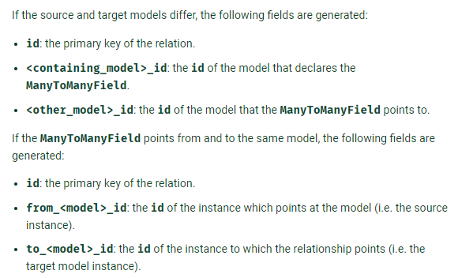
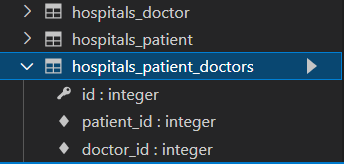
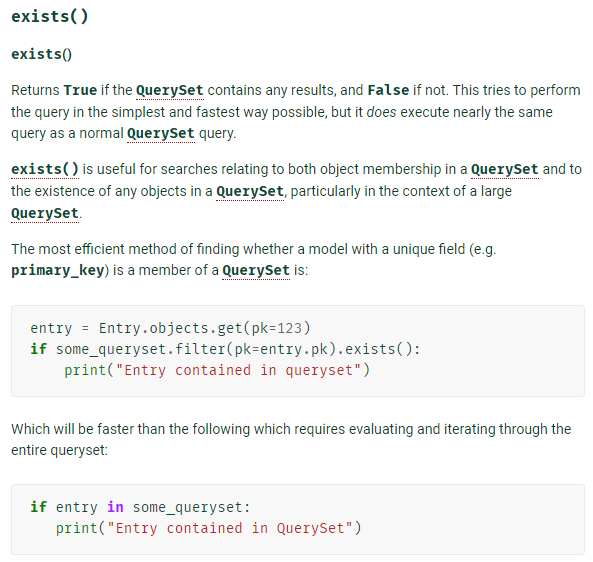
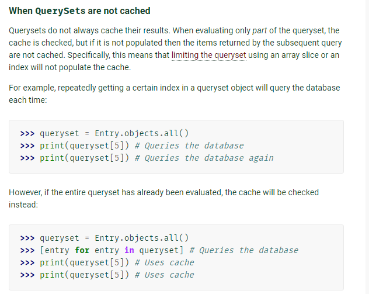
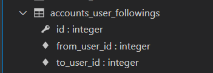

## DB 02


## Model Relationship 

### A Many to Many relationship

> M:N (다대다 관계) 를 나타내기 위해 사용하는 필드
>
> RelatedManager 를 통해 관련 개체를 추가(add), 제거(remove)


#### 중개 모델

class Doctor 과 class Patient 를 중개하는 class Reservation

각각의 클래스는 중개 테이블과 1: N 관계

class Doctor 1 : class Reservation N : `doctor.reservation_set.all()`

class Patient 1 : class Reservation N :` patient.reservation_set.all()`


###  Argument

#### through

- 추가 데이터를 다대다 관계와 연결하려는 경우 중개 테이블 직접 지정
- through 옵션을 사용하여 중개 테이블을 나타낼 수 있다.


class Patient (Many to Many field 를 가진 쪽 -> 중개 테이블을 만든다)

`'through=reservation'`


##### cf) 중개 테이블을 거치지 않고 manager 통해 가져오기

`patient.doctors.all() ` (여기서 doctors 는 필드 이름)


##### 필드 이름 형성 규칙




#### Related_name

class Doctor

`related_name='patients'` (필드가 없는 측에서 필드가 있는 측을 역참조)

`doctor.patients.all()` 


- ForeignKey 의 related_name 과 동일
  - 중복되면 M:N 쪽을 필수 변경한다.
- target model 이 source model 을 참조할 때 사용할 manager name


##### source & target 

- source
  - 관계 필드를 가진 모델
- target
  -  관계 필드를 통해 참조되는 모델


#### symmetrical

```python
from django.db import models

class Person(models.Model):
    friends = models.ManyToManyField('self')
```


- 자기 참조
- `models.ManyToManuField('self')`
- 위처럼 동일한 모델을 가리키는 정의의 경우 person_set 매니저 추가되지 않는다.
- 대칭적이라고 간주하며  한 쪽이 참조하면 레코드가 추가되는 것
  - 내가 너의 친구라면 너는 나의 친구
- self 와의 M:N 대칭 관계에서 대칭을 원하지 않는 경우 `symmetrical` 를 `False` 로 설정 (기본은 True)
  - 보통 대칭이 아님 (팔로잉 수 != 팔로우 수)


### 🎨Related manager

- 1:N 또는 M:N 관련 컨텍스트에서 사용되는 매니저
  - doctors, patient_set
  - `related_name` 으로 manager 이름 변경 가능
  - manager 끼리는 이름이 겹치면 생성이 안 된다.

#####  related manager method

- 같은 이름의 메서드여도 각 관게에 따라 다르게 동작
- 1:N 에서는 target 모델 객체만 사용 가능 (`1:target`, `N:source`), (역참조할 때)
- M:N 에서는 관련된 두 객체에서 모두 사용 가능
- `add`
  - 지정된 객체를 관련 객체 집합에 추가
  - 이미 존재하는 관계에 다시 사용하면 복제되지 않음
- `remove`
  - 관련 객체 집합에서 지정된 모델 객체를 제거
- create
- clear
- set

https://docs.djangoproject.com/en/3.1/ref/models/relations/


### 실습 (병원: 의사와 환자)

- 1:N 의 한계
  - 다른 의사에게 방문한 기록을 만들기 위해서는 예약을 새로 생성해야
  - 방문 예약을 1 에서 2 의사로 변경하기 위해서도 예약을 새로 생성해야
- 예약 정보 기록하는 테이블이 필요하다.
  - 중개모델
  - doctor 와 1: N, patient 와 1:N
  - doctor FK, patient FK 를 가진다.
- 역참조 가능
  - doctor1.reservations_set.all()
  - patient.reservations_set.all()


#### M:N 지원 Field : Many to Many

- 두 모델 중 어느 곳에 둬도 괜찮다. 
  - doctor, patient 둘 중 하나
- 작명시 복수형으로 작성
  - doctors = `models.ManyToManyField(Doctor)`
- 중개 모델이 생성된 것을 확인할 수 있다.
  - app이름 _ model이름 _ field이름



- 서로를 직접 참조할 수 있다
- 새로운 DB API 를 사용한다.
  - `add`
  - 관계를 추가한다
  - `remove`
  - 관계를 끊는다.

```python
patient1.doctors.add(doctor1)
patient1.doctors.all()

# 나를 참조하는 필드를 가진 객체를 참조한다 = 역참조
# 필드가 없는 측에서 필드가 있는 측을 참조한다는 것
doctor1.patient_set.all()
doctor1.patient_set.add(patient2)

patient2.doctors.all()

# 관게 끊기
doctor1.patient_set.remove(patient1)
patient2.doctors.remove(doctor1)
```


##### 중개 테이블을 직접 작성해야 하는 경우?

- 기본 외래키 제외 하고  추가적으로 파생 필드를 필요로 할 경우
- 중개테이블이 있을 경우 명령어가 추가 된다.

```python
class Patient(models.Model):
    name = models.TextField()
    doctors = models.ManyToManyField(Doctor, through='Reservation')
```


##### 역참조 모델 매니저 이름 바꾸기

- 이름 규칙 통일하려고
  - patient_set => patients
- `related_name`
  - related_name 을 설정하면 기존의 patient_set 은 사용할 수 없다

```python
class Patient(models.Model):
    name = models.TextField()
    doctors = models.ManyToManyField(Doctor, related_name='patients')
```


### like 하기

> user - article

#### 좋아요 여부 검증 메서드 : exist()

- 동일한 쿼리지만 in 보다 빠르다
  - if 평가의 결과를 캐시에 저장해두는데
  - 동일한 쿼리에 대해서 같은 쿼리셋을 사용하기 위함
  - 그런데 쿼리셋 자체가 엄청 크다면 캐시를 많이 차지하고
  - 캐시 전체를 조회하면 오래 걸림
  - 그러나 exists 는 쿼리셋을 저장하지 않고 그 때에만 판단한다.
  - 따라서 쿼리셋의 크기가 크고 전체 조회가 필요하지 않다면 exists 를 쓰는 것이 좋다.




##### Queryset are LAZY

- 쿼리셋을 만드는 작업에는 DB 작업이 포함되지 않는다 (DB가 관여하지 않는다)
  - 필터 체이닝을 해도 그 자체는 DB 작업에 영향을 미치지 않으므로 괜찮다.
- 그럼 언제 DB 에 보내는가?
  - 평가 (hit, assess, query)
  - 쿼리를 DB 로 날린다 (무거운 작업이기 때문)
  - 쿼리셋을 cache 로 만든다.
- 평가는 언제 이루어지는가?
  - 반복문, 조건문,  출력
    - Iteration 쿼리셋은 반복 가능하며 처음 반복할 때 데이터베이스 쿼리를 실행(평가)
    - bool()
  - https://docs.djangoproject.com/en/3.1/ref/models/querysets/#when-querysets-are-evaluated
- 평가의 결과는 
  - 쿼리셋의 내장 cache 에 저장된다
  - 다시 순회할 때 또 평가하지 않는다.
- cache 를 이용해 효율적으로 사용 가능
  - 평가를 거치면 cache 에 저장된다는 점을 이용
  - 특정 객체를 slicing, index 로 접근 할 때엔 cache 저장하지는 않는다




##### cache 활용하기

- DB 에 쿼리를 최소한으로 보내기 위한 최적화 방법

```python

like_set = article.like_users.filter(pk=request.user.pk)
if like_set:  # 평가
    # 쿼리셋의 전체 결과가 필요하지 않은 상황임에도
    # ORM 은 전체 결과를 가져와 cache 에 담는다
    article.like_users.remove(request.user)

# 개선 1
# exists() 쿼리셋 캐시를 만들지 않으면서 특정 레코드가 있는지 검사
if like_set.exists():
    # DB 에서 가져온 레코드가 없다면 메모리를 절약할 수 있다.
    article.like_users.remove(request.user)
    
# 만약 If 문 안에서 반복문이 있다면?
# if 에서 평가 후 캐싱
if like_set:
    for user in like_set:  # 순회 할 때에는 위에서 이미 평가가 이루어졌으므로 cache 사용
        print(user.username)
        
# 만약 쿼리셋 자체가 너무 크다면?
# iterator()
# 데이터를 작은 덩어리로 쪼개어 가져오고, 이미 사용한 레코드는 메모리에서 지운다
# 전체 레코드의 일부를 DB에서 가져오므로 메모리를 절약한다.
if like_set:
    for user in like_set.iterator(): 

# 쿼리셋이 너무너무 크다면? if 평가 조차 버거울 수 있다.
if list_set.exists():
    for user in like_set.iterator():
```


###### 안일한 최적화

도널드 커누스,  섣부른 최적화는 모든 악의 근원이다.


### follow 하기

> user - user
>
> 재귀적 참조 (대댓글)

#### models.py

```python
class User(AbstractUser):
    followings = models.ManyToManyField('self', symmetrical=False, related_name='followers')

```


- symmetrical 을 False 하면 그때 부터는 related manager 가 존재하므로 (역참조가 가능)
- related_name 을 설정해야 한다.
- 중개 테이블이 생성된다.
- 


##### template 에서 자주 사용하는 구문 변수로 지정하기

- 
  - with tag 안에서 유효한 변수
  - 블럭이 크다고 느껴지면 include 해서 사용해도 될 것

- 최적화와는 관계 없다.

```django
 

  <div>
    팔로잉 : {{ followings|length }} / 팔로워 : {{ followers|length }}
  </div>
      
        <div>
          <form action="" method="POST">
            
            
              <button>언팔로우</button>
            
              <button>팔로우</button>
            
          </form>
        </div>
      
  
```


##### 서버사이드에서 중요한 것

1. 모델링
2. 쿼리문