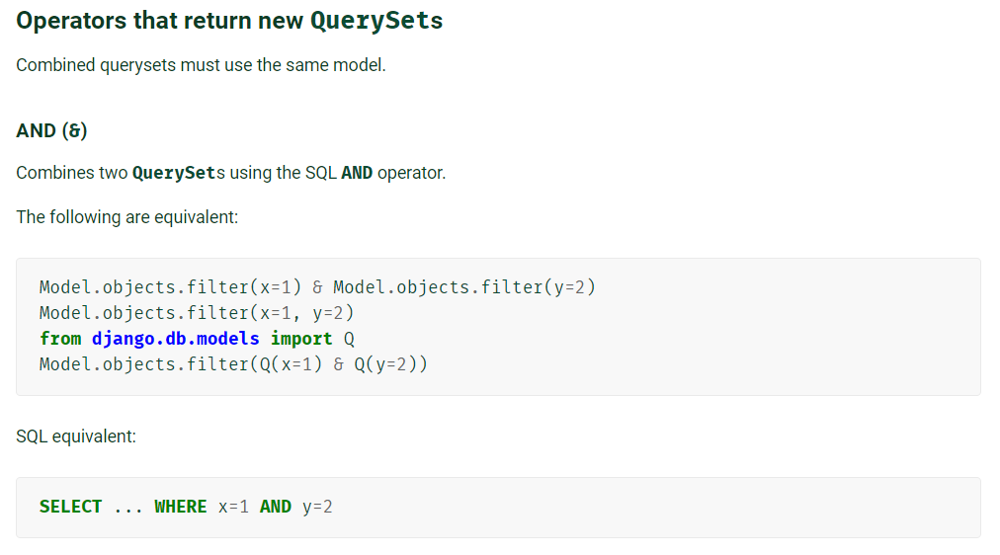
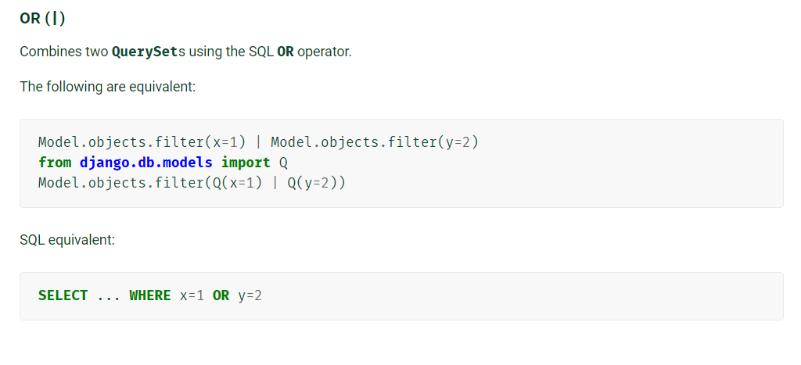
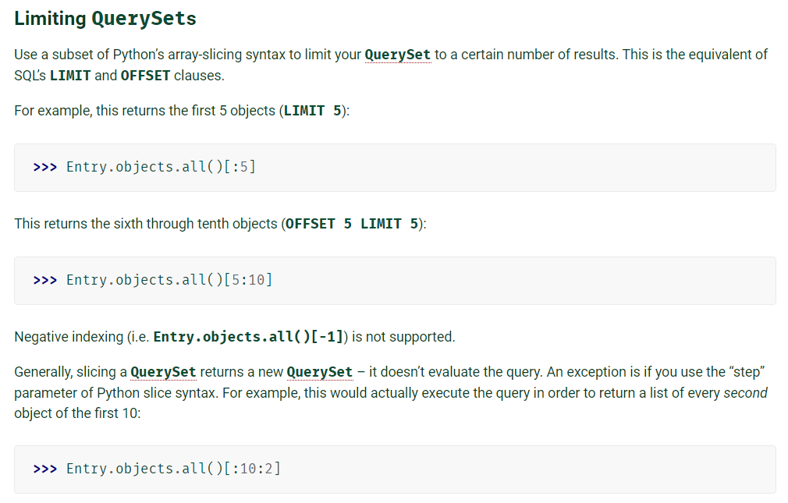
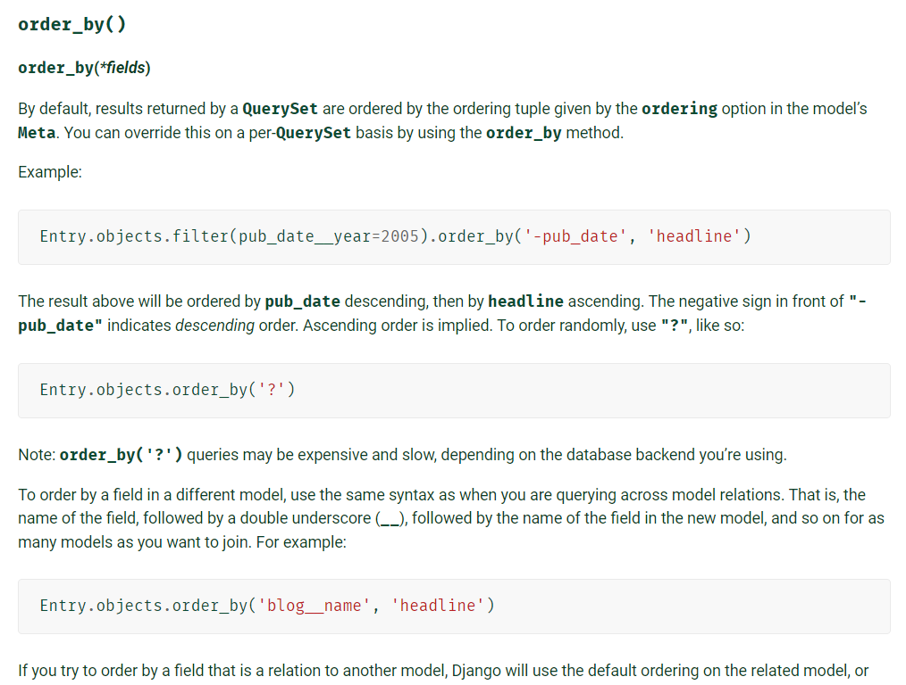
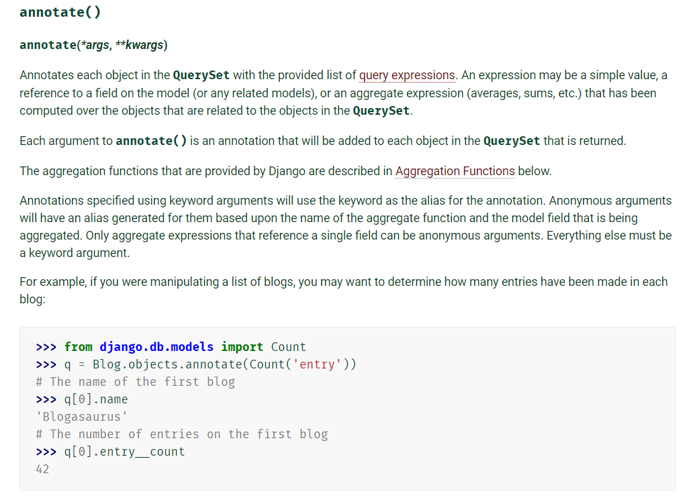

## SQLite


### 시작하기

```sqlite
$ sqlite3 tutorial.sqlite3
sqlite> ; 
sqlite> .databases

sqlite> .mode csv
sqlite> .import hellodb.csv examples

sqlite> SELECT * FROM examples;
sqlite> .headers on
sqlite> .mode column

-- sql 파일 읽어오기
sqlite> .read 00_create_table.sql

-- 테이블 생성
sqlite> CREATE TABLE classmates(
	id INTEGER PRIMARY KEY,
    name TEXT
)

-- 테이블 삭제
sqlite> DROP TABLE classmates;

sqlite> .tables
sqlite> .schema examples


```


- colon 으로 종료
- . 으로 시작하면 전용 명령어 (SQL이 아님)
  - .mode 설정
  - .import
- SQL 공식 명령어는 대문자


## DML

#### INSERT

```sqlite
--INSERT
INSERT INTO classmates (name, age) 
VALUES ('홍길동', 23);

-- 모든 열에 데이터를 넣을 때에는 column 을 명시할 필요 없다
INSERT INTO classmates
VALUES ('김길동', 30, '서울')

-- 여러 행 삽입 가능하다.
INSERT INTO classmates (name, age, address)
VALUES ('정먼지', 3, '밴쿠버'),
('유선혜', 28, '연남동'),
('여주은', 28, '성남시'),
('박정은', 28, '서초구');
```


- PK 를 따로 명시적으로 작성하지 않으면
- 자동으로 값이 증가하는 PK 옵션을 가진 `rowid` 컬럼을 정의


```sqlite
CREATE TABLE classmates(
  id INTEGER PRIMARY KEY AUTOINCREMENT,
  name TEXT NOT NULL,
  age INT NOT NULL,
  address TEXT NOT NULL
);
```

- autoincrement 해서 pk 를 만들경우, 
- 이전에 삭제된 행의 id 값을 재사용하지 않는다.
- 이는 메모리, 디스크 공간을 추가적으로 사용하는 것이나
- django 는 사용한다. 
- 삭제된 데이터에 대해 불필요한 데이터라고 처리하는 것을 중요하게 생각하기 때문이다,


#### SELECT

```sqlite
-- 전체 조회
SELECT * FROM classmates;

-- 컬럼 지정 조회
SELECT rowid, name FROM classmates;

-- 개수 제한(지정)
SELECT rowid, name FROM classmates
LIMIT 1;

--  LIMIT 개 OFFSET 뒤부터 (순서 중요)
SELECT rowid, name FROM classmates 
LIMIT 2 OFFSET 2; 
```


##### WHERE

```sqlite
-- 검색 조건
SELECT id, name FROM classmates
WHERE address='수지';

-- 중복 제거
SELECT DISTINCT age FROM classmates;
```


```sqlite
-- users 에서 age 가 30 이상인 사람
SELECT *
FROM users
WHERE age >= 30;

-- users에서 age 가 30 이상인 사람의 이름만
SELECT last_name||first_name
FROM users
WHERE age >= 30;

-- user 성이 김이면서 나이가 30 이상인 사람의 성과 나이
SELECT last_name, age
FROM users
WHERE age >= 30 and last_name = '김'
```


##### LIKE

- `-`  반드시 이 자리에 한 개의 문자 
- `%` 이 자리에 문자열이 있을 수도 없을 수도 있다.

```sqlite
-- 값의 비교가 아닌 패턴의 비교 (LIKE)
SELECT *
FROM users
WHERE age LIKE '2_';

-- 지역번호가 02인 사람
SELECT phone
FROM users
WHERE phone LIKE '02-%';

-- 준으로 끝나는 사람의 이름
SELECT last_name||first_name
FROM users
WHERE first_name LIKE '%준';

-- 중간 번호가 5114 인 사람
SELECT phone
FROM users
WHERE phone LIKE '%-5114-%'

```


##### ORDER BY

```sqlite
-- 나이 순으로 오름차순 정렬하여 상위 10개
SELECT * 
FROM users
ORDER BY age ASC
LIMIT 10;

-- 나이 순으로 내림차순 정렬하여 상위 10개
SELECT * 
FROM users
ORDER BY age DESC
LIMIT 10;

-- 나이 순, 성 순으로 오름차순 정렬하여 상위 10개
-- 순서 유의미 (우선순위)
-- order by age, last_name 1차정렬 나이 2차정렬 성 
-- order by last_name, age 1차정렬 성 2차정렬 나이
SELECT * 
FROM users
ORDER BY age ASC, last_name DESC
LIMIT 10;


-- users에서 계좌 잔액순으로 내림차순 정렬하여 성과 이름 10개 
SELECT last_name||first_name
FROM users
ORDER BY balance DESC
LIMIT 10;

```


##### group by

- 지정된 기준에 따라 행 세트를 그룹으로 결합한다.
- 데이터를 요약하는 상황에 주로 사용한다.
- SELECT 문의 option clause 이다.

```sqlite
SELECT last_name, COUNT(last_name) as name_count
FROM users
GROUP BY last_name;
```


#### DELETE

```sqlite
DELETE FROM classmates 
WHERE address = '밴쿠버'
```


#### UPDATE

```sqlite
UPDATE classmates
SET name = '유진정', address = '풍덕천동'
WHERE id = 1;

```


## DDL

#### ALTER

```sqlite
ALTER TABLE news 
ADD COLUMN created_at TEXT

```


## django ORM

```bash
python manage.py dbshell

## ORM 이 사용하는 SQL 문을 보여준다.
python manage.py shell_plus --print-sql
```


### iPython[notebook]

```
pip install ipython[notebook]
python manage.py shell_plus --notebook
```


#### WHERE





https://docs.djangoproject.com/en/3.1/ref/models/querysets/#field-lookups


#### LIMIT OFFSET




#### ORDER BY



- ? 는 랜덤정렬. 쓸 일이 있을까?
- 


### annotate()

- 기존의 컬럼 값을 이용하여 파생 컬럼 만들기
- DB 튜팅
- M:N 일 수록 빛을 발한다.




