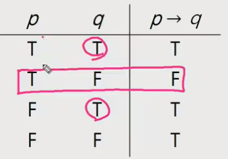
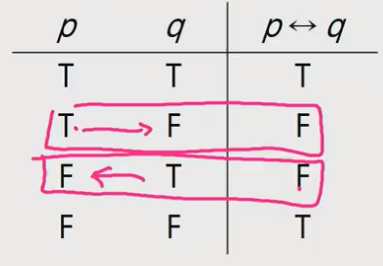
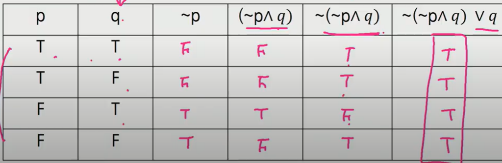
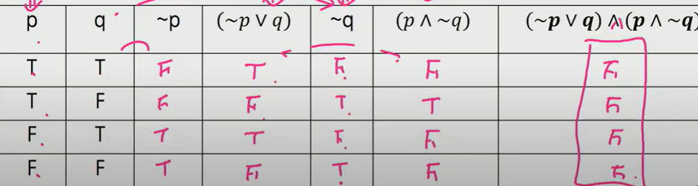
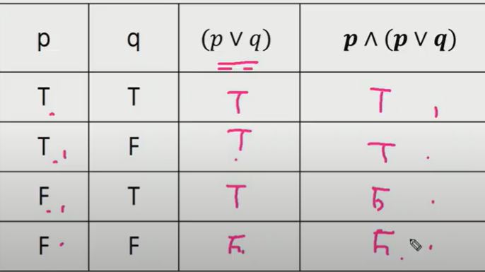
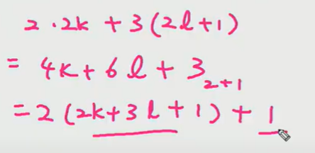
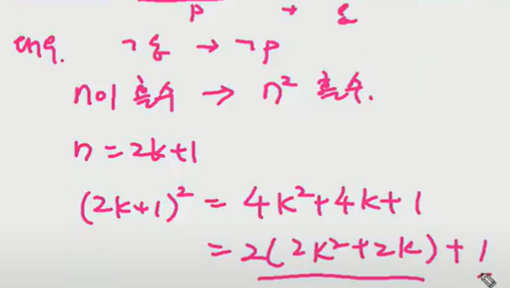
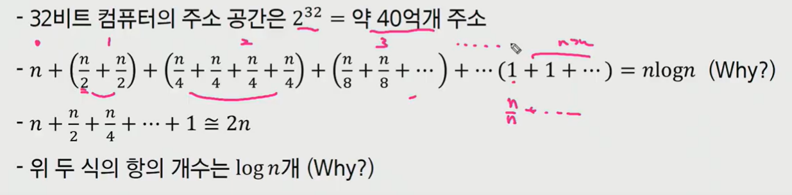
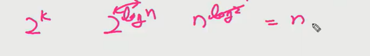
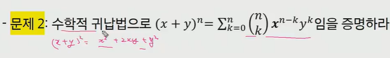

# 컴퓨팅 사고력

> 이산 수학 


### 논리 (Hard Logic)

- Hard vs Soft Logic
- 일상생활에서는 Soft logic 이 빠르기 때문에 유용
- 프로그래밍은 Hard logic 을 사용
- Soft logic 으로 알고리즘을 이해하려고 하는 오류
- 


### 명제

- 참이나 거짓을 알 수 있는 식이나 선언적 문장
- p, q, r ... 로 표현


### 진릿값

- 참이나 거짓을 표현
- T, F 또는 1, 0


##### 정의

- 부정 NOT
  - p가 명제일 때 명제의 진릿값이 반대
  - ~p
  - not p 또는 p 의  부정
- 논리곱 AND (Cunjunction)
  - p, q 가 명제일 때, p,  q 모두 참일 때만 참이 되는 명제
  - p^q (p and q, p 그리고 q)
- 논리합 OR
  - p, q 가 명제일 때, p , q 모두 거짓일 때만 거짓이 되는 명제
  - p v q (p or q, p 또는 q)
- 배타적 논리합 XOR
  - p, q 가 명제일 때 p, q 중 하나만 참일 때 참이 되는 명제
  - p xor q
  - exclusive OR
- 연산자 우선 순위
  - `not >  v`, `^ >  (->, <->)`
- 항진 명제
  - 진릿값이 항상 참
- 모순 명제
  - 진릿값이 항상 거짓
- 사건 명제
  - 항진 명제도 모순 명제도 아닌 명제
- 조건 명제
  - p, q 가 명제일 때 명제 p 는 조건(또는 원인)
  - q 가 결론 (또는 결과)로 제시되는 명제
  - p -> q (p이면 q이다)
  - T -> F 이면 F



- 쌍방 조건 명제
  - p q 가 명제일 때 명제 p와 q 가 모두 조건이면서 결론인 명제
  - p <-> q (p면 q고, q면 p다)



- 조건 명제의 역, 이, 대우
  - 역 q -> p
  - 이 ~p -> ~q
  - 대우 ~q -> ~p
    - 원래의 조건 명제와 결과가 같다


### 증명

- 증명은 정확한 명제식으로 표현할 수 있는 것이라야 함
- 보통은 정확한 명제식까지 쓰지는 않지만 명제식으로 바꿀 수 있음
- p -> q 를 p <-> q 와 혼동하지 않는다


#### 수학적 귀납법

- p(1) 이 참이고 p(n)->p(n+1) 이 참이면 p(n) 은 모든 자연수 n 에 대해서 참이다
- 수학적 귀납법의 강한 형태
  - p(1) 이 참이고 p(1) ^ p(2) ^ ... ^ p(n) ^ p(n+1) 이 참이면 모든 자연수 n에 대하여 p(n) 은 참이다.


1. 직접 증명
2. 간접 증명 (대우로 증명한다)

3. Trivial Proof (자명한 증명)
   - p(x) -> q(x) 를 증명하려는데, q(x) 가 항상 참인 경우
4. Vacuous Proof (공허한 증명)
   - p(x) -> q(x) 를 증명하려는데, p(x) 가 항상 거짓인 경우


## 논리와 증명


- 문제 1 : 다음 명제들이 항진명제라는 것을 진리표를 이용해서 보이시오

1. ~(~p^q)vq




- 문제 2 : 다음 명제들이 모순 명제라는 것을 진리표를 이용해서 보이시오

1. (~qvq)^(p^~q)




- 문제 3 : 다음 명제의 쌍 들에 대해서 두 명제가 동등한지를 진리표를 이용해 확인하시오

1. p ^ (pvq) 와 p




- 문제 4: 명제식의 변형을 통하여 다음 명제를 간소화 하시오.

1. (p^~q) v (p^q)
   - p ^ (~q v q)


- 문제 5: 다음 명제들이 참인지 확인하시오. 단 R 은 실수의 집합을 의미하고, Z는 정수의 집합을 의미한다.

1. A x €  R, x^2 >= x

3. Ex  €  R, x^2 < x
   - 어떤 x


- 문제 6: (직접 증명) n 이 짝수이면 3n + 5 는 홀수 임을 증명하라.
  - n = 2k 로 두고 3n+5 가 2(정수) + 1 형태로 표현될 수 있는가?


- 문제 8 : m 이 짝수이고 n 이 홀수 이면 2m+3n 은 홀수 임을 증명하라
- 


- 문제 10 : n^2이 짝수이면 n 은 짝수임을 증명하라
  - 간접증명 (대우)




**문제 12 과제** 


## 수와 표현


- 컴퓨터는 0, 1 을 표현할 수 있는 비트들을 모아 수를 표현
- k 개의 비트를 사용하면 0 부터 (2^k)-1 까지 표현 가능
- 경우의 수 2^K 가지의 값을 표현하는 것이 가능하다는 뜻
- 10 진수로 k 자리를 쓰면 0 부터 (10^k)-1 까지 표현이 가능한 것과 완전히 동일한 과정
- 어떤 값 n을 표현하기 위해서는 몇개의 비트가 필요할까?
  - 2^k - 1 >= n 이 성립해야 함
  - 2^k >= n + 1
  - k >= log(n+1) 따라서 약 log n 의 비트가 필요하다
  - x = log n 과 2^x = n 은 같은 말 (밑이 2 인 로그를 사용하기 때문에)


### log n

- 2 의 몇승이 n 이 되느냐의 답
- n을 표현하는 데 몇 비트가 필요한가의 답
- 1 로 시작해서 계속 두 배를 할 때 몇번 하면 n 이 되느냐의 답
- n 을 2 로 계속 나눌 때 몇번 나누면 거의 1이 되느냐의 답
- 



- 분모를 생각할 때 2^0, 2^1, 2^2 ..., 2^logn 따라서 logn + 1 개 
- 상수항은 생략하기 때문에 log n 개로 생각한다
- 등비수열의 합 생각하면 (1/2 + 1/4 +...+ 1/2^n) 은 1 이기 때문에 


- 문제 1 : 2 진수 표현에서 logn 비트로 표현할 수 있는 숫자 범위는?




- 문제 3 : n 이 충분히 큰 값일 때 다음 중 어느 값이 더 큰가?

1. 2n (<) n^2
2. 2^nlogn (>) n!


```
2^k = n
k = log n

2^nlogn = n^n
n^n = n*n*n*...*n 
n! = 1*2*3*...*n
```


- 문제 4 <과제>


- 문제 5 : 다음 함수들의 역함수를 구하시오.

1. f(x) = log(x-3) - 5

```
f(x)+5 = log(x-3)
2^(f(x)+5) = x-3
x= 2^(f(x)+5)+3

f-(x)= 2^(x+5)+3
```


## 집합과 조합론

- 두 집합 A 와 B에 대해 A가 B의 부분 집합임을 증명한다는 것은 A의 임의의 원소가 B에 포함됨을 보이는 것과 같다
- 모든 4 의 배수는 2의 배수라는 것을 증명하려면 , 4k = 2(2k) 임을 보이면 된다
- 두 집합  A, B 가 같다는 것을 증명하기 위해서는 A 가 B 의 부분집합이고 B 가 A의 부분집합이라는 것을 증명하면 된다.


- 조합론은 경우의 수를 따지는 문제
- 조합은 개수는 C  를 이용하여 표현하기도 하지만 (5 2) = 10 과 같은 괄호 표현을 더 많이 쓴다
- 이항계수

- nCr


- 문제 1 : nCk + nCk-1 = n+1Ck 임을 증명하라

```
nCk = n! / (n-k)!*k!
nCk-1 = n!/(n-k+1)!(k-1)!

nCk+nCk-1 
= (n-k+1)n!+kn!/(n-k+1)!k!
= n!(n+1)/(n-k+1)!k!
=(n+1)!/(n+1-k)!k!
=n+1Ck
```


- 문제 2 : 수학적 귀납법으로 증명
- 


- 문제 4 : 귀류법을 이용하여 (A-B)^(B-A) = 0 임을 증명하라
- p -> q 를 증명하기 어려운 경우, 
- p ^ ~q 를 전제로 하여 모순을 보인다
- 공집합이 아니라고 가정한다

```
p E (A-B) , p E (B-A) 인 p가 있다면,

# 1
p E A, p !E B 일 때,
p E (B-A) E B
p !E B 라는 것은 모순

# 2
p !E A, p E B 일 때,
p E (A-B) E A
p !E A 라는 것은 모순

# 3
p E A, p E B 일 때, 모순

# 4
p !E A, p !E B일 때 모순,

따라서 p E (A-B) , p E (B-A) 인 p는 존재하지 않는다.
```


- 문제 12: 52 개의 카드를 이용해서 만들 수 있는 5개 카드의 조합은 몇가지?

1. 52C5


- 문제 16 <과제>


## 기초 수식

- 알고리즘의 시간 복잡도를 표현할 수 있는 다양한 수식이 존재한다


- 문제 1: T(n) = T(n-1) + 1 
  - 진짜 1 이 아니라 상수시간, c, 세타
  - T(0) = 1 로 가정한다.
  - 예시) 팩토리얼 재귀 호출

```
T(n) = T(n-1) + 1
= T(n-2) + 1 + 1
= T(n-3) + 1 + 1 + 1
= T(n-k) + k
= T(0) + n
= 1 + n

O(n) 으로 표기할 수 있다.
```


- 문제 3 : T(n) = T(n-1) + logn
  - T(0) = 1 가정

```
f(n):
if n > 0:
for (i=0;i<n;i=i*2)
```

```
T(n) = T(n-1) + logn
= T(n-2) + log(n-1) + logn
= T(n-k) + log(n-k+1) + ... + log(n-1) + logn
= T(0) + log 1 + ... + log(n-1) + log n
= T(0) + log (1*...*n-1*n)
= 1 + log n! <= 1 + log n^n = 1+ nlogn
<= 1 + nlogn

O(nlogn)
```


- 문제 5: T(n)=T(n/2)+n
  - T(1) = 1

```
T(n) = T(n/2) + n
= T(n/4) + (n/2) + n
= T(n/8) + (n/4) + (n/2) + n
= T(n/2^k) + n/2^(k-1) + ... + (n/2^1) + (n/2^0)
= T(1) + n(1/2^(logn-1)+...+(1/2^1)+(1/2^0))
<= 1 + n

O(n)
```


- 문제 7 : T(n) = 3T(n/2) + n

```
T(n) = 3T(n/2) + n
= 3^2*T(n/2^2)+ 3/2*n + n
= 3^3*T(n/2^3)+ 3^2/2^2*n + 3/2*n + n
= 3^K*T(n/2^k)+(3/2)^k*n+...+3/2*n + n
= 3^logn*T(1)+ 2*n((3/2)^logn-1)
= n^log3 + 2*n*n^log3/2-2n
= n^log3 + 2*n*n^(log3-log2)-2n
= n^log3 + 2*n*(n^log3/n^log2)-2n
= n^log3 + 2*n*(n^log3/n)-2n
= n^log3 + 2*(n^log3)-2n
= 3*n^log3 - 2n

```


## 재귀


## 동적프로그래밍


