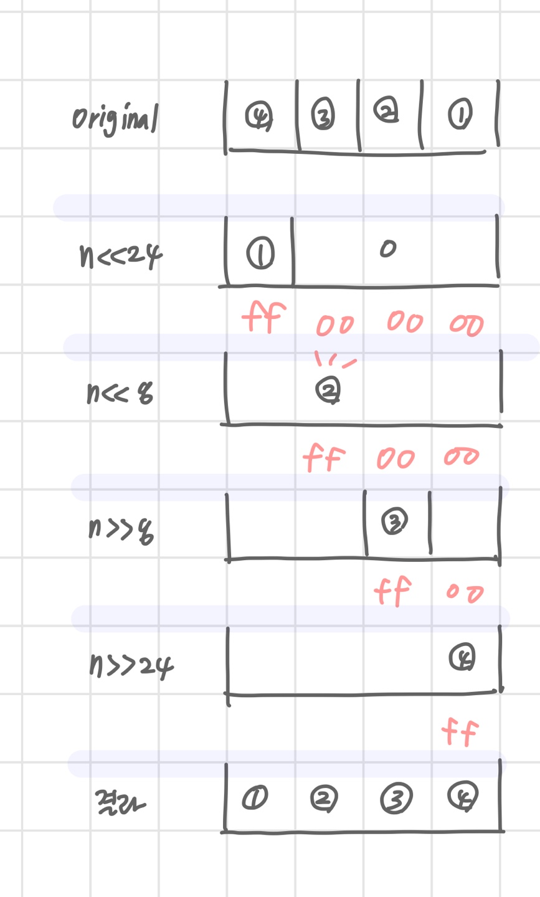

# Start


## SW 문제 해결


### 문제 해결 과정

- 문제를 읽고 이해한다
- 문제를 익숙한 용어로 재정의한다
- 어떻게 해결할지 계획을 세운다
- 계획을 검증한다
- 프로그램으로 구현한다
- 어떻게 풀었는지 돌아보고, 개선할 방법이 있는지 찾아본다.


### 체계적인 접근을 위한 질문들

- 비슷한 문제를 풀어본 적이 있었나?
- 단순한 방법에서 시작할 수 있을까?
- 문제를 단순화할 수 있을까?
- 그림으로 그려볼 수 있을까?
- 수식으로 표현할 수 있을까?
- 문제를 분해할 수 있을까?
  - 조합이나 순열 
  - 순서를 정한다던가
- 뒤에서부터 생각해서 문제를 풀 수 있을까?
- 특정 형태의 답만을 고려할 수 있을까?


## 복잡도 분석

- 알고리즘
  - 유한한 단계를 통해 문제를 해결하기 위한 절차나 방법
  - 컴퓨터가 일을 수행하기 위한 단계적 방법
- 공간적 효율성과 시간적 효율성
  - 공간적 효율성은 연산량 대비 얼마나 적은 메모리 공간을 요하는가
  - 시간적 효율성은 연산량 대비 얼마나 적은 시간을 요하는가
  - 효율성을 뒤집어 표현하면 복잡도가 된다
  - 복잡도가 높을수록 효율성은 저하된다
- 시간적 복잡도 분석
  - 하드웨어 환경에 따라 처리시간이 다르다
    - 부동소수 처리 프로세서 존재 유무
    - 나눗셈 가속 기능 유무
    - 입출력 장비의 성능, 공유 여부
  - 소프트 웨어 환경에 따라 처리 시간이 달라진다
    - 프로그램 언어의 종류
    - 운영 체제, 컴파일러의 종류
  - 이러한 환경적 차이로 인해 분석이 어렵다


### 복잡도의 점근적 표기

- 시간 복잡도는 입력 크기에 대한 함수로 표기하는데, 이 함수는 주로 여러 개의 항을 가지는 다항식이다.
- 이를 단순한 함수로 표현하기 위해 점근적 표기 (Asymptotic Notation) 를 사용한다.
- 입력크기 n 이 무한대로 커질 때의 복잡도를 간단히 표현하기 위해 사용하는 표기 법이다.


### O(Big-Oh) 표기

- O- 표기는 복잡도의 점근적 상한을 나타낸다
- 복잡도가 f(n) = 2n^2 -7n + 4 이라면, f(n) 의 O-표기는 O(n^2) 이다
- 단순화된 함수 n^2 에 임의의 상수 c를 곱한 cn^2 이 n 이 증가함에 따라 f(n)의 상한이 된다.
  - n이 충분히 큰 경우
  - 단, c > 0
- 단순히 실행 시간이 n^2 에 비레하는 알고리즘


### Ω(Big-Omega) 표기

- 복잡도의 점근적 하한을 의미한다
-  f(n) = 2n^2 -7n + 4 이라면, f(n) 의 O-표기는 Ω(n^2) 이다
- 최소한 이만한 시간은 걸린다
  - 잘 해봤자


### Θ(Theta)- 표기

- 항상 이정도 연산은 하게된다.
- O == Ω 일때
- f(n) 은 n 이 증가함에 따라 n^2 과 동일한 증가율


### 자주 사용하는 O 표기

- O(1) 상수시간
- O(logn)
- O(n) 선형 시간
- O(nlogn) 로그 선형 시간
- O(n^2)
- O(n^3)
- O(2^n)


## 표준 입출력 방법


### python3 표준입출력

#### 입력

- Raw  값의 입력
  - input()
  - 받은 입력값을 문자열로 취급
- Evaluated 된 값의 입력
  - eval(input())
  - 받은 입력값을 평가된 데이터형으로 취급
  - 가능하지만 안전하지 않다


#### 파일의 내용을 표준 입력으로 읽어오기

- 기본 입출력은 키보드 버퍼  -> 콘솔 <-> 내부 코드
- 파일 입출력은 아래와 같다
  - 파이참 입력 버퍼 ~= 1 MB
  - 사이클링 (덮어쓴다는 뜻)
  - 입력 용량이 1 MB 넘어갈 때 사용할 것

```python
import sys
sys.stdin = open('input.txt', 'r')
sys.stdout = open('output.txt', 'w')

text = input()
print(text)
```


#### 출력

- print()
  - 표준 출력 함수
  - 출력값의 마지막에 개행 문자 포함
- print('text', end='')
  - 개행문자 제외
- print('%d'%number)
  - formatting 된 출력
  - 


## 비트 연산

### 비트 연산자

- `&`
  - 비트단위로 AND 연산을 한다
  - num1 & num2
  - 특정 비트를 0으로 만들 때 사용
- `|`
  - 비트단위로 OR 연산을 한다
  - num1 | num2
  - 특정 비트를 1로 만들 때 사용
- `^`
  - 비트단위로 XOR 연산을 한다 (같으면 0 다르면 1)
  -  num1 ^ num2
  - 비트 패턴이 같은지 다른지 검사할 때 사용
  - 특정 비트를 반전시킬 때 사용
    - A^(1<<2) : 2번 비트만 반전시킨다
    - 0^1 = 1 
    - 1^1 = 0
- `~`
  - 단항 연산자로서 피연산자의 모든 비트를 반전시킨다
  - ~(1<<1) = ~(0010) = 1101
- `<<`
  - 피연산자의 비트 열을 왼쪽으로 이동시킨다
  - 2로 곱한다
- `>>`
  - 피연산자의 비트 열을 오른쪽으로 이동시킨다
  - 2로 나눈다
  - 부호를 유지한다


### 비트연산

- 1<<n
  - 2^n 의 값
  - 원소가 n 개일 경우의 모든 부분집합의 수
  - Power set
    - 공집합과 자기 자신을 포함한 모든 부분 집합
    - 각 원소가 포함되거나 포함되지 않는 2가지 경우의 수를 계산하면 모든 부분집합의 수가 계산된다.
- i & (1<<j)
  - i 의 j 번째 비트가 1 인지 아닌지를 의미한다
  - i의 j번째 비트를 검사한다
    - i의 j번째 비트가 1 일경우 
    - 결과적으로 i&(1<<j) !=0 이므로 True
    - i의 j번째 비트가 0일 경우
    - 결과적으로 i&(1<<j) == 0 이므로 False


### 보수법

- 컴퓨터로 음수를 표현하는 방법
  - 1의 보수로 표현하지 않으면 0 이 +0/-0 2개
- 맨 앞에 있는 비트를 부호 비트로 사용
- 1 은 음수 0은 양수


```
00000001(2) = 1
11111110(2) = ~1
+1
11111111(2) = -1

2의 제곱 수와의 차이
(현재 비트보다 1자리 많은 2의 제곱 수가 되기 위해 얼마나 더해야 하지)
100000000 = 11111111 + 00000001

```

- 2^4 

  - 16개의 숫자 표현
  - -8 ~ 7 까지 표현 가능

  

##### 참고

LSB = 낮은 자리

MSB = 높은 자리


#### 예제 1

```
def Bbit_print(i):
	ourput = ''
	for j in range(7, -1, -1):
		output += '1' if i & (1<<j) else '0'
	print(output)
	
for i in range(-5, 6):
	print('%3d=' %i, end='')
	Bbit_print(i)
```


#### 예제 2

```
...
print ('0%X=' %x, end ='')
for i in ragne(0, 4):
	Bbit_print((x>>i*8)&0xff) // 마스킹 (검사하기)
```


### 엔디안 (Endianness)

- 컴퓨터의 메모리와 같은 1차원 공간에 여러 개의 연속된 대상을 배열하는 방법
- HW 아키텍처 마다 다르다


#### 빅엔디안

- 보통 큰 단위가 앞에 나옴, 네트워크

- 0 x 1234

  - 12 34

- 0 x 12345678

  - 12 34 56 78

    

#### 리틀 엔디안

- 작은 단위가 앞에 나옴
- 작은 단위가 더 작은 주소에 있다는 뜻
- 대다수 데스크탑 컴퓨터
- 0x1234
  - 34 12
- 0x12345678
  - 78 56 34 12


#### 예제3

```
n = 0x00111111


if n & 0xff:  // 00이 어디에 있는지 검사하기 -> 11~ 이면 True
	print('little endian') // 작은 단위가 먼저 저장되어 있다
else:
	print('big endian') 
```


#### 예제4

- byte 단위로 순서 바꾸어 출력하기 
- 리틀 엔디안을 빅 엔디안으로 바꾸기
- byte 단위로 붙이는 작업은 하지 않았다

```
x = 0x01020304
p = []
for i in range(0, 4):
	p.append((x>>(i*8))& 0xff)  // p=[(04),(03),(02),(01)]
	
print('x=%d%d%d%d' % (p[0],p[1],[2],p[3]))
p = ce(x)
print('x=%d%d%d%d' % (p[0],p[1],[2],p[3]))
```


```
def ce(n):  # change endian
	p = []
	for i in range(0, 4):
		p.append((n >> (24- i*8))& 0xff)
	return p
```


```
def ce1(n):
	return (n<<24 & 0xff000000) | (n<<8 & 0xff0000)
	| (n>> 8 & 0xff00) | (n >> 24 & 0xff)
```




## 진수

> 진수 변환을 코드로 구현해보자


### 10 진수 => 타 진수

- 원하는 타집법의 수로 나눈 뒤 나머지를 거꾸로 읽는다.


### 타진수 => 10진수

- 135(8) = 1 * 8^2 + 3 * 8^1 + 5 * 8^0
- 소수점이 있을 때,
  - 135.12 (8) = 1 * 8^2 + 3 * 8^1 + 5 * 8^0 + 1*8^-1 + 2 * 8^-2


### 2진법 -> 8진법, 16진법

- 2진수를 3개로 한 묶음 (8)
  - 8 진수 1 자리 = 8 가지 = 2 진수 3 자리
- 2진수를 4개로 한 묶음(16)
  - 0~15 (0123456789ABCDEF)
  - 16 진수 1 자리 = 16 가지 = 2 진수 4 자리


### 컴퓨터에서의 음의 정수 표현 방법

#### 1의 보수

- 부호와 절대값으로 표현된 값을 부호 비트를 제외한 나머지 비트들을 0 은 1로 1 은 0으로 변환한다


#### 2의 보수

- 1의 보수 방법으로 표현된 값의 최하위 비트에 1을 더한다
- `뒤집고 + 1`


```
6 = 0000 0000 0000 0110 (2)
~6 = 1111 1111 1111 1001 (2)
~6 +1 = 1111 1111 1111 1010 (2)
```


## 실수


### 실수의 표현

- 소수점 이하 4자리를 10 진수로 나타내 보면
- 정수 부분과는 달리 10 진수 값 사이에 빈틈이 있다..
- 오차가 생긴다


### IEEE 754

- 컴퓨터는 실수를 표현하기 위해 부동 소수점 (floating-point) 표기법을 사용한다
- 부동 소수점 표기 방법은 소수점의 위치를 고정시켜 표현하는 방식
  - 소수점의 위치를 왼쪽의 가장 유효한 숫자 다음으로 고정시키고 밑수의 지수승으로 표현

```
1001.0011
-> 1.0010011 * 2^3
= 가수 * 지수
```


### 실수를 저장하기 위한 형식

#### 단정도 실수 (32 비트)


#### 배정도 실수 (64 비트)

- 기본형으로 사용한다

  


- 가수부 : 실수의 유효 자릿수들을 부호화된 고정 소수점으로 나타낸 것
- 지수부: 소수점의 위치를 지수로 나타낸 것


#### 단정도 실수의 가수 부분 만들기

```
1001.0011

// 1. 정수부의 첫 번째 자리가 1이 되도록 오른쪽으로 시프트
// 2. 소수점 이하를 23 비트로 만든다(날리는 데이터가 생김)
// 3. 소수점 이하만을 가수 부분에 저장
// 4. 지수 부분은 시프트 한 자릿수 만큼 증가 또는 감소

```


#### 단정도 실수의 지수 부분을 만드는 방법

- 지수부에는 8비트가 배정 (256개의 상태를 나타낼 수 있다)
- 숫자로는 0-155 까지 나타낼 수 있지만
- 음수 값을 나타낼 수 있어야 하므로 익세스 (excess) 표현법을 사용
- 지수부의 값을 반으로 나누고 그 값을 0 으로 간주하는 표기법
- 127 = 0 으로 표현하는 것


- 컴퓨터는 실수를 근사적으로 표현한다
  - 이진법으로 표현할 수 없는 형태의 실수는 정확한 값이 아니라 근사 값으로 저장된다 이 때 생기는 작은 오차가 계산 과정에서 다른 결과를 가져온다
- 유효 자릿수
  - 32 비트 실수형 유효자릿수 : 6자리
  - 64 비트 실수형 유효자릿수 : 15자리


#### 파이썬의 실수 비교

```
import sys
abs(a-b) <= sys.float_info.epsilon

#epsilon은 부동소수점 연산에서 반올림을 함으로써 발생하는 오차 상환
```

