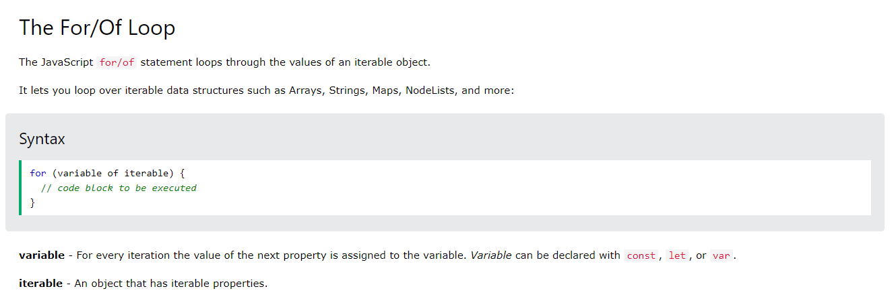
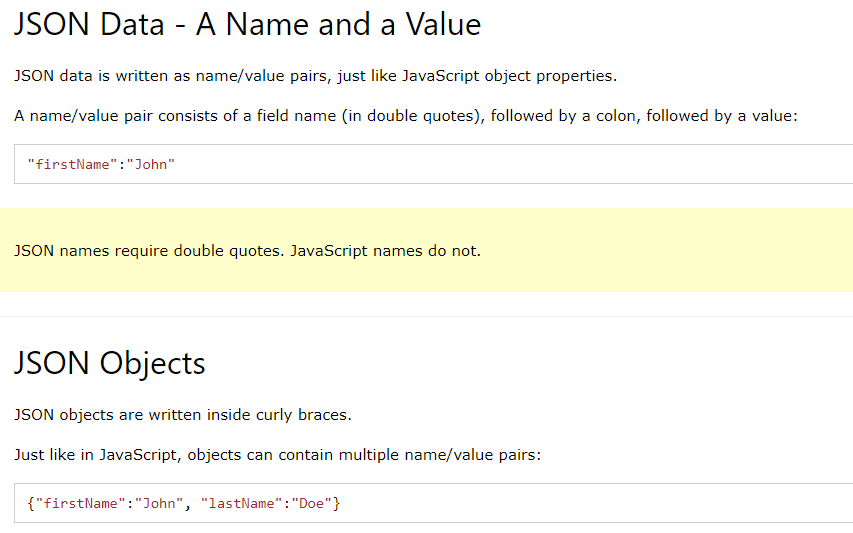
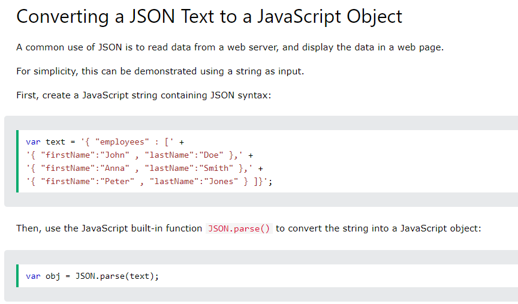
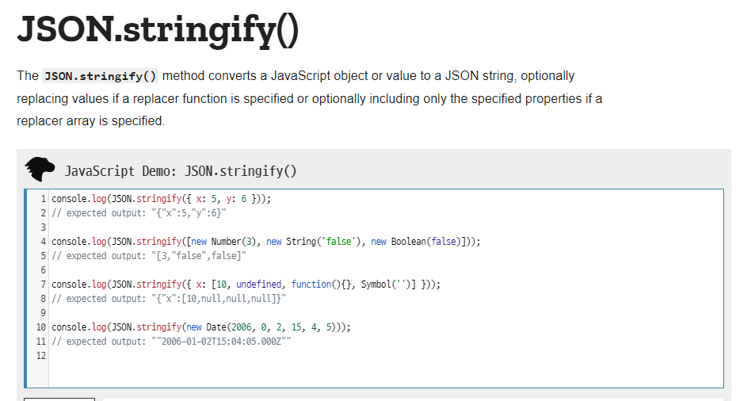

# JavaScript 문법


## 0. 변수

```javascript

// let 변수, 선언 후 재할당 가능, 재선언 불가능, 블록 스코프
let x = 1
x = 2 

// const 변수, 선언 후 재할당 불가능, 재선언 불가능, 블록 스코프
const y = 1
y = 2 // ERROR

let p = 1
if(true){
    let q =3
    p = 2 // 가능
}
console.log(p) // 2
console.log(q) // 모름 (not defined)
```

1. camelCase (lower Camel)
   1. 변수
   2. 상수
   3. 함수명
2. PascalCase
   1. Class 명
3. UPPER_SNAKE_CASE
   1. 절대 변하지 않는 상수
   2. PI = 3.14


## 1. 타입

### 

primitive type

1. Number

   1. 1, -1, 3.14, 2.998e3
   2. Infinity
   3. -Infinity
   4. NaN (Not a Number)

2. String

   1. 문자열
   2. `+` 연산자는 허용 (concat)
   3. 백틱(`)으로 f string 처럼 변수를 대입하여 사용 할 수 있다.

   ```javascript
   'hello' + 'world'
   const name = 'yujin'
   `my name is ${yujin}`
   ```

   

3. Empty

   1. undefined : 의도하지 않은 빈 값, 함수에 리턴 값이 없을 때 반환되는 값
   2. null : 의도한 빈 값

4. Boolean

   1. true
   2. false


## 2. 연산자

```javascript
// 1
console.log(
  'Unary Operator',
  -1,
  typeof(a),  // 함수가 아니라 연산자
)

let i = 1
console.log(++i)  // i 에 대한 평가 전에 1 을 더한다
console.log(i++)  // i 에 대한 평가가 끝난 후 1을 더한다

console.log(!true)
console.log(!false)


// 2
console.log(true&&false)
console.log(true||false)

// 3
console.log(5<3 ? 'three is greather than five' : 'tree is less than five')
```


1. 단항연산자
   1. `-` (음수표현)
   2. typeof : 함수라고 생각하기 쉽지만 연산자
   3. ++, -- (전/후위 증감식)
   4. ! (not)
2. 산술연산자
   1. +, -, /,  +=, -=, *=, /=,
3. 비교연산자
   1.  `>`, <. >=, <=, 
   2. ===
      1. == 는 value 만 같아도 true 가 나오는데
      2. === 는 type 까지 같아야 true
4. 논리연산자
   1. && ,||  :  단축 평가 일어난다
5. 삼항연산자
   1. 조건 `?` 참의 결과 `:` 거짓의 결과


## 3. 조건문

```javascript
const id = 'admin'

if (id === 'admin'){
  console.log('관리자님, 환영해요.')
} else if (id === 'manager'){
  console.log('매니저님, 환영해요.')
} else {
  console.log(`${id} 님, 환영합니다`)
}

switch(id) {
  case 'admin' : 
    console.log('관리자님, 환영해요.')
    break  // 빼먹지 않게 주의, break 없으면 모든 case 다 방문함
  
  case 'manager' : 
    console.log('매니저님, 환영해요.')
    break
  
  default :
    console.log(`${id}님, 환영해요.`)
    
}
```


## 4.반복문

```javascript
let i = 0  // const로 선언하지 않게 주의(계속 재할당되어야 하기 때문)
while (i < 5) {
  console.log('hi')
  i++ // 후위 증감
}


const arr = [1, 2, 3, 4, 5]

// 전통적인 for
for (let i = 0; i < arr.length; i++) {
  console.log('hi')
}

// array 요소를 꺼내는 for ~ of
for (const number of arr) {
  console.log(number)
}

// object key 꺼내는 for ~ in
const person = {
  name:'yujin',  // object key 의 따옴표 생략 가능 (편리!)
  address : 'suji'
}

for (const key in person){
  console.log(key)
}
```


1. 전통적인 반복문
   1. for
   2. while
2. for of 
   1. iterable 한 객체에서 각 요소를 뽑아올 수 있다
3. for in 
   1. object 에서 key 값을 뽑아온다.





## 5. 함수


함수 선언하는 3가지 방법

1. 선언식

```javascript
// 1. 선언식 : function funcName(){} <전통>
function add(n1, n2){
  return n1 + n2
}
```


1. 표현식

   1. 변수에 할당

   2. arrow function

      1. function 키워드를 지운다
      2. 매개변수가 1개일 경우 소괄호 생략이 가능하다
      3. 인자와 중괄호 사이에 =>
      4. 블록 안에 return 구문만 있다면 중괄호 생략 가능
      5. this 키워드가 있지 않은 이상 일반 함수 선언식과 동일하게 동작한다

      

```javascript
// 2-1. 표현식 : const funcName = function () {}

const sub = function (n1, n2){
  return n1 - n2
    
    
// 2-2. () => {} Arrow Function  ES6+
    
// original
const cube = function (n) {
  return n ** 2
}

// 1, 2 적용
cube = (n) => {
  return n ** 2
}

// 3, 4 적용
cube = n => n ** 3
```


기본값 할당하기

```javascript
// Default Arguments
function myFuncWithoutDefault(a, b) {
  if (a !== undefined){
    a = 0
  }

  if (b !== undefined){
    b = 0
  }
  return a + b
}

function myFuncWithDefault(a=0, b=0){
  return a+b
}
```


## 6. 배열


```javascript
/*
JS 의 배열 (array)
1. 리스트 (크기 제한 없음)
2. 음수 인덱싱, 슬라이싱 불가능
 */

const numbers = [1, 2, 3, 4]
numbers[0]
numbers[-1]// fail
// numbers[:] // fail
numbers.length

// .reverse()  return 있고 원본 파괴
numbers.reverse()  // return 값이 있고 원본도 바뀐다 [4, 3, 2, 1]
numbers // [4, 3, 2, 1]

// .push() return 있고 원본 파괴
numbers.push(5)  // numbers.length 를 return 한다 띠용
numbers // [4, 3, 2, 1, 5]

// .pop() return 있고 원본 파괴
numbers.pop()  // 5 pop한 원소 return 
numbers // [4, 3, 2, 1]

// .unshift() enqueue 처럼 동작한다
numbers.unshift(0) // numbers.length 를 return 
numbers // [0, 4, 3, 2, 1]

// .shift()  dequeue 처럼 동작한다
numbers.shift() // 0 dequeue 한 결과
numbers // [4, 3, 2, 1]


// .includes()
numbers.includes(3) // true
numbers // 변화 없음


// .indexOf()
numbers.indexOf(1) // 3, 주어진 값의 인덱스 반환, 없는 값은 -1 반환
numbers.indexOf(1234)
numbers


// .join()
const r = numbers.join(',') // '4,3,2,1'
numbers = [4, 3, 2, 1] // 원본변화 없음
```


일반적인 배열과의 차이

1.  선언 시 배열 크기 초기화 필요하지 않다 
2. 크기 제한 없는 리스트

파이썬과의 차이

1. 음수 인덱스 사용 불가능
2. 슬라이싱 불가능


배열 기본 메서드

1. reverse
   1. 원본 변경
   2. reverse 된 배열을 반환
2. push
   1. push 후 갱신된 배열의 길이를 반환
3. pop
   1. 제거한 원소를 반환
4. unshift
   1. enqueue 처럼 동작 (left append)
5. shift
   1. dequeue 처럼 동작
6. includes
   1. 내가 아는 contains 처럼 동작
   2. true / false 반환
7. indexOf
   1. 찾는 값의 인덱스 반환
   2. 값이 존재하지 않을 경우 -1
8. join
   1. 배열을 지정한 구분자로 구분하여 하나의 string 으로 합쳐준다


## 7.객체


```javascript
/*
python 의 dictionary 와 비슷하게 보인다.

JavaScript 는 이를 object 라고 부른다.

python dictionary 와의 차이

1. key 문자열의 따옴표 생략 가능 (띄어쓰기 없을 때 => 변수명 작명과 같이 lowerCase를 사용하면 해결 될 문제)
2. value 에 접근하기 위해 [key]  또는 .key 로 접근한다.

*/


const me = {
  name : '정유진',
  // 'phone number': '010-8627-4992',  가능하지만 key 도 변수명 처럼 지을 것
  phoneNumber : '01086274992',
  inventory: [
    'phone', 'tablet', 'pencil'
  ],
  home : {
    address : '수지',
    owner : '정사장'
  }
}

// ES6+ 축약 

// old
var books = ['LearningJs', 'EloquentJS']
var magazines = ['ELLE', 'Allure', 'cosmopolitan']
var bookshop = {
  books:books,
  magazines:magazines
}

//New
const books = ['LearningJs', 'EloquentJS']
const magazines = ['ELLE', 'Allure', 'cosmopolitan']

// key value 이름이 같다면 1 번만 쓸 수 있다 (개꿀)
const bookshop = {
  books,
  magazines
}


// Old
var dooly = {
  name: '둘리',
  greeting : function(){
    console.log('어서오고')
  }
}

// New (마치 java에서 class 정의하는 것과 비슷, 속성과 메서드)
// javascript 에서 class, 상속은 prototype 을 통해 구현된다 (proto)
const dooly = {
  name: '둘리',
  greeting1 : () => console.log('어서오고2'),  // Arrow
  greeting2 () {  // function 키워드 대체, syntactic sugar
    console.log('어서오고3')
  }
}


// computed property name (minor)
const key = 'regions'
const value = ['서울', '대전', '광주', '구미', '부산']
const ssafy = {
  [key]:value
}
ssafy.regions


```


- object destructuring 은 자주 사용하게 된다.

```javascript
// Object Destructuring (비구조화), syntactic sugar
// Old
var userInfo = {
  name:'정유진',
  email: 'jinietree20@gmail.com',
  phone: '01086274992'
}

var name = userInfo.name
var email = userInfo.email
var phone = userInfo.phone


// New
const userInfo = {
  name:'정유진',
  email: 'jinietree20@gmail.com',
  phone: '01086274992'
}

// 변수명과 key 값이 같다면 아래와 같이 작성 가능
const {name, email, phone} = userInfo

// 아래와 같이 사용할 수 있다
function introduce({name, email, phone}){
  console.log(`안녕 나는, ${name}, ${email} ${phone}`)
}

introduce(userInfo)
```


## 8.JSON


```javascript
// JSON === JavaScript Object Notation

const objData = {
  coffee: 'Dolce',
  iceCream: 'Chocolate',
}

const jsonData = JSON.stringify(objData)  // javaScript 객체 또는 value를 JSON string 으로 바꾼다
const backToObj = JSON.parse(jsonData)
```




JSON 메서드

1. stringify
   1. JavaScript object => JSON String
   2. encode
2. parse
   1. JSON String => JavaScript object
   2. decode






## 9. ArrayHelperMethod


```
arr.helperMethod(callbackFunction)
arr.helperMethod(function(arg){})
```


```javascript
const arr = [1, 2, 3]


1. forEach

​```javascript
// forEach()  return 되는 값 없으므로 === 콜백 함수에 return 필요 없다
// array를 다룰 때 쓴다.
arr.forEach(function(num){
  console.log(num)
})

// for of 와 같은 효과 (공식 문서에 따르면 iterable 한 객체에 대해 다 적용 가능한듯)
// iterable : arrays, strings, maps, nodeLists...
for (const num of arr){
  console.log(num)
}
```


2. map

```javascript
// .map()  콜백함수의 리턴 값이 리턴된다.
arr.map(function(num){
  return num * 2
})

arr.map(num => num*2)


const contents = ['hello', 'world']
const tags =contents.map(function(str){
  return `<li>${str}</li>`  // 이렇게 쓰니 Node 라고 인식하지 않음. 당연한가 string인데ㅎ
})


tags.forEach(tag => document.write(tag))


const seasons = ['spring', 'summer', 'autumm', 'winter']
const lists = seasons.map(function(season){
  const li = document.createElement('li')
  li.innerText = season 
  return li // 이렇게 쓰니 Node 라고 인식해서 appendChild 를 쓸 수 있었다.
})

const ul = document.createElement('ul')
ul.id = 'seasonList'
document.body.appendChild(ul)
lists.forEach(li => ul.appendChild(li))

```


3. find

```javascript
// .find()  콜백 함수의 리턴 값이 true 혹은 true 로 평가되는 첫 번째 요소만 리턴
arr.find(function(num){
  return num === 2
})

arr.find(x => x===2)


const articles = [
  {pk:1, title:'title1'},
  {pk:2, title:'title2'},
  {pk:3, title:'title3'},
]

articles.find(x => x.pk===1)  // pk가 1인 article 찾기
```


4. filter

```javascript
// .filter()  콜백함수의 리턴값이 true 혹으 true 로 평가 되는 요소만 모아서 배열로 리턴
arr.filter(num => num % 2)

const movies = [
  {title:'matrix', isAdult:false},
  {title:'kingsman', isAdult:true}
]

const adultMovies = movies.filter(function(movie){
  return movie.isAdult
})


const adults = movies.filter(movie => movie.isAdult) // Arrow function 으로 바꾸기
```


5. some, every

```javascript
// .some(), .every()  배열 안의 하나라도 / 배열 전부 콜백에서 return 하는 조건을 만족하면 true/false 리턴
arr.every(num => num > 0)
arr.some(num => !(num%2))
arr.some(function(num){
  return num > 2  // 이 리턴 조건이 참, 거짓을 판단하기 때문에 return 이 중요하다.
})

```


6. reduce

```javascript
// .reduce(callback(acc, num), initialValue) 
// 위의 함수들을 모두 대체할 수 있다.
// callback 함수의 첫 번째 매개변수는 누적 값
// initialValue 는 반환할 누적 값의 초기 값이다

arr.reduce(function(acc, num){  // 배열의 요소 하나하나가 num으로 넘어오고, acc는 처음에는 initValue로 시작
  console.log(acc, num)
  return acc+num  // return 값이 다음 반복의 acc로 넘어간다 (재귀적)
},0)


// map
arr.reduce(function(previous, current){
  previous.push(current**2)
  return previous
}, [])


// filter
arr.reduce(function(previous, current){
  if (current%2){
    previous.push(current)
  }
  return previous
}, [])
```


## 10. Rest Spread Operator


- rest operator
  - python 에서 *args 와 비슷하다

```javascript
// Rest Operator

function withoutRestOpr(a, b, c, d, e){
  const numbers = [a, b, c, d, e]
  numbers.map(num => num + 1)
}


// python *args
function withRestOpr(x, y, ...numbers) {
  numbers.map(num => num + 1)
}

```


- spread operator
  - python 에서 *arr 과 비슷하다
  - 배열 풀어헤치기

```javascript
/*
  python
  a = [1, 2, 3]
  b = [0, *a]

*/
// Spread Operator

function withoutSpreadOpr(){
  const odds = [1, 3, 5, 7]
  const evens = [2, 4, 6, 8]
  const nums = odds.concat(evens)
}


function withSpreadOpr(){
  const odds = [1, 3, 5, 7]
  const evens = [2, 4, 6, 8]
  const nums = [...odds, ...evens]
}
```


## 11. class


- java 의 클래스 선언과 흡사하다
  - 생성자
    - 생성자 안에서 this를 통해 필드를 생성하는 것은 python 과 닮았다.
    - `constructor` 예약어를 사용한다
  - 메서드
    - 접근제한자와 반환형이 없다
  - 상속
    - `extends` 예약어를 사용해 부모 클래스를 지정하고
    - `super()` 로 부모의 생성자를 먼저 구현한다
  - 객체 생성
    - `new` 연산자를 사용한다


```javascript
class Car {
  // __init__ ()
  constructor(options) {
    this.title = options.title
  }

  // method
  drive() {
    return `${this.title}이 부릉부릉 달린다`
  }
}

const options = {title:'붕붕', color: 'blue'}
const car = new Car(options)

//  상속
class Mercedes extends Car {
  constructor(options){
    super(options)
    this.color = options.color
  }

  honk(){
    return '빵빵'
  }
}

const eclass = new Mercedes(options)
```


## 12. this


- this 는 아래 2가지 경우를 제외하고는 항상 최상위 객체인 window를 뜻한다.
- 예외의 경우
  - constructor 함수 내부
    - 클래스를 통해 생성될 객체를 뜻한다
  - 메서드
    - 메서드가 소속된 객체를 뜻한다
    - object 에서 key : function() 으로 정의된 경우
    - class 정의 내부의 메서드 정의된 경우


메서드와 함수의 차이?

메서드는 객체에 종속되어 있는 함수를 말한다 (obj.method)


```javascript
function greeting(){
  console.log(this)
  return `안녕하세요, 저는 ${this.firstName} 이에요.`
} 

const yujin = {
  firstName: '유진',
  lastName: '정',
  fullName() {
    return `${this.lastName}${this.firstName}`
  },
  greeting,
}

yujin.greeting()  // method true => .greeting() o
greeting() // method false => greeting() x


```


메서드 내부의 함수에는 this가 적용될까? 

```javascript

// .map 의 callback 함수는 메서드가 아니므로 this 는 window 객체를 뜻한다

  const double = {
  numbers: [1, 2, 3, 4],
  x: 2,
  get_double() {
    const doubled = this.numbers.map(function (num) {
      console.log(this)
      return num * this.x
    })   
    return doubled
  }
}

double.get_double()  
// .map 의 인자 cb 함수는 메서드가 아니다. 고로 cb 안의 this 는 windows 가 된다.
```


- this를 인지시킬 수 있는 방법
  - bind 함수
  - arrow function 

```javascript
// old: function.bind(this)를 사용해서 this가 window 가 아니라 만들어질 객체로 바인딩
const double = {
  numbers: [1, 2, 3, 4],
  x: 2,
  get_double(){
    const doubled = this.numbers.map(function(num){
      return num * this.x
    }.bind(this))
    return doubled
  }
}

// arrow function 을 쓰면 해결
const triple = {
  numbers : [1, 2, 3, 4],
  x : 3,
  get_triple() {
    return this.numbers.map(num => num * this.x)
  },
}
```


## 13. callback


- concurrency model 을 따르므로 callback 함수의 실행은 특정 조건이 충족될 때 까지 지연될 수 있다.
  - 시간
  - request >> response 를 받기

```javascript
function getTodos(){
  let data = null

  setTimeout(function() {
    data = [
      {id:1, content:'a'},
      {id:2, content:'b'},
    ]
    console.log(data)
  }, 2000)

  return data // null 반환 된다
}
```


- 함수도 결국엔 값이라는 것을 이해하기

```javascript
function make101(){
  return (x) => 100+x
}

// make101()(1)

const a = make101()
a(1)
```


- array helper method 구현하기

```javascript
/* map */
// arr.map(()=>{})
// map(arr, () => {})

// 일반적으로는 함수 정의 이후에 실행하지만
// 밑의 코드는 cb 가 아직 정의되지 않은 함수여도 실행한다.
// 매개변수로 전달될 것이 함수라는 믿음
// main method를 먼저 구현해두고 추후에 정의
// 매개변수와 자리를 미리 정해두었으니 그것을 기반으로 구현해야 한다.

function map(cb, arr){
  const newArr = []

  for (const elem of arr) {
    newArr.push(cb(elem))
  }

  return newArr
}

function plusOne(num){
  return num+1
}


map((x)=>x+2,[1,2,3,4,5])


/*filter*/
function filter (callback, arr) {
  //채우세요
  newArr = []

  for (elem of arr){
    if (callback(elem))
    newArr.push(elem)
  }

  return newArr
}

filter(function(n){
  return n % 2
}, [1, 2, 3, 4, 5])
```

