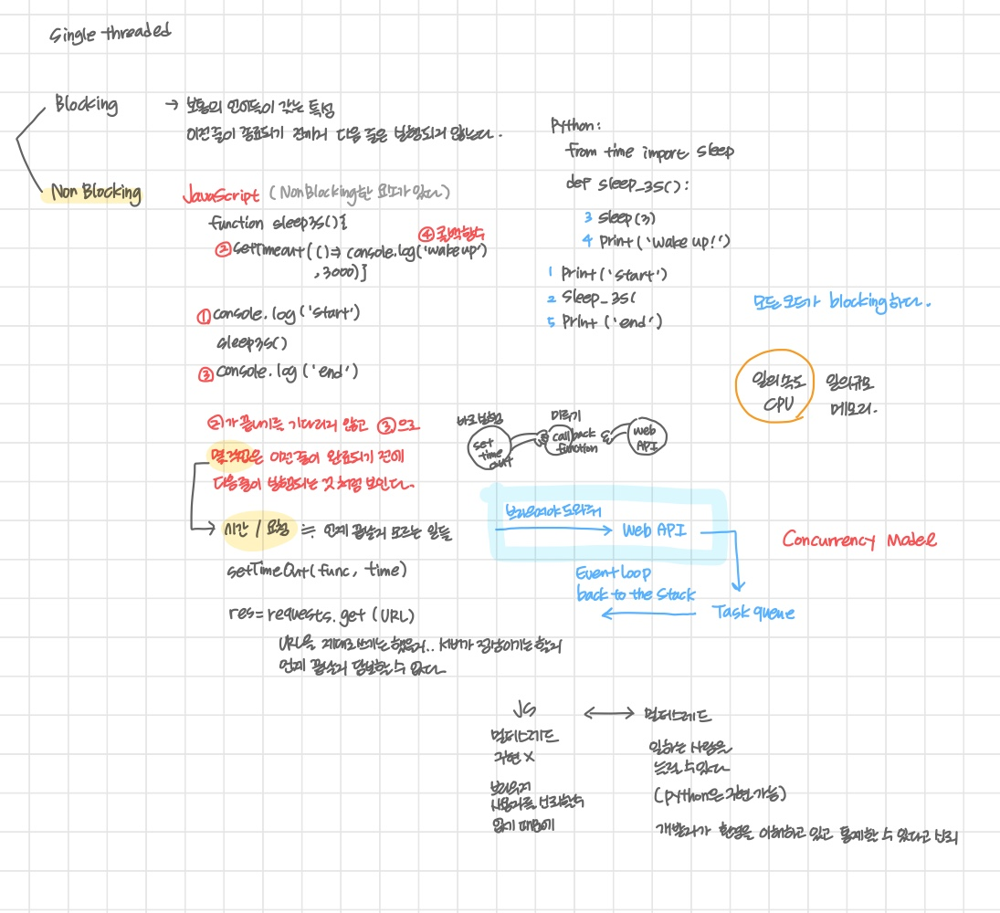
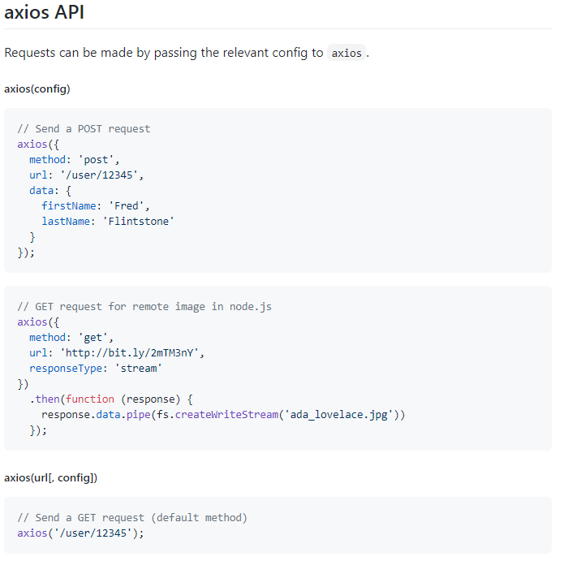
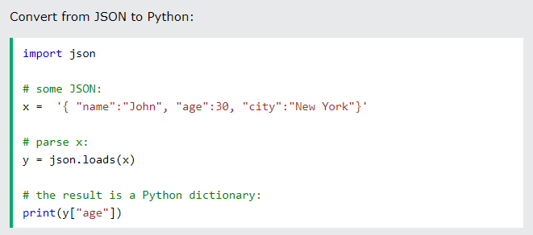
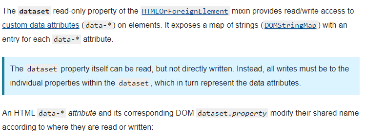
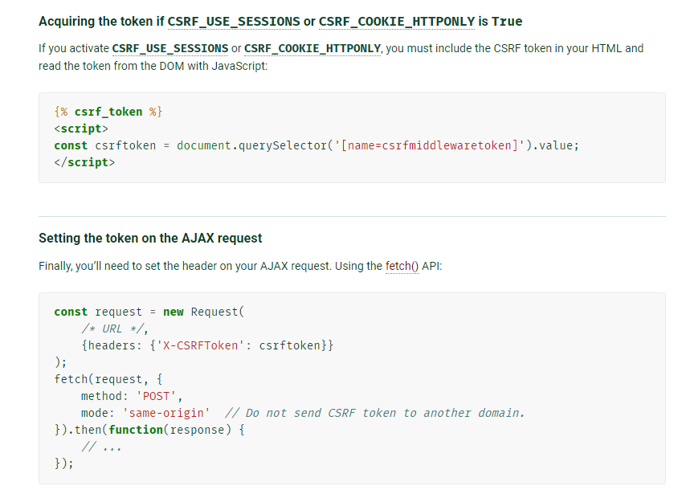
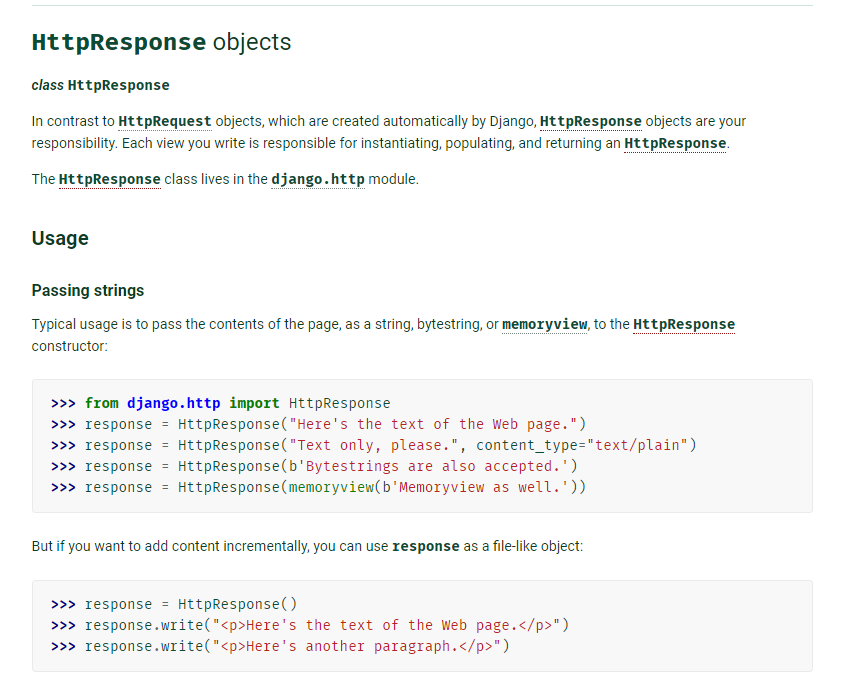
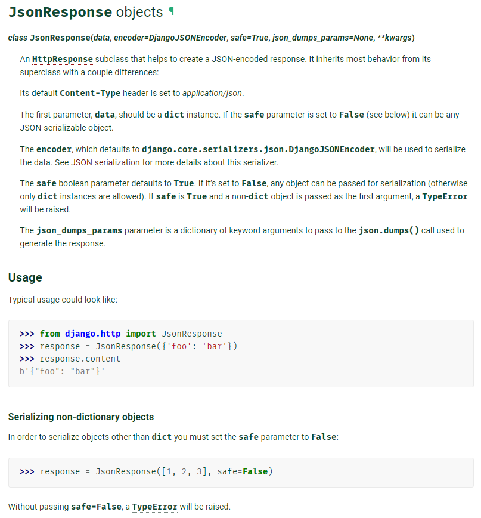

# JavaScript 03


## AJAX


- Asynchronous Javascript And XML
- 서버와 통신하기 위해 `XMLHttpRequest` 객체 활용
  - 동기식, 비동기식 통신을 모두 지원
- 페이지 전체를 reload 하지 않고서도 수행되는 `비동기성`
  - 사용자의 event 가 있으면 전체 페이지가 아닌 일부분 만을 업데이트
- AJAX 의 X 가 XML 을 의미하기는 하지만 요즘은 더 가벼운 용량이고 JS 의 일부인 JSON을 더 많이 사용


- 2005년 Google Maps & Gmail 등에 활용되는 기술을 설명하기 위해 용어 최초 사용
  - Gmail : 전송버튼을 누르고 다른 페이지로 넘어가고 메일은 알아서 전송 처리
  - Google Maps : 스크롤 하는 행위 하나하나가 모두 요청이지만 페이지는 갱신되지 않음
- 특정 기술이 아닌 기존의 여러 기술을 사용하는 새로운 접근법을 설명


### XMLHttpRequest object

- 서버와 상호작용하기 위해 사용되며, 전체 페이지의 새로 고침 없이 URL 로부터 데이터를 받아올 수 있음
- 사용자가 하는 것을 방해하지 않으면서 페이지의 일부를 업데이트할 수 있도록 해줌
- 주로 AJAX 프로그래밍에 사용
- XML 뿐만 아니라 **모든 종류의 데이터를 받아오는 데에 사용 가능하다**
- 생성자
  - XMLHttpRequest()


```javascript
const request = new XMLHttpRequest()
const URL = 'https://~'

request.open('GET', URL)
request.send()

const todo = request.response
console.log(todo)
```


## Asynchronous JS


### 동기와 비동기

- 동기식
  - 순차적, 직렬적 태스크 수행
  - 요청을 보낸 후 응답을 받아야만 다음 동작이 이루어짐 (blocking)
    - 위의 코드가 완료되어야 다음 코드가 수행된다
- 비동기식
  - 병렬적 태스크 수행
  - 요청을 보낸 후 응답을 기다리지 않고 다음 동작이 이루어짐 (non-blocking)
    - 즉, 요청을 보내놓고 다음 태스크로 진행


**왜 비동기를 사용하는가?**

- 예를 들어, 데이터를 구동하고 실행되는 앱이 있으며 데이터의 크기가 굉장히 크다고 가정하자
- 동기식 코드라면 데이터를 모두 로드한 뒤에야 앱이 실행되기 때문에 로드 되는 동안 앱을 사용할 수 없는 상태로 로딩 되기를 기다려야
- 앱이 모두 멈춘 것으로 보인다
- 동기식 요청은 코드 실행을 차단하여 화면이 멈추고 응답하지 않는 사용자 경험을 만든다 (하락)
- 많은 웹  API 기능은 현재 비동기 코드를 사용하여 실행


#### 동기식 예시

- alert 이후의 코드는 alert 의 처리가 끝날 때까지 실행되지 않는다
- JS 는 `single threaded` 이기 때문이다


```python
response = request.get(url)
todo = response.json()
print(todo)
```


#### 비동기식 예시

- 요청을 보내고 응답을 기다리지 않고 다음 코드가 실행
- 결과적으로 변수에는 응답 데이터가 할당되지 않고 빈 문자열이 출력
- JS 는 기다려 주지 않는 방식으로 동작하는 이유, single threaded


### Thread

- 프로그램이 작업을 완료하는 데에 사용할 수 있는 단인 프로세스
- 각 thred 는 한 번에 하나의 작업만 수행할 수 있다
- Task A >> Task B >> Task >> c
  - 다음 작업을 시작하려면 반드시 앞의 작업이 완료되어야
  - 컴퓨터 CPU는 여러 코어를 가지고 있기 때문에 한 번에 여러가지 일을 처리


#### JS 는 single threaded 이다

- 컴퓨터가 여러개의 CPU가 있대로 main thread 라 불리는 단일 스레드에서만 작업 수행
- 즉 이벤트를 처리하는 **Call Stack 이 하나**인 언어
- 이 문제를 해결하기 위해 JS 는 **즉시 처리하지 못하는 이벤트들을 Web API**: 다른 곳 로 보내서 처리하고
- 처리된 이벤트들은 **처리된 순서대로 Task Queue : 대기실** 에 줄을 세워 놓고
- Call Stack 이 비면 **Event Loop : 담당자가 대기 줄에서 가장 오래된 (제일 앞의) 이벤트를 Call Stack 으로** 보냄


#### Concurrency model (동시성 모델)

- Event loop 를 기반으로 하는 동시성 모델

1. Call Stack
2. Web API (Browser API)
3. Task Queue (Event Queue, Message Queue)
4. Event Loop


##### Call Stack

- 요청이 들어올 때 마다 해당 요청을 순차적으로 처리하는 Stack 형태의 자료 구조


##### Web API (Browser API)

- JavaScript 엔진이 아닌 브라우저 영역에서 제공하는 API
  - 당장 해결할 수 없는 작업
  - JS 가 싱글스레드이기 때문에 브라우저의 힘을 빌리는 것
  - JS 엔진이 아니라는 점
- setTimeout(), DOM events, AJAX 처럼 데이터 가져오는 데에 시간이 걸리는 일
- 조건이 만족되면 Task Queue 로 향할 것 


##### Task Queue

- 콜백 함수가 대기하는 Queue 형태의 자료 구조
- **main thread 가 끝난 후** (call stack 이 비었을 때) 실행되어 **후속 JavaScript 코드가 차단되는 것을 방지**
- Event Loop 이 부를 때 까지 대기
- 다시 stack 으로 돌아가도록 call back 하기 때문에 call back 함수


##### Event Loop

- call stack 이 비어있는지 여부 확인
- 비어있는 경우 Task Queue 에 실행 대기중인 콜백이 있는지 확인
- 대기중인 콜백이 있다면 가장 앞에 있는 콜백을 call stack 으로 push


```javascript
setTimeout(function hello(){
    console.log('activate!')
}, 3000)  // 3초 후에 task queue 에 들어간다.

// 아래 코드가 무거울 경우, 3초를 지키지 못할 수도 있다
// call stack 이 비어야 event loop이 task queue 에서 꺼낼 것이기에

setTimeout(function hello(){
    console.log('activate!')
}, 0) 
```





##### zero delay

- 순서를 보장할 수 없다
- web api 에 들어간 순서대로 진행되는 것이 아니라 처리된 순서 대로 task queue 에 들어가기 때문
- 실제로 0ms 후에 콜백이 시작된다는 의미가 아님 (Web API 처리시간을 의미할 뿐)
- 실행은 task queue 에 대기 중인 작업 수에 따라 다르다 (따라서 0초 이상이 걸릴 수 있다)
- delay 는 JS 가 **요청을 처리하는 데에 필요한 최소 시간이지 보장된 시간이 아니다**
- 따라서 특정 시간 제한을 지정 했더라도 대기중인 메시지의 모든 코드가 완료될 때 까지 대기한다.


### Asynchronous JS

### 순차적인 비동기 처리하기

> WEb API 로 들어오는 순서는 중요하지 않고 어떤 이벤트가 먼저 처리 되느냐가 중요
>
> 실행 순서 불명확
>
> 이를 해결하기 위해 순차적인 비동기 처리를 위한 2가지 작성 방식


1. Async callbacks
   1. 백그라운드에서 실행을 시작할 함수를 호출할 때 인자로 지정된 함수
   2. 순서 보장, 클릭 했을 때 (event)=> 동작한다 (callback function) 
   3. addEventListener() 의 두 번째 인자
2. promise-style
   1. Modern Web APIs 에서 새로운 코드 스타일
   2. SMLHttpRequest 보다 조금 더 현대적


## Callback Function

> 순서 보장을 위하여


- **다른 함수에 인자로 전달된 함수**
- 외부 함수 내에서 호출되어 일종의 루틴 또는 작업을 완료한다
- 동기식, 비동기식 모두 사용된다
- 비동기 작업이 완료된 후 코드 실행을 계속 하는 데 사용되는 경우 비동기 콜백이라고 한다.


### JS 의 함수는 일급 객체 (Fisrt-class object)

1. 인자로 넘길 수 있다
   1. eventListener, map 
2. 함수의 반환 값으로 사용할 수 있다
3. 변수에 할당할 수 있다


### Async callbacks (비동기 콜백)

- 백그라운드에서 코드 실행을 시작할 함수를 호출할 때 인자로 지정된 함수
- 백그라운드 코드 실행이 끝나면 콜백 함수를 호출하여 작업이 완료되었음을 알리거나, 다음 작업을 실행하게 할 수 있다.


왜 사용하는가?

- 콜백 함수는 명시적인 호출()이 아닌 특정 routine 혹은 action 에 의해 호출되는 함수
  - 예를 들면 event
- Django 의 경우 요청이 들어오면 (path), JS 에서 event 의 경우 특정 이벤트가 발생하면, 이라는 조건 하에 함수를 호출할 수 있었던 이유 : Callback Function 매커니즘 
- 비동기 로직을 수행할 때 콜백 함수는 필수
  - 명시적인 호출이 아닌 특정 시점에 알아서 호출되도록 만들어야 하기 때문
  - 기다려주지 않고 언젠가 처리해야 하는 일은 콜백 함수를 활용한다


### Callback Hell

>  순서를 보장하려다 보니 빠지게 되는 콜백 지옥


- 순차적인 연쇄 비동기 작업을 처리하기 위해, 콜백 함수>> 콜백함수2 >> 콜백함수3 >> ... 의 패턴이 지속 반복
- 여러 개의 연쇄 비동기 작업을 할 때, 
- 이를 Callback Hell 또는 pyramid of doom 이라고 부른다
- 위와 같은 상황이 벌어질 경우, 가독성이 떨어지고 디버깅이 어려워진다.


#### 해결하기

1. keep your code shallow (코드의 깊이를 얕게 유지)
2. modularize (모듈화)
3. Handle every single error (모든 단일 오류 처리)
4. Promise way (Promise 방식 사용)


## 👑 Promise object

- 비동기 작업의 최종 완료 또는 실패를 나타내는 객체
  - 미래의 완료 또는 실패와 그 결과 값을 나타낸다
  - 미래의 어떤 상황에 대한 **약속**
- 성공(이행)에 대한 약속
  - .then()
- 실패(거절)에 대한 약속
  - .catch()


### 상태

1. 대기 (pending)
   - 이행되거나 거부되지 않는 초기 상태
2. 이행 (fulfilled)
   - 성공
3. 거부 (rejected)
   - 실패


### 메서드

#### then(callback)

- then(callback)
  - 이전 작업(promise) 이 성공했을 때 (이행했을 때) 수행할 작업을 나타내는 콜백 함수
  - 그리고 각 콜백 함수는 이전 작업의 성공 결과를 인자로 전달 받음 (return 반환값이 필요)
  - 성공했을 때의 코드를 콜백 함수 안에 작성


#### catch(callback)

- catch(callback)
  - .then 이 하나라도 실패하면(거부되면) 동작 (try-catch 구문과 유사)
  - 이전 작업의 실패로 인해 생성된 error 객체는 catch 블록 안에서 사용할 수 있음


```
비동기작업.then(callback(result){
	result 처리 (비동기 작업이 성공했을 때, 성공 결과가 result)
})

비동기작업.then(callback()).then(callback())
.then(callback())
.catch(callback(error){
	error 처리 (비동기 작업이 어느 시점에서 실패했을 때, 생성된 에러 객체)
})
```


- 각각의 .then() 블록은 서로 다른 promise 반환
  - 즉 then() 을 메서드 체이닝(chaining) 하여 연쇄적인 작업을 수행할 수 있음
  - 깊이가 깊어지지 않는다
  - 결국 여러 비동기 작업을 차례대로 수행할 수 있다
- 마찬가지로 then(), catch() 메서드 모두 promise 를 반환하기 때문에 chaining 이 가능한 것
- 주의
  - **반환 값이 반드시 있어야 한다**
    - 결과값을 계속 정제해 나가는 식이기 때문
  - 없다면 콜백 함수가 이전의 promise 결과를 받을 수 없다


```javascript
const myPromise = new Promise((resolve, reject) => {
    setTimeout(function(){
        resolve('성공!')
    }, 300)
})

myPromise.then(function(response){
    console.log('success' + response)
})
.catch(function(error){
    console.log('fail' + error)
})
```


#### finally(callback)

- finally(callback)
  - promise 객체를 반환
  - 결과에 상관 없이 무조건 지정된 콜백 함수가 실행
  - 어떠한 인자도 전달 받지 않는다
    - promise가 성공되었는지 거절되었는지 판단할 수 없기 때문
  - 무조건 실행되어야 하는 절에서 활용
    - then,  catch 블록에서의 코드 중복을 방지
    - 중복되는 코드가 있다면 성공 여부에 상관없이 무조건 실행되어야 하는 코드일 것


### 보장하는 것

- Async callback 작성 스타일과 달리 promise 가 보장하는 특징
- 콜백은 자바스크립트 event loop 가 현재 실행중인 콜 스택을 완료하기 이전에는 절대 호출되지 않음
  - promise 콜백은 event queue 에 배치되는 엄격한 순서로 호출됨
- 비동기 작업이 성공하거나 실패한 뒤에, then() 메서드를 이용하여 추가한 경우에도 1번과 똑같이 동작
- **then() 을 여러번 사용하여 여러 개의 콜백을 추가할 수 있다 (Chaning)**
  - 각각의 콜백은 주어진 순서대로 실행된다
  - chaining 이 최대 장점


## 👑 Axios

> promise 를 수월하게 쓰기 위한 라이브러리
>
> View.js 공식 채택


- Promise based HTTP client for the browser and Node.js
- 요청에 특화
- 브라우저를 위한 Promise 기반의 클라이언트
  - Promise를 리턴한다
- 원래는 XHR 이라는 브라우저 내장 객체를 활용해 AJAX 요청을 처리하는데 이보다 편리한 AJAX 요청이 가능하도록 도움을 준다
  - 확장 가능한 인터페이스와 함께 패키지로 사용이 간편한 라이브러리 제공


```javascript
axios.get(URL)
	.then(function(response){
    console.log(response.data)
    return response.data
})
	.then(function(data){
    return data.title
})
	.catch(function(error){
    console.log(error)
})
	.finally(function(){
    console.log('나는 무조건 실행된다')
})
```


##### async & await (참고)

- 비동기 코드를 작성하는 새로운 방법 ES8 +
- 기존 Promise 시스템 위에 구축된 syntactic sugar
  - promise 구조의 then chaining 을 제거
- 비동기 코드를 조금 더 동기 코드 처럼 표현하고 작동하게 하는 것이 장점


syntactic sugar

- 문법적 기능은 그대로 유지하는데 읽는 사람이 직관적으로 쉽게 코드를 읽을 수 있게 만든다


```javascript
async function fetchDogImg(URL){
    const res = await aios.get(URL)
    const breed = Object.keys(res.data.message)[0]
    const dogImages = await axios.get('http'+ ${breed})
    console.log(dogImges)
}

URL = 'http://www.xxxx'
fetchDogImg(URL)
	.catch(err => {
    	console.log(err)
})
```


##### 비동기 방식이 왜 필요할까

- human-centered design with UX
  - 사용자 경험을 갖춘 인간 중심 설계
  - 실제 Ajax 라는 용어를 처음 논문에서 사용한 jesse james garrett이 Ajax 를 소개하며 강조한 한마디


## practice


### axios API

- get, post method 를 직접 쓰는 방법 외에도 객체 자체를 매개변수로 넘길 수 있다
- 이 쪽이 더 편하게 느껴진다.
- headers 속성도 넣을 수 있다.
- 공식 문서를 보니 data 로 javascript 객체를 넘길 수 있는 모양
- views 에서 꺼낼 때는request.body에 들어있다 (django 기준)
  - drf 에서 request.data 로 추출했던 이유는 drf 가 제공하는 속성이기 때문 
- json.loads 로 해석해서 dict 로 파싱해 사용할 수 있다.

https://github.com/axios/axios#axios-api

https://docs.djangoproject.com/en/3.2/ref/request-response/#django.http.HttpRequest






### HTML dataset

- custom attribute 만들기
- `data-*`
- JS 에서 사용하기 위해



https://developer.mozilla.org/en-US/docs/Web/API/HTMLOrForeignElement/dataset


### AJAX csrf token




https://docs.djangoproject.com/en/3.2/ref/csrf/


### JsonResponse


- django.http.HttpResponse
  - string 으로 data를 보내야 한다
  - JSON string 을 보낼 수도 있다.  >> JsonResponse 로 대체



- django.http.JsonResponse
  - python 객체를 data 로 입력했을 때 json string으로 만들어 response 한다




##### 선언형 프로그래밍

A 의 변화 >> B, C, D 가 변화하도록 설계한다

