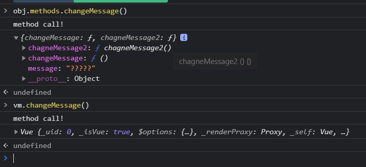
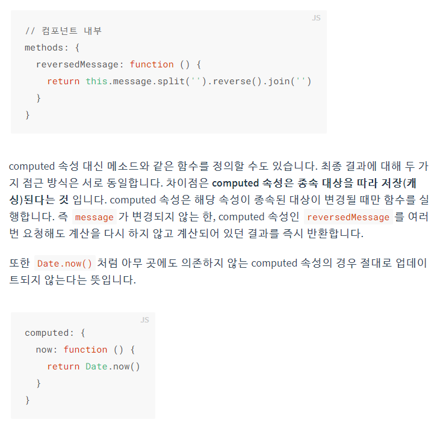
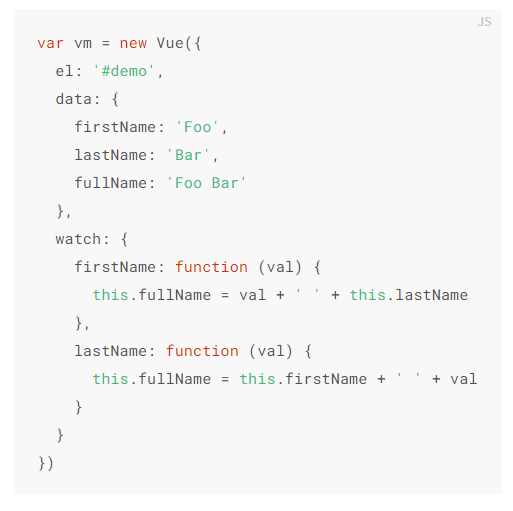

# vue 01


- react: 페이스북
- angular : 구글


## Vue

> 사용자 인터페이스를 만들기 위한 프로그레시브 프레임워크


- Single Page Application (SPA) 완벽하게 지원
- 구글 Angular 보다 더 가볍고 간편하게 사용할 수 있는 프레임워크


### SPA

- 단일 페이지 애플리케이션
- 현재 페이지를 동적으로 작성함으로써 사용자와 소통
- 단일 페이지로 구성되며 서버로부터 처음에만 페이지를 받아오고 이후에는 동적으로 DOM 을 구성
  - 즉 처음 페이지를 받은 이후에는 서버로부터 완전한 새로운 페이지를 불러오지 않고 현재 페이지를 동적으로 다시 작성한다
  - 연속되는 페이지 간의 사용자 경험 (UX) 향상
  - **모바일 사용이 증가하고 있는 현재 트래픽의 감소와 속도, 사용성, 반응성의 향상은 매우 중요한 이슈**
  - 동작 원리의 일부가 CSR 을 따른다
    - Client Side Rendering
      - 경제적이므로 회사가 선호
      - 개발자가 스크립트를 던지면 클라이언트의 브라우저가 일하게 하는 것
    - HTML 을 만드는 주체가 누구인가에 따라서 결정된다
    - (antonym) SSR (Server Side Rendering)
      - DTL 
      - Django, Server 가 더 일을 한다


#### 등장 배경

- 과거의 웹 사이트들은 요청에 따라 매번 새로운 페이지를 응답하는 방식
  - Multi Page Form


### CSR

- Clinet Side Rendering
- 장점
  - 서버와 클라이언트 간의 트래픽 감소 (HTML 양이 줄었기 때문)
- 단점
  - Search Engine Optimazation 문제
  - Semantic 하게 태그를 사용하여 구글 검색 시 사이트의 내용이 크롤링 될 수 있도록 하는 것
  - https://developers.google.com/search/docs/beginner/seo-starter-guide?hl=ko
  - 해결 방법이 존재합니다


#### SSR


### 왜 Vue 를 사용해야 할까

- 가장 인기 있는 프론트엔드 프레임워크
- 현대 웹페이지는 페이지 규모가 계속해서 커지고 있으므로
- Vanilla JS 로는 구현이 복잡해짐
  - 명령형  (Imperative)
  - DOM 중심
  - 데이터가 수정되면 모든 요소를 선택해서 이벤트를 등록하고 값을 변경
- Vue 와 react 는 선언형 (Declarative)
  - 데이터 중심
  - 단일 DOM 과 data 연결하여 제어
  - data가 바뀌면 DOM 은 알아서 변경
  - reactive
  - 즉 우리가 신경 써야할 것은 오로지 **Data 에 대한 관리** 뿐


### Concepts of  vue


#### MVVM Pattern

> 애플리케이션 로직을 UI 로부터 분리하기 위해 설계된 디자인 패턴

1. Model : 데이터,  Object
2. View : 화면, DOM(HTML)
3. View Model : 중개인, Vue Instance


#### 코드 작성 순서

1. Data 작성
2. DOM 


## 공식문서 따라하기

https://kr.vuejs.org/v2/guide/index.html


### 선언적 렌더링

#### interpolation (보간법)

```vue
<div id="app">
  {{ message }}
</div>
```


```javascript
var app = new Vue({
  el: '#app',
  data: {
    message: '안녕하세요 Vue!'
  }
})
```


#### 바인딩

> 디렉티브에서 더 자세히 살펴볼 것


```vue
<div id="app-2">
  <span v-bind:title="message">
    내 위에 잠시 마우스를 올리면 동적으로 바인딩 된 title을 볼 수 있습니다!
  </span>
</div>
```

```javascript
var app2 = new Vue({
  el: '#app-2',
  data: {
    message: '이 페이지는 ' + new Date() + ' 에 로드 되었습니다'
  }
})
```


### Directive (디렉티브)

> data와 바인딩하기
>
> Vue 에서 제공하는 특수 속성임을 나타내는 `v-` 접두어가 붙어있고 
>
> 렌더링된 DOM 에 특수한 반응형 동작을 합니다.


- `v-text`
  - innerText

```vue
<p v-text="message"></p>
```


- `v-html`
  - innerHTML
  - XSS 공격에 취약하여 사용하지 않는다

```vue
 <div v-html="tag"></div>
```


- `v-show`
  - css display
  - null 이었던 data의 속성값이 변화하면서 display 되도록 제어할 수 있다

```vue
<p v-show="isVisible">is Visible?</p>
<p v-show="true">false</p>
<p v-show="false">false</p>  <!--display:none-->
```


- `v-if`
  - javascript 표현식을 사용한다

```vue
<p v-if="username === 'admin'">admin, 환영해요</p>
<p v-else-if="username === 'manager'">manager, 환영해요</p>  
<!--조건을 통과하지 못한 elem 은 아예 출력되지 않는다-->
<p v-else>user, 환영해요</p>
```


```vue
<div id="app-3">
  <p v-if="seen">이제 나를 볼 수 있어요</p>
</div>
```

```javascript
var app3 = new Vue({
  el: '#app-3',
  data: {
    seen: true
  }
})
```


- `v-for`
  - v-for 속성이 있는 element 가 반복되어 출력된다.
  - `in` 문법을 사용한다

```vue
<div id="app-4">
  <ol>
    <li v-for="todo in todos">
      {{ todo.text }}
    </li>
  </ol>
</div>
```

```javascript
var app4 = new Vue({
  el: '#app-4',
  data: {
    todos: [
      { text: 'JavaScript 배우기' },
      { text: 'Vue 배우기' },
      { text: '무언가 멋진 것을 만들기' }
    ]
  }
})


- `v-on`
  - vue 인스턴스에서 methods 를 호출하는 이벤트 리스너 추가
  - 축약형 `@event`
  - 직접적으로 DOM 을 건드리지 않고 앱의 상태값을 업데이트
  - DOM 조작은 Vue에 의해 처리된다

​```vue
<div id="app-5">
  <p>{{ message }}</p>
  <button v-on:click="reverseMessage">메시지 뒤집기</button>
</div>
```

```javascript
var app5 = new Vue({
  el: '#app-5',
  data: {
    message: '안녕하세요! Vue.js!'
  },
  methods: {
    reverseMessage: function () {
      this.message = this.message.split('').reverse().join('')
    }
  }
})
```


```vue
<!-- 클릭 이벤트 전파가 중단됩니다 -->
<a v-on:click.stop="doThis"></a>

<!-- 제출 이벤트가 페이지를 다시 로드 하지 않습니다 -->
<form v-on:submit.prevent="onSubmit"></form>

<!-- 수식어는 체이닝 가능합니다 -->
<a v-on:click.stop.prevent="doThat"></a>

<!-- 단순히 수식어만 사용할 수 있습니다 -->
<form v-on:submit.prevent></form>

<!-- 이벤트 리스너를 추가할 때 캡처모드를 사용합니다 -->
<!-- 즉, 내부 엘리먼트를 대상으로 하는 이벤트가 해당 엘리먼트에서 처리되기 전에 여기서 처리합니다. -->
<div v-on:click.capture="doThis">...</div>


<!-- event.target이 엘리먼트 자체인 경우에만 트리거를 처리합니다 -->
<!-- 자식 엘리먼트에서는 안됩니다 -->
<div v-on:click.self="doThat">...</div>
```


- `v-model`
  - **input 입력** 과 앱 상태 (data) 를 양방향으로 바인딩
  - message 와 바인딩 되어 있는 input 태그의 value를 수정하면 model(data) 가 바뀐다
  - enter 또는 focus out 되어야 반영된다

```vue
<div id="app-6">
  <p>{{ message }}</p>
  <input v-model="message">
</div>
```


## Vue 인스턴스

> 모든 Vue 앱은 Vue 함수로 새 Vue 인스턴스를 만드는 것 부터 시작


https://kr.vuejs.org/v2/api/#propsData

1. data
2. props
3. propsData
4. computed
5. methods
6. watch


### 인스턴스 라이프사이클 훅


#### 1. (before)Created

- 생성 전 
- 주입 시작

#### 2. (before)Mounted

- DOM 에 부착되기 직전
- 부착된 후
  - HTML에 접근하기 원한다면 mounted 이후일 것

#### 3. (before)Updated

- 변화 감지
- 변화 후 DOM에 반영되어 재구성

#### 4. (before)Destroyed

- destroy 호출


- arrow function 에 대해 주의


하지만 axios 에서 then 을 호출하며 callback 을 작성할 때에, this를 window 객체로 생각하기 때문에 부득이하게 arrow function을 쓸 수 밖에 없었다. 아니면 bind() 를 해야함


기본형 예시

```javascript
 // vue instance 재료
    const obj = {  // vue instance 의 특정 속성들을 정의(선언)
        
      el: '#app',  // vue 인스턴스에 마운트할 elem 결정
      data: { //  Model/ 화살표 함수, this를 쓰지 않는다
        message: '안녕하세용 Vue',
        firstName: '',
        lastName: '',
      },
    
      methods: {  // 화살표 함수 쓰지 않는다, 브라우저 개발자 화면에서 보이지 않는다 <setter>
        changeMessage: function(){
          console.log('method call!')
          console.log(this)  // 상위 객체인 method가 출력 => vm 을 거치면 vue 객체
          this.message = '?????'  // this 는 vm 객체를 뜻한다(약속) 
        },
        inputFirstName (event) {
          this.firstName = event.target.value
        },
      },
      computed: { // <getter>
        fullName () {  // 명사처럼 작성
          return this.lastName + this.firstName
        }
      },
    }

    // ViewModel (Vue Instance)
    const vm = new Vue(obj)
```


### 속성

#### 1.el

#### 2.data

> Vue 인스턴스가 생성될 때  `data` 객체에 있는 모든 속성이 Vue 의 반응형 시스템에 추가된다. 각 속성 값이 변경될 때 뷰가 반응하여 새로운 값과 일치하도록 업데이트

```javascript
// 데이터 객체
var data = { a: 1 }

// Vue인스턴스에 데이터 객체를 추가합니다.
var vm = new Vue({
  data: data
})

// 인스턴스에 있는 속성은
// 원본 데이터에 있는 값을 반환합니다.
vm.a === data.a // => true

// 인스턴스에 있는 속성값을 변경하면
// 원본 데이터에도 영향을 미칩니다.
vm.a = 2
data.a // => 2

// ... 반대로 마찬가지입니다.
data.a = 3
vm.a // => 3

- 데이터가 변경되면 화면은 다시 렌더링 된다
- 유념, data 에 있는 속성들은 인스턴스가 생성될 때 존재한 것들만 반응형
- 새 속성을 추가할 경우 화면이 갱신되지 않는다.
- 따라서 어떤 속성이 나중에 필요할 경우, 빈 값이거나 존재하지 않은 상태로 시작한다면 아래와 같이 초기값 지정할 것

​```javascript
data: {
  newTodoText: '',
  visitCount: 0,
  hideCompletedTodos: false,
  todos: [],
  error: null
}
```


- Vue 인스턴스는 데이터 속성 이외에도 유용한 인스턴스 속성 및 메소드를 제공한다.
  - 다른 사용자 정의 속성과 구분하기 위해 `$` 접두어가 붙는다

```javascript
var data = { a: 1 }
var vm = new Vue({
  el: '#example',
  data: data
})

vm.$data === data // => true
vm.$el === document.getElementById('example') // => true

// $watch 는 인스턴스 메소드 입니다.
vm.$watch('a', function (newVal, oldVal) {
  // `vm.a`가 변경되면 호출 됩니다.
})
```


#### 3.methods

> data setting
>
> setter


##### this

execute 되면서 (vue class 객체 생성되며) 상위 객체인 method가 아닌 **vue 객체를 가르키게 된다**




#### 4.computed

> (computed) data getting
>
> 계산된 getter
>
> return 이 필요하다


템플릿 내에 표현식을 넣을 수 있다. 하지만 간단한 연산일 때만 이용하는 것이 좋고 너무 많은 연산을 템플릿 안에서(중괄호 안에서) 하면 코드가 비대해지고 유지보수가 어려움

```vue
<div id="example">
  <p>원본 메시지: "{{ message }}"</p>
  <p>역순으로 표시한 메시지: "{{ reversedMessage }}"</p>
</div>
```

- 실상은 함수지만 속성 값 처럼 사용하고 있다
  - python 의 @property 와 유사하다


```javascript
var vm = new Vue({
  el: '#example',
  data: {
    message: '안녕하세요'
  },
  computed: {
    // 계산된 getter
    reversedMessage: function () {
      // `this` 는 vm 인스턴스를 가리킵니다.
      return this.message.split('').reverse().join('')
    }
  }
})
```

- 일반 속성 처럼 computed 속성에도 템플릿에서 데이터 바인딩 할 수 있다.
- Vue 는 reversedMessage 가 message에 의존하고 있다는 것을 알고있기 때문에 message가 바뀔 때 reversedMeassage 에 의존하는 바인딩을 모두 업데이트


- methods 와의 차이
  - 종속 대상을 따라 저장(캐싱) 된다
  - 해당 속성이 종속된 대상이 변경될 때만 함수를 실행한다
    - methods 는 실행할 때마다 매번 연산하여 값을 가져온다
    - computed 는 바뀌지 않은 이상 이전의 값을 사용한다
  - 따라서 computed 가 성능적 이득이 있다



 

##### watch

- Vue 인스턴스 데이터 변경을 관찰하고 이에 반응하는 일반적인 속성
- 명령적
- 명령적인 watch 콜백 < computed 속성을 쓸 것




```vue
<div id="watch-example">
  <p>
    yes/no 질문을 물어보세요:
    <input v-model="question">
  </p>
  <p>{{ answer }}</p>
</div>
```


```javascript
<!-- 이미 Ajax 라이브러리의 풍부한 생태계와 범용 유틸리티 메소드 컬렉션이 있기 때문에, -->
<!-- Vue 코어는 다시 만들지 않아 작게 유지됩니다. -->
<!-- 이것은 이미 익숙한 것을 선택할 수 있는 자유를 줍니다. -->
<script src="https://unpkg.com/axios@0.12.0/dist/axios.min.js"></script>
<script src="https://unpkg.com/lodash@4.13.1/lodash.min.js"></script>

<script>
var watchExampleVM = new Vue({
  el: '#watch-example',
  data: {
    question: '',
    answer: '질문을 하기 전까지는 대답할 수 없습니다.'
  },
  watch: {
    // 질문이 변경될 때 마다 이 기능이 실행됩니다.
    question: function (newQuestion) {
      this.answer = '입력을 기다리는 중...'
      this.debouncedGetAnswer()
    }
  },
  created: function () {
    // _.debounce는 lodash가 제공하는 기능으로
    // 특히 시간이 많이 소요되는 작업을 실행할 수 있는 빈도를 제한합니다.
    // 이 경우, 우리는 yesno.wtf/api 에 액세스 하는 빈도를 제한하고,
    // 사용자가 ajax요청을 하기 전에 타이핑을 완전히 마칠 때까지 기다리길 바랍니다.
    // _.debounce 함수(또는 이와 유사한 _.throttle)에 대한
    // 자세한 내용을 보려면 https://lodash.com/docs#debounce 를 방문하세요.
    this.debouncedGetAnswer = _.debounce(this.getAnswer, 500)
  },
  methods: {
    getAnswer: function () {
      if (this.question.indexOf('?') === -1) {
        this.answer = '질문에는 일반적으로 물음표가 포함 됩니다. ;-)'
        return
      }
      this.answer = '생각중...'
      var vm = this
      axios.get('https://yesno.wtf/api')
        .then(function (response) {
          vm.answer = _.capitalize(response.data.answer)
        })
        .catch(function (error) {
          vm.answer = '에러! API 요청에 오류가 있습니다. ' + error
        })
    }
  }
})
</script>
```


## lodash 라이브러리

> javascript 의 math 연산을 위해


https://lodash.com/