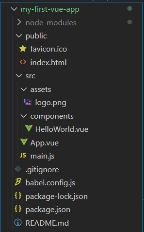
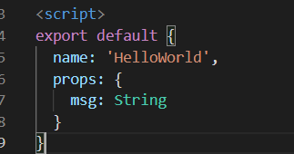
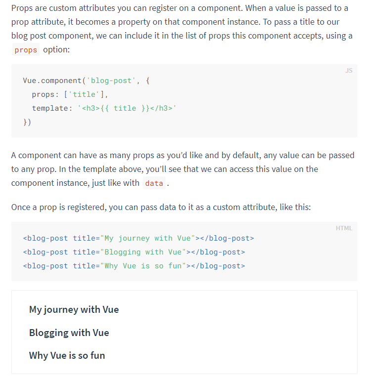

# vue 02

vue CLI


## SFC


### Component

- 기본 HTML 엘리먼트를 확장하여 **재사용** 가능한 코드를 캡슐화 하는데 도움
- CS 에서는 **다시 사용할 수 있는 범용성**을 위해 개발된 소프트웨어 구성 요소를 의미
- 즉 , 컴포넌트는 개발을 함에 있어 유지 보수를 쉽게 만들어줄 뿐만 아니라 재사용성의 측면에서도 매우 강력한 기능 제공
- Vue 컴포넌트 === Vue 인스턴스
- 반드시 하나의 파일을 의미하지 않고 하나의 파일에 여러 컴포넌트가 들어갈 수도 있다


vue component 구조 예시


## SFC

> Single File Component

-  Vue 컴포넌트 기반 개발의 핵심 특징
- 하나의 컴포넌트는 .vue 라는 하나의 파일 안에서 작성되는 코드의 결과물
- 화면의 특정 영역에 대한 HTML, CSS, JavaScript 코드를 하나의 파일에서 관리
- 즉 vue  확장자를 가진 싱글 파일 컴포넌트를 통해 새발
- Vue 컴포넌트 === vue 인스턴스 === .vue 파일


## Vue CLI

- vue.js 개발을 위한 표준 도구
- 프로젝트의 구성을 도와주는 역할, Vue 개발 생태계에서 표준 tool 기준을 목표로 함
- 확장 플러그인, GUI, ES2015 구성요소 제공 등 다양한 tool 제공


### Node.js

- 자바스크립트를 브라우저가 아닌 환경에서도 구동할 수 있도록 하는 자바스크립트 런타임 환경
  - 브라우저 밖을 벗어날 수 없었던 자바스크립트 언어의 태생적 한계를 해결
- Chrome V8 엔진을 제공하여 여러 OS 환경에서 실행 할 수 있는 환경을 제공
- 즉 단순히 브라우저만 조작할 수 있던 자바스크립트를 SSR(Server Side Rendering)에서도 사용 가능하도록 한다


### NPM (Node Package Manager)

- 자바스크립트 언어를 위한 패키지 관리자
  - python 의 pip와 유사
  - pip와 마찬가지로 다양한 의존성 패키지 관리
- Node.js 의 기본 패키지 관리자이므로 자동 설치된다.


#### 설치

```
vue-cli 설치
$ npm install -g @vue/cli

버전확인
$ vue --version


```

https://cli.vuejs.org/guide/installation.html


#### 프로젝트 생성

```
$ vue create <my-first-vue-app:프로젝트이름>
```

- interactive terminal




-  assets : static 한 assets 모음
- 최상위 component : App.vue
- components 하위 컴포넌트 모음
- main.js 
  - runserve 하고 webpack이 빌드를 시작할 때 가장 먼저 불러오는 entry point
  - 단일 파일에서 DOM과 연결
  - vue 전역 모듈 등록
- .gitignore 자동 생성 (추가 필요)
- 분명히 git init 안 했는데 master 가 붙어있냐..?
  - git init 자동
- package.json
  - 명령어 scripts
  - dependencies 개발환경, 배포환경에서 사용할 모듈
  - 메타데이터
  - requirements.txt와 유사하다
- package-lock.json
  - 동일한 종속성 유지하도록 도움
  - dependency 의 상세 내용
- NPM 사용시 package.json 과 package-lock.json은 자동갱신된다 
  - 수정하지 않음
  - 


#### 런 서버

```
$ npm run serve
```


## Babel & Webpack


### Babel

- JavaScript Transcompiler
- 자바스크립트의 신버전 코드를 구버전으로 번역/변환 해주는 도구
- 자바스크립트 역사에 있어서 파편화와 표준화의 영향으로 작성된 코드의 스펙트럼이 매우 다양
  - 최신 문법을 사용해도 브라우저의 버전별로 동작하지 않는 상황이 발생
  - 같은 의미의 다른 코드를 작성하는 등의 대응이 필요해졌고 이러한 문제를 해결하기 위한 도구
- 원시 코드(최신버전) 를 목적 코드(구 버전)으로 옮기는 번역기가 등장하면서 개발자는 더이상 내 코드가 특정 브라우저에서 동작하지 않는 상황에 대해 크게 고민하지 않을 수 있음


### Webpack

- static module bundler
- 모듈 간의 의존성 문제를 해결하기 위한 도구


#### Module

- 파일 하냐 (스크립트 하나 === 모듈 하나)
- 배경
  - 브라우저만 조작할 수 있었던 시기의 자바스크립트는 모듈 관련 문법 없이 사용
  - 하지만 자바스크립트와 애플리케이션이 복잡해지고 크기가 커지자 전역 스코프를 공유하는 형태의 기존 개발 방식의 한계점
  - 그래서 라이브러리를 만들어 필요한 모듈은 언제든지 불러오거나 코드를 모듈 단위로 작성하는 등의 다양한 시도가 이루어짐
- 과거 모듈 시스템
  - AMD, CommonJS, UMD
- 현재 대부분의 브라우저와 Node.js 가 모듈 시스템 지원


##### 의존성 문제

- 모듈의 수가 많아지고 라이브러리 혹은 모듈간의 의존성(연결성)이 깊어지면서 특정한 곳에서 발생한 문제가 어떤 모듈 간의 문제인지 파악하기 어려워짐
- Webpack은 모듈 간의 의존성 문제를 해결하기 위해 존재하는 도구


#### Bundler

- 모듈 의존성 문제를 해결해주는 작업이 Bundling 이고 이러한 일을 해주는 도구가 Bundler
- Webpack 은 다양한 Bundler 중의 하나
- 모듈들을 하나로 묶어주고 묶인 파일은 하나 (혹은 여러개)로 만들어 진다
- Bundling 된 경과물은 더이상 서-순에 영향을 받지 않고 동작
- Bundling 과정에서 문제가 해결되지 않으면 최종 결과물을 만들어 낼 수 없기 대문에 유지 & 보수 측면에서 매우 편리
- snowpack, parcel, rollup.js 등의 webpack 이외에도 다양한 모듈 번들러 존대
- Vue CLI에는 Webpack 이 기본


## src


### App.vue

- template


- script

- style

1. `scoped` 적용 범위 지정 가능 
2. 


`.vue` 가 하나의 컴포넌트

App.vue 가 최상위 컴포넌트

하위 컴포넌트는 components 안에 


#### 사용순서

1. 불러와서 (import)
2. 등록하고 (export)
   1. export default 객체
   2. node.js 문법 반영
   3. 다른 파일에서 현재 파일의 객체를 사용하기 위해서는 현재 파일에서 export 해야 import 하여 다룰 수 있다.
3. 사용하기 (template)


- 최상위 component 에서 하위 component 로 데이터가 내려가고 있다.
  - 상위 component인 App.vue
  - msg 를 정의했다
  - 
  - 하위 component인 HelloWorld
  - 데이터에 대한 명시, props에 등록





### Component

https://vuejs.org/v2/guide/components.html


#### template

- 하나의 root HTML 요소를 가진다
- Single Root Element
- div를 선언하고 그 안에 코드를 작성하면 된다


#### script


##### data는 반드시 함수여야 한다

- data에 개별 이름 공간 block scope를 만든다고 생각
- 개별적인 component data를 갖기 위해
- 그래야 다른 instance 들이 값을 공유하지 않는다


- component 재사용을 위해서 data는 객체가 아닌 함수여야 한다.
  - 상위 객체에서 보내는 props는 공유하고 있기 때문에 객체여도 상관 없다


## Pass Props & Emit Events

- 컴포넌트는 부모- 자식 관계에서 가장 일반적으로 함께 사용하기 위함
- 부모는 자식에게 데이터를 전달 (Pass props) 하며,
- 자식은 자신에게 일어난 일을 부모에게 알림(Emit event)
  - 부모와 자식이 명확하게 정의된 인터페이스를 통해 격리된 상태로 유지할 수 있다
- props 는 아래로, events 는 위로
- 부모는 props 를 통해 자식에게 데이터를 전달하고 자식은 event 를 통해 부모에게 메시지를 보낸다.


### props

- prop는 상위 컴포넌트의 정보를 전달하기 위한 사용자 지정 특성
- 하위 컴포넌트는 props 옵션을 사용하여 수신하는 props를 **명시적으로 선언** 해야 사용 가능
- 즉 데이터는 props 옵션을 사용하여 하위 컴포넌트로 전달된다
  - 부모의 data를 전달하기 위해 `v-bind` 속성을 사용한다
  - 
- 부모 데이터에 자식이 직접 참조하는 것은 불가능하다





- props 이름 컨벤션
  -  in HTML
    - kebab case
    - my-message
  - in script
    - camel case


- props 정의 style guide


##### 단방향 데이터 흐름

- 모든 props 는 하위 속성과 상위 속성 사이의 단반향 바인딩 형성
- 부모의 속성이 변경되면 자식 속성에게 전달되지만, 반대 방향으로는 안 된다
  - 자식 요소가 의도치 않게 부모 요소의 상태를 변경함으로써 앱의 데이터 흐름을 이해하기 어렵게 만드는 일을 막는다
- 부모 컴포넌트가 업데이트 될 때마다 자식 요소의 모든 prop 들이 최신 값으로 업데이트된다.


### Emit event

> 데이터는 올릴 수 없지만 사건이 일어났음을 알릴 수 있음


- $emit(event)
  - 현재 인스턴스에서 이벤트를 트리거
  - 추가 인자는 리스너의 콜백 함수로 전달
- 부모 컴포넌트는 자식 텀포넌트가 사용되는 템플릿에서 `v-on` 을 사용하여 자식 컴포넌트가 보낸 이벤트 청취
- 사용자 지정 이벤트


- 이벤트 이름
  - 컴포넌트 및 props 와는 달리 자동 대소문자 변환을 제공하지 않음
  - HTML 의 대소문자 구분을 위해 DOM 템플릿의 v-on 이벤트 리스너는 항상 자동으로 소문자 변환되기 때문에 v-on:myEvent 는 자동으로 v-on:myevent 로 변환
  - 이러한 이유로 **이벤트 이름에는 kebab-case 를 사용하는 것을 권장한다.**


- event와 함께 부모에게 데이터를 전달할 수 있다
  - event handler를 method 로 작성할 경우 첫 번째 인자로 넘어오는 값이 자식이 부모에게 전송하는 데이터 (payload)
  - ...args 이므로 여러개를 전달할 수 있고 그 경우 배열로 받는다.
  - 1개의 데이터만 전달할 경우 아래와 같이 받으면 된다


- input 태그의 값을 넘길 경우 `v-model` 속성을 사용하면 좀더 편리하다
- v-model 로 연동되어 있는 data를 emit 하며 넘기면 되기 때문


##### 적용 코드

```vue
<template>
  <div>
    <h2>New Component!</h2>
    <h3>{{ myMessage }}</h3>
    <input @keyup.enter="childInputChange" v-model="childInputData" type="text">
  </div>
</template>

<script>
export default {
  name: 'NewComponent',
  data() {
    return {
      childInputData:''
      }
  },
  props: {
    myMessage: {  //props 를 자세하게 명시하도록 style guide
      type: String,
      required: true,
    },
  },
  methods: {
    childInputChange() {
      this.$emit('child-input-change', this.childInputData) // 부모에게 알릴 event, payload
    }
  }
}
</script>

<style>

</style>
```


## Vue Router

- Vue.js 의 공식 라우터
- 중첩된 라우트/ 뷰 매핑 모듈화 된, 컴포넌트 기반의 라우터 설정 등 SPA 상에서 라우팅을 쉽게 개발 할 수 있는 기능을 제공


### 설치


- Vue CLI

```
$ vue add router
```

- 프로젝트 중간에 추가하면 폴더의 구조가 바뀌게 된다 
  - 중간에 작성한 것이 사라지지 않도록 백업할 것


- template 에 router-link 추가
  - single page A 인데 a tag?
  - 여전히 SPA 유지 중 
  - 페이지 전환이 이루어진게 아니라 component가 새롭게 렌더링된 것
  - index.js 에 등록된 경로- 컴포넌트의 name 을 bind 하여 (`:to`) 접근 할 수 있다.
    - to 속성에 객체를 넘긴다
    - "{name:'내가 지정한 이름'}"


- router-view 추가
  - router link에 따라서 어디에 렌더링 할 것인지 결정한다
- router 폴더 추가
- views 폴더 추가


#### router-link

- router > index.js

- urls.py 와 흡사해보인다

- index.js 파일에 정의한 경로에 등록한 특정한 컴포넌트와 매핑

- a 태그 지만 우리가 알고 있는 GET 요청을 보내는 a 태그와는 다르게 기본 GET 요청을 보내는 이벤트를 제거한 형태를 구성

- HTML5 히스토리 모드에서 , router-link는 클릭 이벤트를 차잔하여 브라우저가 페이지를 다시 로드하지 않도록 한다.

- 주소가 바뀌는 것처럼 보이지만, network 탭을 확인하면 변화가 없다

  - history API

  


#### router-view

- **실제 component 가 DOM에 부착되어 보이는 자리**를 의미

- router-link 를 클릭하면 해당 경로와 연결되어 있는 index.js 에 정의한 컴포넌트가 위치

  

#### history mode

- HTML history API 를 사용해서 router 를 구현한 것
- 브라우저의 히스토리는 남기지만 실제 페이지는 이동하지 않는 기능을 지원
- 사용자를 위해 페이지 이동의 경험을 주는 것
- 새로운 컴포넌트를 보는 것이 아니라 새로운 페이지를 본다고 느낌
- history
  - 뒤로가기
  - 앞으로가기
  - 공유를 가능하게 한다


### 순서

0. 컴포넌트 생성
1. 컴포넌트 호출
2. 라우터 등록


### 필요한 이유

1. SPA 등장 이전
   1. 서버가 모든 라우팅 통제
   2. 요청 경로에 맞는 HTML 제공
2. SPA 등장 이후
   1. 서버는 index.html 하나 제공
   2. 이후 모든 처리는 HTML 위에서 JS 코드를 활용해 진행
   3. 즉 요청에 대한 처리를 더이상 서버가 하지 않는다 (할 필요가 없어짐)
3. 라우팅 처리 차이
   1. SSR
      1. 라우팅에 대한 결정권을 서버가 가짐
   2. CSR
      1. 클라이언트는 더이상 서버로 요청을 보내지 않고 응답받은 HTML 문서 안에서 **주소가 변경되면 특정 주소에 맞는 컴포넌트를 렌더링**
      2. 라우팅에 대한 결정권을 클라이언트가 가짐
   3. Vue Router 는 라우팅의 결정권을 가진 Vue.js 에서 라우팅을 편리하게 할 수 있는 Tool 을 제공
      1. 라우팅에 대한 매핑을 책임진다


### components vs views

> 위계구조가 생기면서 자연스럽게 따라오는 고민


- 컴포넌트를 만들어 갈 때 정해진 구조가 있는 것은 아님
- 주로 아래와 같이 구조화
- App.vue
  - 최상위 컴포넌트
- views/
  - `router-view` 를 통해 보여지는 컴포넌트
  - router(index.js) 에 매핑되는 컴포넌트를 모아두는 폴더
  - App 텀포넌트 내부에 About & Home 컴포넌트 등록
- components
  - router 에 매핑된 컴포넌트 내부에 작성하는 컴포넌트를 모아두는 폴더
  - Home 컴포넌트 내부에 HelloWorld 컴포넌트 등록


### dynamic route matching

> 기존에 알던 variable routing 과 유사 하다


- `$route.params.var-name`


### Redirect

- `this.$router.push({name: 'routename'})`


```javascript
this.$router.push('/')
this.$router.push({name: 'Home'})
```

https://michaelnthiessen.com/redirect-in-vue/

