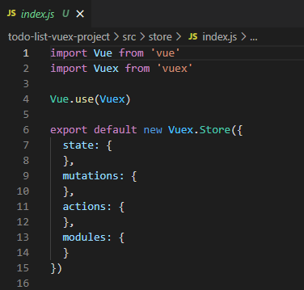
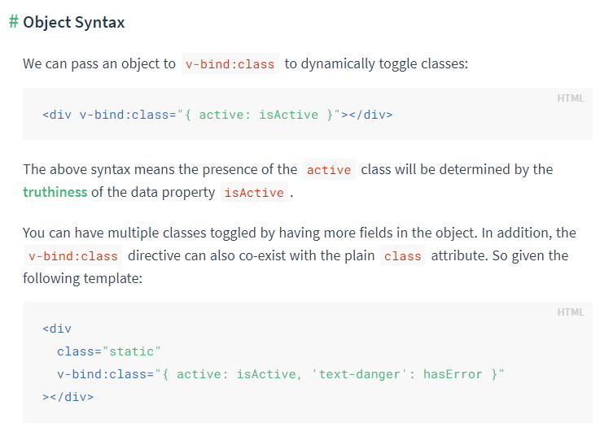
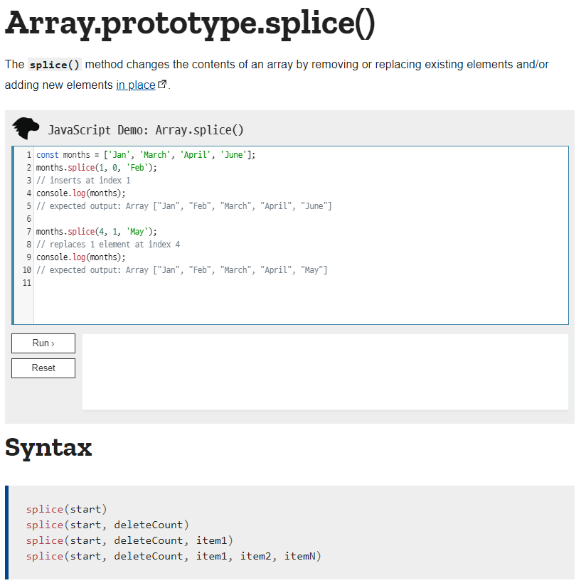

# vue 03

상태 관리 패턴에 관하여

## Vuex

- statement management pattern + libaray for vue.js
  - **상태 관리 패턴** + 라이브러리
- 상태를 **전역 저장소로 관리**할 수 있도록 지원하는 라이브러리
  - state 가 예측 가능한 방식으로만 변경될 수 있도록 보장하는 규칙 설정
  - 애플리케이션의 모든 컴포넌트에 대한 **중앙 집중식 저장소** 연결
- Vue 공식 devtools 와 통합되어 기타 고급 기능을 제공


### State

- **state 는 data** 이며 해당 어플리케이션의 핵심이 되는 요소
- 각 컴포넌트에서 관리 (.html의 경우 new Vue({}), SFC에서는 .vue 에 해당)
- DOM 은 data(state)에 반응하여 DOM 을 렌더링


### Pass props & Emit event

- 각 컴포넌트는 독립적으로 데이터를 관리
- 데이터는 단방향 흐름으로 부모 >> 자식 간의 전달만 가능하며 반대의 경우 이벤트를 통해 전달
- 장점
  - 데이터의 흐름을 직관적으로 파악 가능
- 단점
  - 컴포넌트 중첩이 깊어지는 경우 동위 관계의 컴포넌트로의 데이터 전달이 불편해짐


### in Vuex

- 중앙 저장소에서 state를 모아서 관리
- 규모가 큰 (컴포넌트 중첩이 깊은) 프로젝트에 매우 편리
- 각 컴포넌트에서는 중앙 집중 저장소의 state 만 신경쓰면 됨
- 이를 공유하는 다른 컴포넌트는 알아서 동기화


## Vuex core concept

### 단방향 데이터 흐름

- 상태(state )는 앱을 작동하는 원본 소스 (data)
- 뷰(view)는 상태의 선언적 매핑
- 액션(action)은 뷰에서 사용자 입력에 대해 반응적으로 상태를 바꿈 (methods)
  - 공통의 상태를 공유하는 여러 컴포넌트가 있는 경우 복잡해짐
  - 지나치게 중첩된 컴포넌트를 통과하는 prop


### 상태관리 패턴

- 컴포넌트의 공유된 상태를 추출하고 이를 전역에서 관리
- 컴포넌트는 커다란 뷰가 되며 모든 컴포넌트는 트리에 상관없이 상태에 엑세스하거나 동작을 트리거
- 상태 관리 및 특정 규칙 적용과 관련된 개념을 정의하고 분리함으로써 코드의 구조와 유지관리 기능 향상


### 구성 요소

1.  State
2. Actions
3. Mutations
4. Getters


#### State

- 중앙에서 관리하는 모든 상태 정보 (data)
- Mutations 에 정의된 메서드에 의해 변경
- 여러 컴포넌트 내부에 있는 특정 state 를 중앙에서 관리
  - 이전의 방식은 state 를 찾기 위해 각 컴포넌트를 직접 확인
  - Vuex 를 활용하는 방식은 Vuex Store 에서 컴포넌트에서 사용하는 state를 한 눈에 파악 가능
- state 가 변화하면 해당 state 를 공유하는 컴포넌트의 DOM 은 (알아서) 렌더링
- 컴포넌트는 vuex store 에서 state 정보를 가져와 사용
- `dispatch() ` 를 사용하여 Actions 을 호출


#### Actions

- Component 에서 `dispatch` 메서드에 의해 호출
- Backend API 와 통신하여 Data Fetching 등의 작업 수행
  - 동기적인 작업 뿐만 아니라 비동기 작업도
- 항상 `context` 가 인자로 넘어옴
  - store.js 파일 내에 있는 모든 요소에 접근해서 속성 접근 & 메서드 호출이 가능
  - 그러나 state 를 직접 변경하지 않도록 한다
- **mutations 에 정의된 메서드를 `commit` 메서드로 호출**
- state 는 오로지 mutations 메서드를 통해서만 조작
  - 명확한 역할 분담
  - 서비스 규모가 커져도 state 올바르게 관리


#### Mutations

- setter

- Actions 에서 `commit` 메서드에 의해 호출
- **state(data) 를 변경한다.**
- 비동기적으로 동작하면 state가 변화하는 시점이 달라질 수 있어 **동기적인 코드만** 작성한다
- mutations 에 정의하는 메서드의 첫 번째 인자로 `state` 가 넘어온다


Actions와 Mutations 모두 특정 기능을 하는 메서드가 존재한다


#### Getters

- state 를 변경하지 않고 활용하여 계산을 수행 (computed 와 유사)
  - 실제 계산된 값을 사용하는 것 처럼 getters 는 저장소의 상태(state) 를 기준으로 계산
  - 예를 들어 state 에 todo list 의 해야할 일의 목록의 경우 todo 가 완료된 목록만 필터링해서 보여줘야 하는 경우
  - getters 에서 completed 의 값이 true 인 요소가 필터링 해서 계산된 값을 담아 놓을 수 있다
- getters 자체가 state 자체를 변경하지는 않음
  - state 를 특정한 조건에 따라 구분(계산) 만 한다
  - 즉 계산된 값을 가져온다


## 실습


- 설치

```vuvue add vuex
vue add vuex
```


- store >> index.js
  - modules 는 프로젝트의 규모가 커져서 store 자체를 module 화 할 때 사용 
  - getter 는 추후 추가하여 사용




### component

#### TodoList

```vue
<template>
  <div>
    <TodoListItem v-for="(todo, idx) in todos" :key="idx" :todo="todo"/>
  </div>
</template>

<script>
import TodoListItem from '@/components/TodoListItem.vue'

export default {
  name: 'TodoList',
  components: {
    TodoListItem,
  },
  computed: {
    todos() {
      return this.$store.state.todos
    }
  }
}
</script>

<style>

</style>
```

- state 에 접근하기
  - `this.$store.state`
  - this 가 의미하는 것은 component 인 vue 객체
  
  
  
  - 재료로 store를 가지고 있기 때문에 `$store`로 접근할 수 있다.


#### TodoListItem

```vue
<template>
  <div>
    <span @click="updateTodo" :class="{completed: todo.completed}">{{todo.title}}</span> 
    <button @click="deleteTodo">X</button>
  </div>
</template>

<script>
export default {
  name: 'TodoListItem',
  props: {
    todo: Object,
  },
  methods: {
    deleteTodo() {
      this.$store.dispatch('deleteTodo', this.todo)
    },
    updateTodo(event) {
      console.log(event.target)
      this.$store.dispatch('updateTodo', this.todo)
    }
  }
}
</script>

<style scoped>
  .completed {
    text-decoration: line-through;
  }

</style>
```

- complete 의 boolean 값에 따라서 class 추가 여부를 결정
- `:class` 에 객체를 할당한다.




#### TodoForm

```vue
<template>
  <div>
    <input type="text" v-model.trim="todoTitle" @keyup.enter="createTodo">
    <button @click="createTodo">Add</button>
  </div>
</template>

<script>
export default {
  name: 'TodoForm',
  data() {
    return {
      todoTitle: '',
    }
  },
  methods: {
    createTodo() {
      const todoItem = {
        title: this.todoTitle,
        completed: false
      }

      if (todoItem.title) {
        // todoItem.title.trim() js 코드로 작성 할 수 있다.
        this.$store.dispatch('createTodo', todoItem)
      } else {
        alert('빈 값 ㄴㄴ')
      }

      this.todoTitle = ''
    }
  }
}
</script>

<style>

</style>
```

- 공백 입력 방지
  - `v-model.trim`
  - `text.trim()`


### Vuex 절차
1. 컴포넌트에서 `dispatch` 메서드로 actions 호출
2. action 에 정의된 메서드는 `commit` 을 활용해 mutations 를 호출
3. mutations 에 정의된 메서드는 state를 조작한다


```javascript
import Vue from 'vue'
import Vuex from 'vuex'

Vue.use(Vuex)

export default new Vuex.Store({
  state: {
    todos: []
  },
  mutations: {
    CREATE_TODO(state, todoItem) {  //uppercase 데이터 조작 함수 명시
      state.todos.push(todoItem)
    }
  },
  actions: {
    createTodo({commit, state}, todoItem) {  //destructuring
      console.log(commit, state)
      commit('CREATE_TODO', todoItem)
        // context.commit()

    }
  },
  modules: {
  }
})

```

- mutation 은 최대한 logic 이  간결해야 한다.


### 리스트 삭제

```javascript
DELETE_TODO(state, todoItem) {
      // 1. todoItem 이 첫번째로 만나는 요소의 인덱스 가져오기
      const idx = state.todos.indexOf(todoItem)
      // 2. 해당 인덱스 1개만 삭제하고 나머지 요소를 토대로 새로운 배열 생성
      state.todos.splice(idx, 1)
    }
```


### 리스트 업데이트

```javascript
UPDATE_TODO(state, todoItem) {
      // const idx = state.todos.indexOf(todoItem)
      // state.todos[idx].completed = !state.todos[idx].completed

      state.todos = state.todos.map((todo)=>{
        if (todo === todoItem) {
          return {...todo, completed:!todo.completed}  // spread syntax
        } else {
          return todo
        }
      })
    
    }
```





### binding helper

https://vuex.vuejs.org/api/#component-binding-helpers

#### mapState

https://vuex.vuejs.org/guide/state.html#the-mapstate-helper

- computed 와 state 를 mapping 
- TodoList 에서 state의 todos 를 for 문으로 출력할 때 
- state의 변수를 가져와서 사용한다


```vue
<script>
import {mapState} from 'vuex'
import TodoListItem from '@/components/TodoListItem.vue'

export default {
  name: 'TodoList',
  components: {
    TodoListItem,
  },
  computed: {
    // todos() {
    //   return this.$store.state.todos
    // }
      
    ...mapState([
      'todos',
    ])
  }
}
</script>
```


#### mapGetters

- computed 와 Getters 매핑
- App 에서 completeCount 와 uncompleteCount 계산 할 때
- Getters 에 정의된 이름과 동일한 이름을 작성하는 것에 주의
- Getters 의 메서드를 가져와 computed 의 메서드로 사용하는 것

```vue
<script>
import {mapGetters} from 'vuex'

export default {
  name: 'App',
  components: {
    TodoForm, TodoList,
  },
  computed: {
    // completedTodosCount() {
    //   return this.$store.getters.completedTodosCount
    // },
    // uncompletedTodosCount() {
    //   return this.$store.getters.uncompletedTodosCount
    // }
    ...mapGetters([
    'completedTodosCount',
    'uncompletedTodosCount'])
  }
}
</script>
```


#### mapActions

- computed와 Actions 매핑
- TodoLisItem 에서 actions 를 호출하는 경우
- 그런데 payload 값을 어찌 넘길 것?
  - 호출할 때에 매개변수를 함께 넘겨야 한다.


```vue
<template>
  <div>
    <span @click="updateTodo(todo)" :class="{completed: todo.completed}">{{todo.title}}</span> 
    <button @click="deleteTodo(todo)">X</button>
  </div>
</template>

<script>
import {mapActions} from 'vuex'

export default {
  name: 'TodoListItem',
  props: {
    todo: Object,
  },
  methods: {
    // deleteTodo() {
    //   this.$store.dispatch('deleteTodo', this.todo)
    // },
    // updateTodo(event) {
    //   console.log(event.target)
    //   this.$store.dispatch('updateTodo', this.todo)
    // }

    ...mapActions([
      'deleteTodo',
      'updateTodo',
    ])
  }
}
</script>
```


### persistedstate plug-in

>  local storage 빌려 state 저장하기


```
npm install --save vuex-persistedstate
```

```
import createPersistedState from "vuex-persistedstate";
```


#### usage

- store에

```
import Vuex from "vuex";
import createPersistedState from "vuex-persistedstate";

const store = new Vuex.Store({
  // ...
  plugins: [createPersistedState()],
});
```

