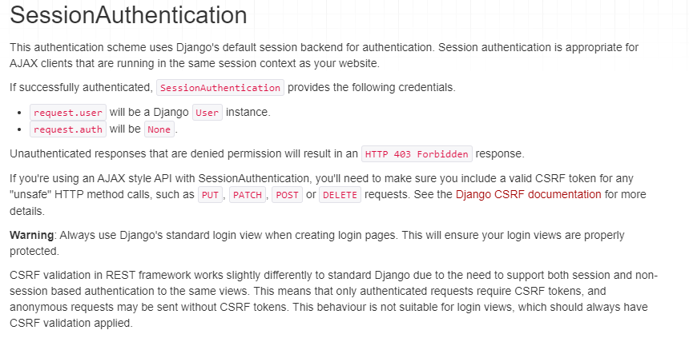
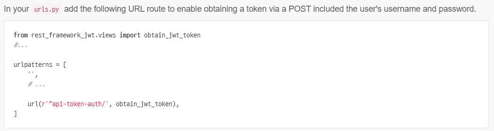

# Vue API


## Server & Client

### Server

- 클라이언트에게 정보, 서비스 제공하는 컴퓨터 시스템
- django 를 통해 응답한 template
- DRF 를 통해 응답한 JSON
- DB 와 통신하여 데이터를 CRUD 하여 Client 에게 응답


### Client

- 서버에게 서버가 제공하는 서비스를 요청
- 서비스 요청을 위해 필요한 인자를 서버가 원하는 방식에 맞게 제공
- 서버로부터 반환되는 응답을 사용자에게 적절한 방식으로 표현


## CORS


## Same orgin policy (SOP)

- 동일 출처 정책
- 특정 출처(origin) 에서 불러온 문서나 스크립트가 다른 출처에서 가져온 리소스와 상호작용하는 것을 제한하는 보안 방식
- 잠재적으로 해로울 수 있는 문서를 분리해 공격받을 수 있는 경로를 줄인다
- 두 URL 의 Protocol, Port, Host 가 모두 같아야 동일한 출처라고 할 수 있다


## Cross Origin Resource Sharing

- 교차 출처 리소스 공유
- 추가 **HTTP header를 사용하여** 특정 출처에서 실행중인 웹 애플리케이션이 **다른 출처의 자원에 접근할 수 있는 권한을 부여하도록 브라우저에게 알려주는 체제**
- 리소스가 자신의 출처 (Domain, Protocol, Port) 와 다를 때 교차 출처 HTTP 요청을 실행
- 보안 상의 이유로 브라우저는 교차 출처 HTTP 요청을 제한 (SOP)
  - XMLHttpRequest 는 SOP 를 따른다
- 다른 출처의 리소스를 불러오려면 그 출처에서 **올바른 CORS header를 포함한 응답을 반환**해야 한다.


#### 교차출처 접근 허용하기

- CORS 를 사용해 교차 출처 접근 허용
- HTTP 의 일부로, 어떤 호스트에서 자신의 컨텐츠를 불러갈 수 있는지 서버에 지정


#### 왜 사용할까?

1. 브라우저, 웹 애플리케이션 보호
   1. 악의적인 사이트의 데이터를 가져오지 않도록
   2. 응답으로 받는 자원에 대한 최소한의 검증
   3. 서버는 정상적으로 응답하지만 브라우저에서 차단
2. Server 의 자원관리
   1. 누가 해당 리소스에 접근 할 수 있는지 관리 가능


#### 어떻게 사용할까

- CORS 표준에 의해 추가된 HTTP Header를 통해 이를 통제


### Access Contol Allow Origin 

- 이 응답이 주어진 출처로부터 요청 코드와 공유 될 수 있는지 나타낸다
- `Access-Control-Allow-Origin:*`
- 브라우저 리소스에 접근하는 임의의 origin 으로부터 요청을 허용한다고 알리는 응답
- `*` 는 모든 도메인의 접근을 허용
- 특정 도메인만 리소스 접근하도록 특정할 수 있다


#### 시나리오 예시

1. Vue.js 에서 A 서버로 요청
2. A 서버는 Access Control Allow Origin 에 특정한 origin을 포함시켜 응답
   1. 서버는 CORS Policy 와 직접 연관 없고 요청에 응답할 뿐
3. **브라우저는** 응답에  Access-Contorl-Allow-Origin  확인 후 허용 여부를 결정
4. 프레임 워크 별로 이를 지원하는 라이브러리 존재
   1. django-cors-headers 라이브러리 통해 응답 헤더 및 추가 설정 


##### vue.js는 localhost:8080, django는 localhost:l8000 port를 사용한다

- django 의 response 에 CORS header를 붙여줘야 한다


- 브라우저가 다른 출처에서 응답이 온 것에 대해 막았다
- CORS 헤더가 없기 때문
- 악의적인 응답이라고 판단함


##### install

https://github.com/adamchainz/django-cors-headers


##### 허용될 list 추가


##### 모든 도메인 허용


```
CORS_ALLOW_ALL_ORIGINS = True
```


##### drf는 csrf token을 필요로 하지 않는다?



- This means that only authenticated requests require CSRF tokens, and anonymous requests may be sent without CSRF tokens


## Authentication & Authorization


### Authentication

- 사용자가 누구인지 확인
- '나' 가 누구인지 확인하는 과정
- 모든 보안 프로세스의 첫번째 단계 (가장 기본 요소)
- 401 미승인 (Unauthorized) === 비인증 (UnAuthenticated)


### Authoriztation

- 권한 부여
- 사용자에게 특정 리소스 또는 기능에 대한 액세스 권한 부여
- 보안 환경에서 권한 부여는 항상 인증이 전제
  - 사용자는 액세스 권한 부여 받기 전에 ID 가 진짜인지 먼저 확인
- 서류의 등급, 웹페이지에서 글을 조회/수정/삭제할 수 있는, 제한 구역
  - 인증이 되었어도 모든 권한을 부여받는 것은 아니다
  - 일반 유저 vs 관리자 유저
- 403 Forbidden


### Authentication and authorization work together

- 회원가입을 하고 로그인을 하면 권한 생성
  - 인증 이후에 권한이 따라오는 경우
- 단 인증을 거쳐도 권한이 동일하게 부여되지 않는다
  - 다른사람의 글을 수정/삭제 할 수 없다


### 인증의 방법

https://sherryhsu.medium.com/session-vs-token-based-authentication-11a6c5ac45e4


#### 세션 (Session)

> session id 발급 >> cookie 에 저장후 매번 request 마다 첨부 


#### 토큰 (Token Based Authentication)

> JWT


- Json Web Token
- Json  포맷을 활용하여 요소 간 안전하게 정보를 교환하기 위한 표준 포맷
- 암호화 알고리즘에 의한 디지털 서명이 되어있어 자체로 검증이 가능하고 신뢰할 수 있는 정보 교환 체계
- JWT 자체가 필요한 정보를 모두 갖기 때문에 (self-contained) 이를 검증하기 위한 다른 검증 수단이 필요없음
  - session 은 session 정보를 담은 테이블을 따로 갖고 있어야 했던 것과 달리
- 사용처
  - Authentication, Information Exchange


##### 사용이유

1. Session 에 비해 상대적으로 HTML, HTTP 환경에서 사용하기 용이
   1. Sesseion 은 유저의 session 정보를 server에 보관
   2. **JWT 는 Client side 에 토큰 정보를 저장하고 필요한 요청에 같이 넣어보내며 그 자체가 인증 수단**
2. 높은 보안 수준
3. JSON 의 범용성
4. 서버 메모리에 정보를 저장하지 않아 자원 절약 가능


##### 구조

- Header

  - 토큰의 유형 (type)
  - Hashing algorithm

- Payload

  - 토큰에 넣을 정보
  - claim 은 정보의 한 조각을 의미하여 payload 에 여러개의 claim 을 넣을 수 있다

- Signature

  - Header 의 encoding 값 + Payload 의 encoding 값 + private key 를 hashing

  


##### 단점?

session id 는 거짓으로 의심되는 것들을 삭제, 폐기 할 수 있지만 jwt 는 상대적으로 관리가 어렵다.


#### 제3자

> AuthO


## JWT

> 인증의 시간복잡도 줄이기 
>
> session id를 사용하면 DB를 거쳐와야 하는 부담
>
> cashing (ram,memory) 한대도 결국 server 의 일
>
> 반면 jwt의 hash decode 는 비교적 간단


### django restframework jwt

https://jpadilla.github.io/django-rest-framework-jwt/

```
$ pip install djangorestframework-jwt
```


#### token을 받기위한 url 추가




#### 사용하기


https://jwt.io/

- decode 해보기
- 

- jwt signature 에는 django secret key 를 사용한다
- 한 번 만든 토큰은 의도적인 만료가 불가능하기 때문에 만료 기간을 길게 잡지 않는다


### vue 수정

- jwt 를 발급받고
- localstorage 에 저장 (setItem)
- 추후 요청을 보낼 때에 header 에 jwt 추가 (getItem)
- 로그아웃시 localstorage 의 jwt 삭제 (removeItem)

```vue
<script>
import axios from 'axios'

// const SERVER_URL = process.env.VUE_APP_SERVER_URL

export default {
  name: 'Login',
  data: function () {
    return {
      credentials: {
      username: null,
      password: null,
      }
    }
  },
  methods: {
    login: function () {
      axios({
        method: 'post',
        url: 'http://127.0.0.1:8000/accounts/api-token-auth/',
        data: this.credentials
      })
        .then(res => {
          console.log(res)
          localStorage.setItem('jwt', res.data.token)
          this.$router.push({name:'TodoList'})
          this.$emit('login')
        })
        .catch(err => {
          console.log(err)
        })
      
    }
  }
}
</script>
```


#### router link < a tag > native

- click event 의 native 한 속성을 회복한다
- native 없이는 해당 component 에서 click 이라는 custom event가 emit 되기를 기다리는 것
  - component 이기 때문에

```vue
<template>
  <div id="app">
    <div id="nav">
      <span v-if="isLogin">
        <router-link :to="{ name: 'TodoList' }">Todo List</router-link> | 
        <router-link :to="{ name: 'CreateTodo' }">Create Todo</router-link> |
        <router-link @click.native="logout" to="#">Logout</router-link>  <!--고유한 event를 사용하기 위해 .native-->
      </span>
      <span v-else>
        <router-link :to="{ name: 'Signup' }">Signup</router-link> |
        <router-link :to="{ name: 'Login' }">Login</router-link> 
      </span>
    </div>
    <router-view @login="changeIsLogin"/>
  </div>
</template>
```


### djagno model 수정

- user FK 추가

```python
from django.db import models
from django.conf import settings

# Create your models here.
class Todo(models.Model):
    title = models.CharField(max_length=50)
    completed = models.BooleanField(default=False)
    user = models.ForeignKey(settings.AUTH_USER_MODEL, on_delete=models.CASCADE, related_name="todos")

    def __str__(self):
        return self.title
```


### django  view 수정

- authentication 관련 import

```python
from rest_framework.decorators import authentication_classes, permission_classes
from rest_framework.permissions import IsAuthenticated
from rest_framework_jwt.authentication import JSONWebTokenAuthentication
```


#### token의 유효 여부 check

- decorator 추가
- user 객체 save 시 추가
- user 가 작성한 게시물 related name = todos

```python
@api_view(['GET', 'POST']) 
# JWT 을 활용한 인증을 할 때 JWT 자체를 검증한 인증 여부와 상관없이 JWT가 유효한지 여부만 파악한다
@authentication_classes([JSONWebTokenAuthentication])
# 인증이 되지 않은 상태로 요청이 오면 '자격 인증 데이터'가 제공되지 않았다는 메세지를 응답한다 [인증]
@permission_classes([IsAuthenticated])

def todo_list_create(request):
    if request.method == 'GET':
        # todos = Todo.objects.all()
        # 로그인 유저의 todos만 보여줄 것
        serializer = TodoSerializer(request.user.todos, many=True)
        return Response(serializer.data)

    elif request.method == 'POST':
        serializer = TodoSerializer(data=request.data)
        if serializer.is_valid(raise_exception=True):
            serializer.save(user=request.user)
            return Response(serializer.data, status=status.HTTP_201_CREATED)
```


```python
@api_view(['PUT', 'DELETE'])
@authentication_classes([JSONWebTokenAuthentication])
@permission_classes([IsAuthenticated])
def todo_update_delete(request, todo_pk):
    todo = get_object_or_404(Todo, pk=todo_pk)

    # 해당 todo의 유저가 아닌 경우 todo 를 수정하거나 삭제하지 못하게 설정
    if not request.user.todos.filter(pk=todo_pk).exists():
        return Response({'detail':'수정 권한이 없습니다'}, status=status.HTTP_403_FORBIDDEN)
```


### postman 으로 

- header 에 jwt 토큰을 포함
  - `Authorization : JWT token`
- body 에 todo 작성


### client 에서 axios 요청에 header 포함시키기

```javascript
 methods: {
    setToken() {  // localstorage 에 저장된 jwt 으로 header 만들기
      const token = localStorage.getItem('jwt')
      const config = {
        Authorization: `JWT ${token}`
      }
      return config
    },
    getTodos: function () {
      axios({
        method: 'get',
        url: 'http://127.0.0.1:8000/todos/',
        headers: this.setToken(),
      })
        .then((res) => {
          console.log(res)
          this.todos = res.data
        })
        .catch((err) => {
          console.log(err)
        })
    },
```

