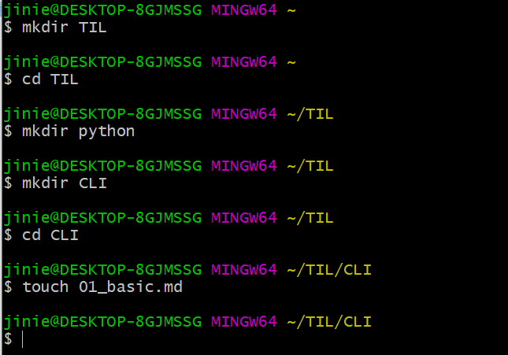

# Mark Language?

Markup , Markdown : 표시하다.

Hyper Text 링크가능한 

Markup 표시

Language 언어

HTML 역할을 표시한다


`HTML`

<h1>제목의 역할을 h1으로 명시한다.</h1>

<h3>소제목의 역할을 h3로 명시한다.</h3>

<p>문단을 paragraph로 명시한다.</p>


`MD`

# 큰 제목은 #으로 표현한다.

## 소제목은 ##으로 표현한다.

### 문단은 ###로 표현한다. #은 6개까지 가능하다.

계층의 우열관계를 잘 나누어야 한다. 
h1은 가장 큰 heading이므로 한 개이므로
글자 크기를 키우기 위해 heading을 바꿔서는 안 된다. (style을 바꾸면 된다.)


`요약`

작성한 것과 보이는 것이 다른 문서

!= what you see is what you get하지 않다.


# Basic CLI

작성한 즉시 결과를 보여준다 

ctrl+/하면 개발자 화면으로 전환


## 폴더(directory)

> 폴더 상징 특수 기호

* `~`
  * Home Directory를 상징한다.
* `/`
  * 위치는 일반적으로 /C/Users/[계정명]
* `.`
  * Root 폴더 (최상단)를 상징한다.
* `..`


## 기본 명령어

* `cd [대상폴더]`
* `ls`
* `rm`
  * option) -a, -r, -f
* `mkdir`
* `touch`
* `clear`
* `pwd`
* `cp` [원본파일] [복사파일]
* `start` [파일]
* `code`


```
backquote 3개를 작성하면 block을 그릴 수 있다.
backquote 작성 후 프로그래밍 언어를 작성하면 그 언어의 block을 작성할 수 있다.

$ mkdir TIL
$ cd TIL
```





## Summary


| 명령어 | 설명          | 상세                     |
| ------ | ------------- | ------------------------ |
| ls     | 목록 보여주기 | `ls -a`  전체 보여주기   |
| mkdir  | 폴더 생성하기 |                          |
| touch  | 파일 생성하기 |                          |
| rm     | 삭제하기      | `rm -r`  폴더 삭제       |
| cd     | 이동하기      | cd [폴더명]              |
| cp     | 복사하기      | cp [원본파일명] [파일명] |
| start  | 열기          | start 파일명.확장자      |
| code   | vscode로 열기 | code .                   |


