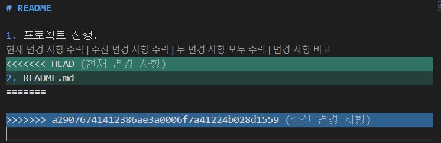
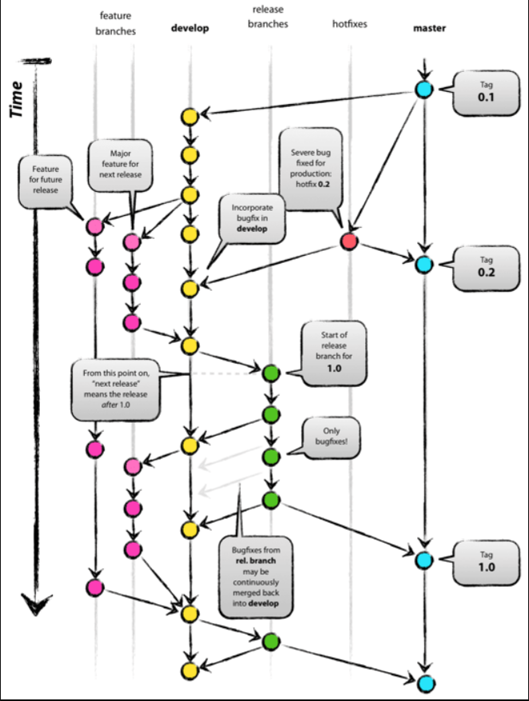

# git 기본

- workspace

- stage
- repository

- Git 사용의 목적

1. 버전관리
2. 협업

## 1 git 시작하기

- `init`
  - $ git init
- `config --global user.name` '이름'
- `config --global user.email '이메일'`

## 2 변경사항 반영하기

- `add`
- `commit`
- `push`

## 3 취소하기

- `restore` 
- `reset`
  - commit id를 통해 특정 시점으로 돌아간다.
  - 로컬의 변경 사항이  reset 되지는 않는다. (다소 안전)
  - 기본적으로 local로 돌아간다 (add하면 staging 될 것)
  - -- soft (option) 추가하면 stage로 돌아간다
  -  --hard (option) 추가하면  로컬의 변경 사항도 reset 된다 (위험)

### Git Undo

#### add 취소

- add 취소하기
  - git rm --cached  < file_name >
- commit 후에 로컬 수정 후 add 했을 때 취소 (수정한 파일 취소)
  - git restore --staged < file >

####  마지막 commit 취소

- commit message 수정
  - git commit --amend
  - i, esc, :wq
- 파일을 누락했을 때
  - 누락한 파일 add (git add d)
  - 마지막 commit과 합치기 ('update cd')
    - commit 을 내려놓고 staging area로 보내기
    - git commit --amend
    - :wq

#### reset

> reset
>
> 사용하지 말자.

##### 1. hard

- git reset --hard < commit 이름 >
- 로그를 보면 완전히 과거로 돌아갔다
- 코드도 과거의 코드로 돌아간다 
- 기억도 삭제

##### 2. soft

- git reset --soft < commit  이름>
- 로그를 보면 과거로 돌아갔는데
- git status 를 보면 지금까지의 수정사항이 staging area에 올라가 있다.
  - add 가 필요하지 않다
- git log: 팝콘 구매 
- git status: 팝콘 구매 이후의 미래가 저장되어 있다 (기억은 남아있다)
- 여기서 commit 하면 달라지는 것 없다

##### 3. mixed (default)

- git reset < commit 이름>
- 로그를 보면 과거로 돌아갔다
- git status를 보면 현재까지의 수정사항이 add 전 working directory에 올라가 있다.
  - add 가 필요하다
- 여기에서 add를 하면 staging area에 올라갈 것

#### revert

- git revert < commit 이름>
- conflict 상황이 발생
- 코드를 봤을 때 과거의 코드로 되돌림
- log 는 다 남아 있다.
- 기억 조작 (코드 조작)
- 내용만 과거로 돌아가고 log 에는 revert 한  새 commit 이 쌓이는 것

## 4 용어 살펴보기

### `Branch`

branch를 따서 원본에 새로운 기능을 구현하고 

완성되면 master에 합치고 망했다면 branch를 버린다.

| 명령어 | 내용                          | 예시                             |
| ------ | ----------------------------- | -------------------------------- |
| branch | branch를 생성한다             | $ git branch  <branch name>      |
|        | branch 내역 확인              | $ git branch                     |
| switch | branch로 이동한다(checkout)   | $ git switch  <branch name>      |
|        | 생성하면서 이동               | $ git switch -c  <branch name>   |
| merge  | branch를 통합한다             | $ git merge  <branch name>       |
|        | branch를 삭제한다             | $ git branch -d  <branch name>   |
|        | branch 강제 삭제 (merge 없이) | $ git branch -D  <branch name>   |
| reflog | log + checkout 기록까지       | $ git reflog                     |
| push   | branch를 repo에               | $ git push origin  <branch name> |

1. 생성
2. 전환
3. 작업
4. 전환
5. 병합

### `Master`

현재 배포되고 있는 프로그램

branch중 기둥이되는 main 가지에서 가장 최신의 commit

branch를 끌어올 때엔 (=변경 사항을 취합) 

HEAD가 Master로 이동해야 한다.

### `Merge`

branch가 걸은 길을 master가 걷는 것 (Fast-forward)

master 로 switch 한 상태에서 진행한다

merge 후에는 branch를 삭제한다 (권장)

####  만약 master에서 수정이 일어났다면? (branch와 다른 길)

##### merge commit

master와 branch를 합친 commit을 새로 만든다.

git log를 찍으면 시간 순으로 볼 수 있다

### `Conflict`

master의 내용과 branch의 내용이 충돌할 경우

직접 수정하며 지울 코드와 남길 코드를 결정한다.

### `HEAD`

'나' 내가 어디에 있나? master? branch?

나의 위치를 표시한다.

### `remote`

듀얼 push를 어떻게 할까?

$ git remote add KEY VALUE

하나일 때는 key를 `origin`으로 정한다.

## 5 git으로 hosting하기

- charlie-jyj.github.io
- new repo를 위의 이름으로 생성한 후에 add remote하면 해당 프로젝트를 github 서버를 통해 
- 아주 작은 파일이라면 웹상에 올려놓을 수 있다.
- charlie-jyj.github.io/파일이름.확장자
- 위와 같이 접근할 수 있다.

## 정리

| 명령어  | 내용                     | 예시                              |
| ------- | ------------------------ | --------------------------------- |
| add     | 변경사항 stage로 올리기  | $ git add filename.md             |
| commit  | stage에서 repo로 올리기  | $ git commit -m 'message'         |
|         | 직전 commit message 수정 | $ git commit --amend              |
| log     | commit 내역 (id) 보기    | $ git log                         |
|         | 한 줄로 보기             | $ git log --oneline               |
|         | 그림표시                 | $git log --graph                  |
| status  | 전체 상태 확인           | $ git status                      |
| push    | gitlab으로 업로드        | $ git push origin master          |
| remote  | origin 변경하기          | $ git remote set-url origin [url] |
|         | repo add 하기            | $ git remote add [별칭] [url]     |
| clone   | clone 받기               | $ git clone [url]                 |
|         | 원격지 보기              | $ git remote -v                   |
| pull    | update하기               | $ git pull                        |
|         | 협업자가 pull 받기       | $ git pull origin main            |
| restore | stage에서 내리기         | $ git restore --staged [파일이름] |
| reset   | commit 취소하기          | $ git reset  [commit id]          |

### Gitlab Flow

## 6. 기여하기

### issue

- 마치 자유게시판

### fork

- 내게 권한 없는 프로젝트를 fork 하여 repo를 복제해온다.
- clone 후 code 수정 한 다음에 push 하면 내 repo에 반영
- 병합요청 (서로 다른 repo 끼리의 병합을 요청하는 것)

